\newpage

\tableofcontents

\newpage

# Introduction
The goal of this assignment is to implement a stock trading system using Python. The system should allow users to buy and sell stocks, view their portfolio, and check the current stock prices. Users use a simple command-line interface to interact with the system. The system should also support multiple users, each with their own portfolio and trading history with a simple JSON-based storage architecture.

## Overall Design

My implementation separates the system into several modules, each responsible for a specific part of the functionality. The main components are:

- **Market**: Manages stock prices and updates them periodically.
- **Users**: Manages user accounts, portfolios, and trading history.
- **Transactions**: Handles the logging of buy/sell transactions.
- **Strategy**: Implements different trading strategies for auto-trading.
- **Trading**: The main entry point for the program, handling user interactions and orchestrating the other components.
- **Constants**: Defines configuration constants, file paths, and enums for strategy and action types.
- **JSON Storage**: Uses JSON files to persist market data, user accounts, and transaction history.

## Directory Structure

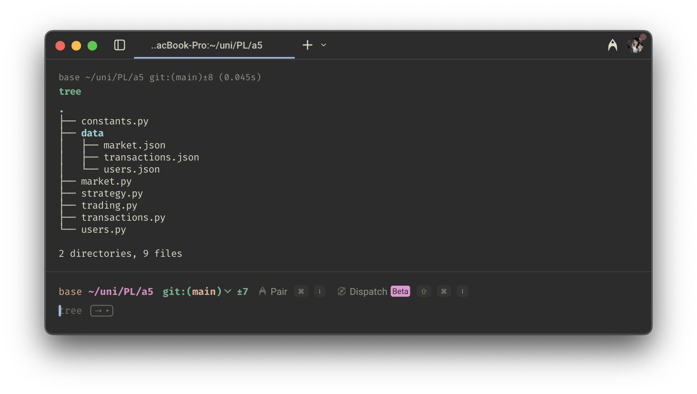{ width=80% }

The `data/` directory contains JSON files for storing market data, user accounts, and transaction history. The main Python modules are responsible for managing the logic and functionality of the trading system. 

Note: `trading.py` is equivalent to `2022310853_Trading.py`; just named in `trading.py` for simplicity while implementing and testing.

\newpage

# Stock Trading System Menus

## Registration

The registration process takes place in `user.py`, where register is defined. Upon registration, users provide a username, password, and select a trading strategy. The system checks for duplicate usernames-—case-sensitive and space-sensitive—-and stores user data in `users.json`. Error Messages are displayed for invalid inputs.

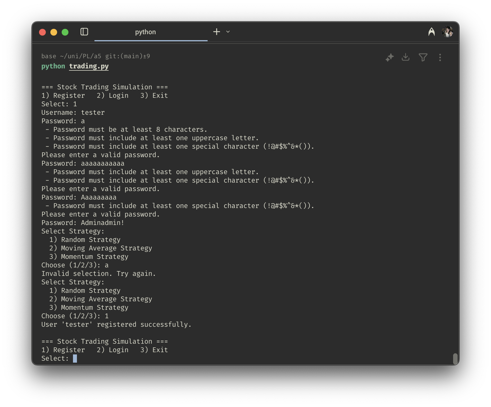{ width=80% }


## Login

During login, the system verifies the username and password, which are case-sensitive and space-sensitive, against stored credentials. If the credentials are valid, the user is granted access to their portfolio and trading options. If not, an error message is displayed.

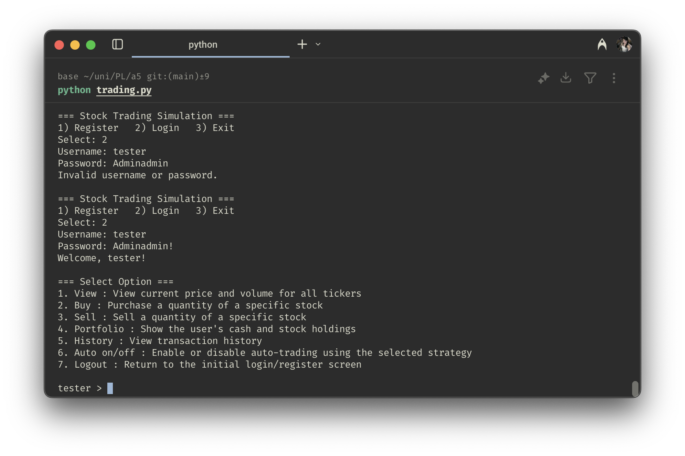{ width=80% }


## Logout

The logout process is straightforward. The user can choose to log out from the main menu, which will save their session data and close the program. The system ensures that all unsaved data is persisted before exiting through the `atexit` function in `trading.py`. This function calls `_cleanup()` to save the market data and user portfolios.

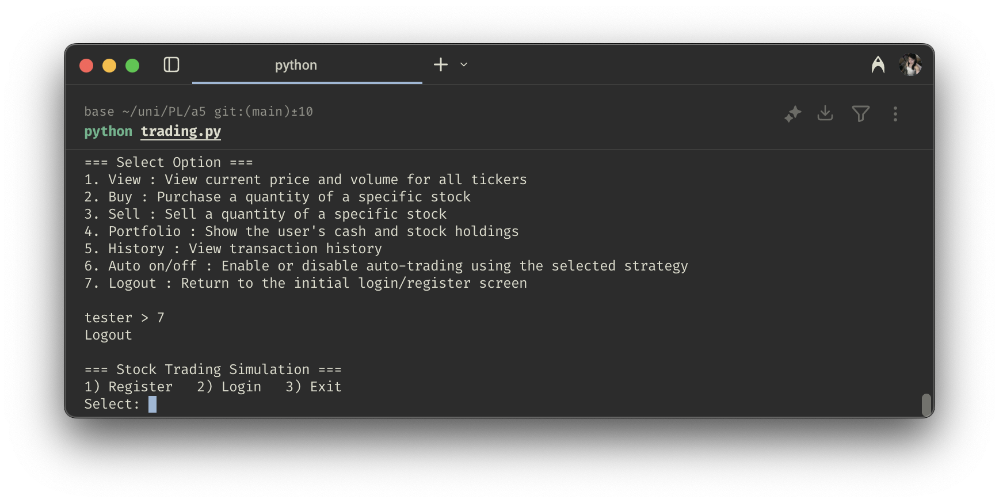{ width=80% }

# Main Screen Menus

## View

The first option on the main screen is to view the current stock prices. The system fetches the latest prices from `market.json` and displays them in a user-friendly format. Users can see the stock symbol, name, and current price.

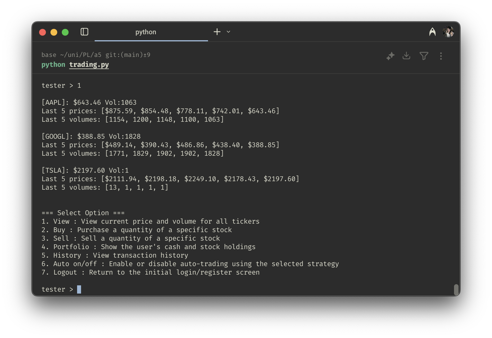{ width=80% }


## Buy/Sell Stocks
The buy/sell stocks option allows users to trade stocks. Both buying and selling stock's underlying logic uses the same function, `execute_trade()` and `get_trade_options()`, which is defined in `user.py`. The system differentiates between buying and selling based on the user's input and uses a parameter to determine the action. 

### Action Enum

The action is defined in `constants.py` as an enum, which makes the code more readable and maintainable.

```python
class Action(Enum):
    BUY = "buy"
    SELL = "sell"
```

### Validation and Storage
The system checks if the user has sufficient funds or shares before proceeding with the transaction. The system also validates the stock symbol and price entered by the user. If the stock symbol is valid, the system updates the user's portfolio and transaction history accordingly. 

The transaction history is stored in `transactions.json`, which keeps track of all buy/sell transactions made by users.

### Buy Stocks

The buy stocks option allows users to purchase stocks. The system prompts the user for the stock symbol, quantity, and price. It checks if the user has sufficient funds and if the stock symbol is valid. If everything checks out, the transaction is processed, and the user's portfolio is updated.


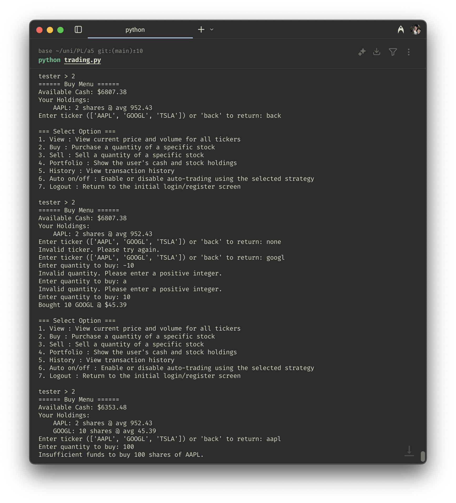{ width=70% }

**1. User Input & Validation**

The `buy_stock()` method begins by prompting the user for a stock ticker and quantity via `get_trade_options()`.

It validates that: 1. The ticker exists (`DEFAULT_STOCK`), 2. The quantity is a positive integer.

**2. Trade Execution**

1. The `execute_trade()` method is called with the action `ActionType.BUY`. 
2. The system retrieves the latest price from the `Market` object. 
3. It checks if the user has enough balance to cover the total cost (`price × qty`).

If valid the balance is reduced and the stock is added or updated in the `portfolio`.

New average price is calculated using a **weighted average** formula:

```python
new_avg_price = (old_qty * old_avg + new_qty * price) / total_qty
```

**3. Logging**

The transaction is logged with `log_transaction()`. A confirmation message is printed unless the trade was triggered by auto-trading.


### Sell Stocks

The sell stocks option allows users to sell stocks from their portfolio. The system prompts the user for the stock symbol, quantity, and price. It checks if the user has enough shares to sell and if the stock symbol is valid. If everything checks out, the transaction is processed, and the user's portfolio is updated.

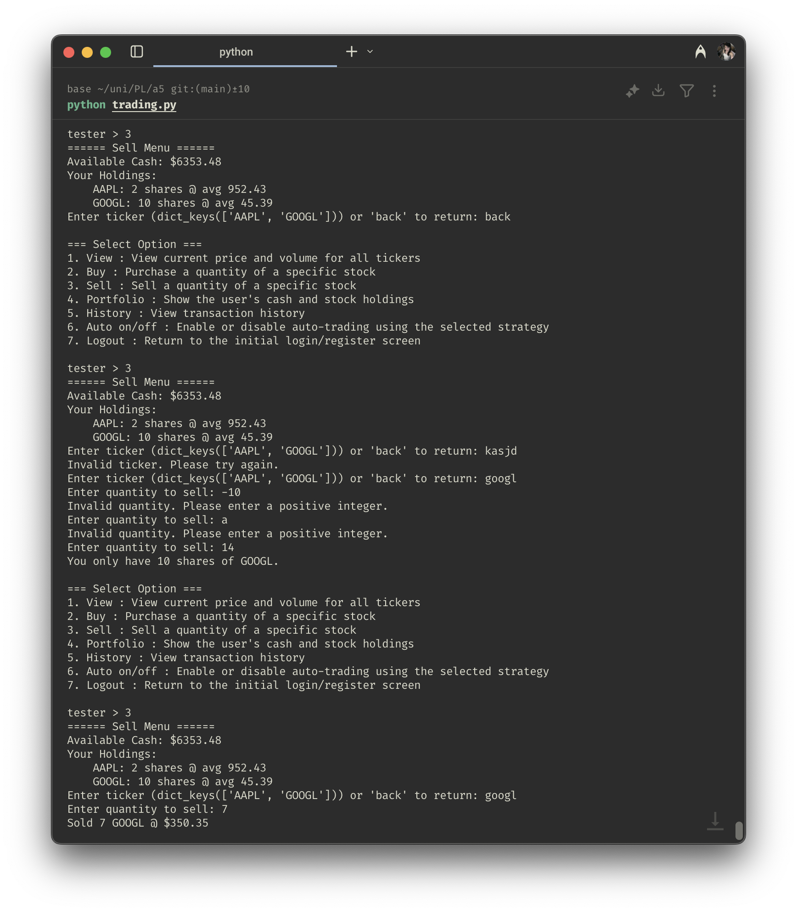{ width=70% }


**1. User Input & Validation**

The `sell_stock()` method similarly asks the user for a ticker and quantity. It ensures two things: 1. The user **owns** the stock, 2. The quantity to sell is **less than or equal** to what’s owned.

**2. Trade Execution**

1. The `execute_trade()` method is called with `ActionType.SELL`.
2. It calculates proceeds as `qty × current_price`.
3. The user's balance is increased.
4. If all shares are sold, the stock is removed from the portfolio. Otherwise, the quantity is reduced.

**3. Logging**

Like buying, this action is recorded in `transactions.json`.


## View Portfolio
Each `User` in the system maintains a personal `portfolio`, which is a dictionary mapping stock tickers (`str`) to `Holding` objects. This structure tracks both the quantity and average purchase price of each stock the user owns.

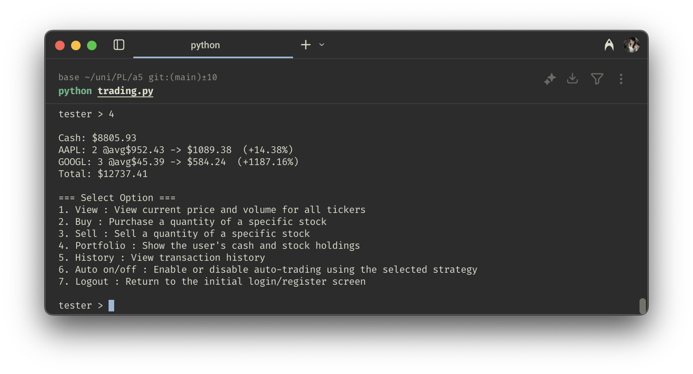{ width=80% }

### Structure

The user's portfolio is a dictionary:

```python
portfolio: Dict[str, Holding] = field(default_factory=dict)

@dataclass
class Holding:
    qty: int
    avg_price: float
```


Each `Holding` stores:

* `qty`: total number of shares owned.
* `avg_price`: weighted average purchase price.

Since JSON does not support custom objects directly, this object is serialized/deserialized using `.to_dict()` and `.from_dict()` methods. This structure supports stock holdings and accurate computation profit/loss.

### Implementation
The `view_portfolio()` method in `user.py` retrieves the portfolio data and formats it for display. It shows the stock symbol, quantity owned, average purchase price, and current market value.

The portfolio is updated in real-time as users buy/sell stocks, updating the total quantity and average price accordingly.


## View Transaction History

The transaction history option allows users to view their past transactions. The system retrieves the transaction history from `transactions.json` and displays it in a user-friendly format. Users can see the action (buy/sell), stock symbol, price, quantity, and timestamp of each transaction.

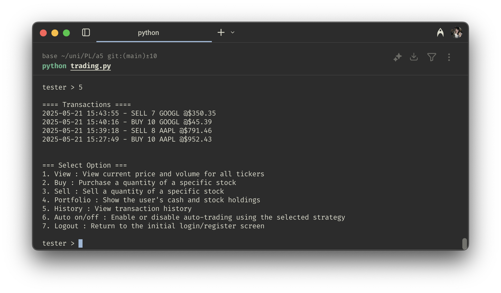{ width=80% }

### Structure
Each individual transaction is represented as an instance of the `Transaction` dataclass defined in `transaction.py`:

```python
@dataclass
class Transaction:
    time: str
    ticker: str
    action: ActionType
    qty: int
    price: float
```

Each transaction can be serialized to a dictionary using the `to_dict()` to facilitate JSON storage.

### Storage

Transactions are saved in a file called `transactions.json`. The format is a dictionary where each key is a username, and each value is a list of transaction records for that user.

### Implementation

At program startup, the system loads existing transactions from `transactions.json` into memory. When a user performs a buy/sell action, the transaction is logged in this file. The `display_history()` method under `transaction.py` takes in the username and retrieves the transaction history for that user. It formats the data for display, showing the action (buy/sell), stock symbol, price, quantity, and timestamp of each transaction.


## Auto Trading

Auto-trading allows users to let a predefined strategy automatically make buy or sell decisions on their behalf. Once enabled, the system makes trading decisions for them in the background based on market data updates.


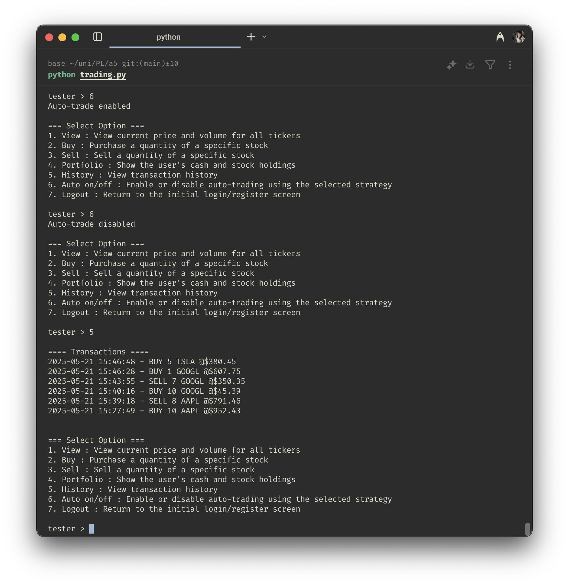{ width=80% }

As shown in the image, new transactions are automatically logged in the transaction history. The user can also disable auto-trading at any time, which will stop the background trading activity.

This feature runs even when the user is logged out, as long as the market is open. The system will continue to execute trades based on the user's selected strategy until they log back in and disable it.

### Implementation

The auto-trading feature is implemented in the `Market` class (`market.py`) within the `_run_market()` method. This method continuously updates the market and checks for users with `auto = True`. If auto-trading is enabled, the system fetches the user's selected strategy from `strategy.py` and executes it using the latest market data.

Supported strategies include `RandomStrategy`, `MomentumStrategy`, and `MovingAverageStrategy`, all of which inherit from a shared `Strategy` interface. These strategies make trading decisions by calling `user.execute_trade()` based on logic defined in their respective `execute()` methods.

The entire `_run_market()` method — including both market updates and strategy execution — runs in a single background thread started by the `open()` method using:

```python
threading.Thread(target=self._run_market, daemon=True).start()
```


## Logout

The logout option allows users to exit the program. The overall session data is saved when the program exits, not when the user logs out. After logging out, the user is returned to the main menu, where they can choose to log in again or exit the program.

{ width=80% }


# Market Module

The market module--defined under `market.py`--is responsible for managing stock prices and updating them periodically. It defined two core components:

- **Stock**: a dataclass representing a single stock's price and volume history.
- **Market**: a class that manages all stocks, periodically updates their values, and executes auto-trading logic for users with enabled strategies.


## Stock Class

The `Stock` dataclass encapsulates the state and history of an individual stock.

### Attributes

* `ticker: str`: The stock symbol (e.g., "AAPL").
* `history: list[dict]`: A list of dictionaries storing time-stamped price and volume data.

### Methods

* `to_dict() -> Dict`: Converts the stock's history into a JSON-serializable format.
* `get_current_price() -> float | None`: Returns the most recent price in the history, or `None` if empty.
* `get_latest_volume() -> int | None`: Returns the most recent volume in the history.
* `update(price: float, volume: int, timestamp: str) -> None`: Appends a new record to the stock history and truncates it to the most recent `MAX_MARKET_HISTORY` entries.

This class is purely data-oriented and is used for both updating and serializing/deserializing market data.

## Market Class
This class maintains a dictionary of all tradable stocks, runs the live market update loop, and integrates auto-trading functionality for users.

### Attributes

* `stocks: Dict[str, Stock]`: Maps ticker symbols to `Stock` objects.
* `_running: bool`: Boolean flag indicating whether the market is currently active.
* `lock: threading.Lock`: Ensures thread-safe updates to market data.

### Methods

`_load_market() -> None`

* Loads existing stock data from `market.json` if it exists.
* If not, initializes empty history for each ticker in `DEFAULT_STOCK` and writes it to file.
* Reconstructs the in-memory `stocks` dictionary from JSON.

`_save_market() -> None`

* Serializes the `stocks` dictionary to `market.json` by calling each `Stock`’s `to_dict()`.

`_update_market() -> None`

* Iterates over all stocks and updates their price and volume with random fluctuations.
* Appends the update to each stock's history.
* Saves updated state to disk.

`_run_market() -> None`

* Called inside a background thread once the market is opened.
* Executes `_update_market()` every `MARKET_UPDATE_INTERVAL` seconds.
* Also loops through all users (imported dynamically from the `users` module) and applies their respective auto-trading strategies if `user.auto` is enabled.
* Uses `STRATEGY_OPTIONS[user.strategy]` from `strategy.py` to retrieve the appropriate strategy instance.

`open() -> None`

* Initializes the market if not already running.
* Loads market data and starts the market thread.

`close() -> None`

* Stops the market and persists stock data.

`view() -> None`

* Prints the current price and volume of each stock.
* Also shows the last 5 prices and volumes to simulate a mini time series chart.


 It fetches the latest stock prices from an external API and stores them in `market.json`. The module also provides functions to get the current price of a specific stock and to update the prices periodically.

The market module is implemented in `market.py`, which includes the following functions:
- `get_stock_price(symbol)`: Fetches the current price of a stock from the API.
- `update_stock_prices()`: Updates the prices of all stocks in the market.
- `get_all_stock_prices()`: Returns a dictionary of all stock prices.


## Threading and Locking

The `Market` uses `threading.Thread` to run live updates in the background, independent of user interaction. It also uses a `threading.Lock()` to guard `_update_market()` from race conditions when auto-trading executes user operations during updates.


## Auto-Trading Strategy Integration

Auto-trading logic is built into `_run_market()`:

* After each update, it loops through all `users` who have `auto = True`.
* It retrieves and calls the `execute()` method of the user’s strategy (`Random`, `Momentum`, or `MovingAverage`).
* The strategy then calls `user.execute_trade()` based on logic.


## Conclusion

This module plays a central role in simulating stock trading. It provides a real-time, multi-threaded stock market engine with historical tracking and hooks for user strategies. Its architecture is cleanly modular, and the JSON-based data persistence ensures session continuity between runs.


# Strategy Module
The strategy module is responsible for implementing different trading strategies that users can choose from. It defines three strategies: `Random`, `Momentum`, and `MovingAverage`. Each strategy is implemented as a class that inherits from a base class `Strategy`.

## Strategy Class
The `Strategy` class is an abstract base class that defines the interface for all trading strategies. It contains only one method, `execute()`, which must be implemented by subclasses. This method takes a `Market` object and a `User` object as parameters and performs the trading logic.

## Random Strategy
The `Random` strategy randomly decides whether to buy or sell a stock. It uses the `random` module to generate a random number and decides the action based on that. The `execute()` method takes a `Market` object and a `User` object as parameters and performs the trading logic.

## Momentum Strategy
The `Momentum` strategy buys stocks that have been increasing in price over the last `MOMENTUM_PERIOD` days and sells stocks that have been decreasing in price. It uses the `get_latest_volume()` method of the `Market` class to get the latest volume of a stock and decides whether to buy or sell based on that. If not enough data is available, it skips the trade until more data is collected.

## Moving Average Strategy
The `MovingAverage` strategy calculates the moving average of a stock's price over the last `MOVING_AVERAGE_PERIOD` days. It buys stocks that are currently above their moving average and sells stocks that are below their moving average. The `execute()` method takes a `Market` object and a `User` object as parameters and performs the trading logic. If not enough data is available, it skips the trade until more data is collected.


# JSON Storage Structure

## Market Data
The market data is stored in a JSON file called `market.json`. This file contains the current prices and volumes of all stocks in the market. The data is structured as follows:

```json
{
  "AAPL": {
    "history": [
      {
        "time": "2024-05-20 20:00:00",
        "price": 135.55,
        "volume": 430
      },
      ...
    ]
  },
  "GOOGL": {
    "history": [...]
  }
}
```

Each ticker contains a `history` list that maintains chronological market updates. This structure allows:

* Efficient appending of new market ticks.
* Easy access to current price and historical data.
* Direct serialization/deserialization via Python's built-in `json` module.

## User Data
The user data is stored in a JSON file called `users.json`. This file contains the usernames, passwords, and portfolios of all users. The data is structured as follows:

```json
{
  "user1": {
    "password": "hashed_password",
    "portfolio": {
      "AAPL": 10,
      "GOOGL": 5
    },
    "strategy": "Random",
    "auto": true
  },
  ...
}
```

## Transaction History
The transaction history is stored in a JSON file called `transactions.json`. This file contains the details of all buy and sell transactions made by users. The data is structured as follows:

```json
{
  "user1": [
    {
      "action": "buy",
      "ticker": "AAPL",
      "price": 135.55,
      "volume": 10,
      "timestamp": "2024-05-20 20:00:00"
    },
    ...
  ],
  ...
}
```


# Miscellaneous

## Graceful Keyboard Interrupt Handling
The program handles keyboard interrupts (Ctrl+C) gracefully by catching the `KeyboardInterrupt` exception. This allows the user to exit the program without losing any unsaved data. The market is closed, and all data is saved before exiting.

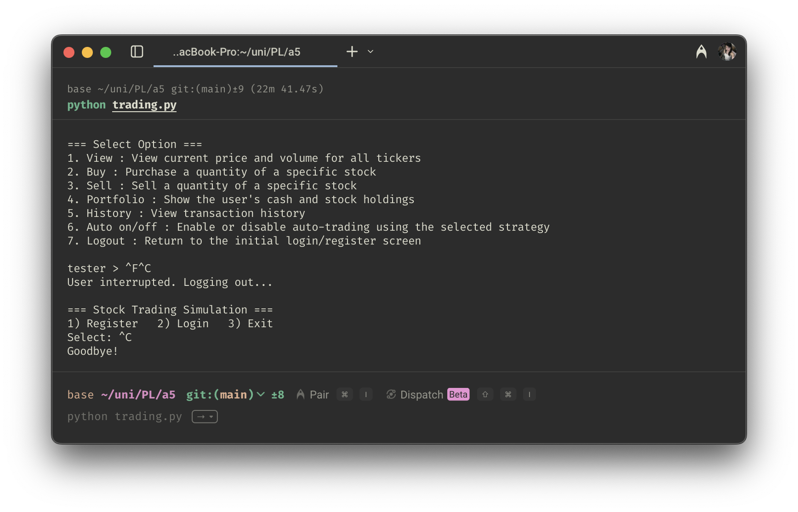{ width=80% }

## Python Version
The code is implemented in Python 3.11.12. Because of the `None` type hinting, the code is not compatible with earlier versions of Python. 