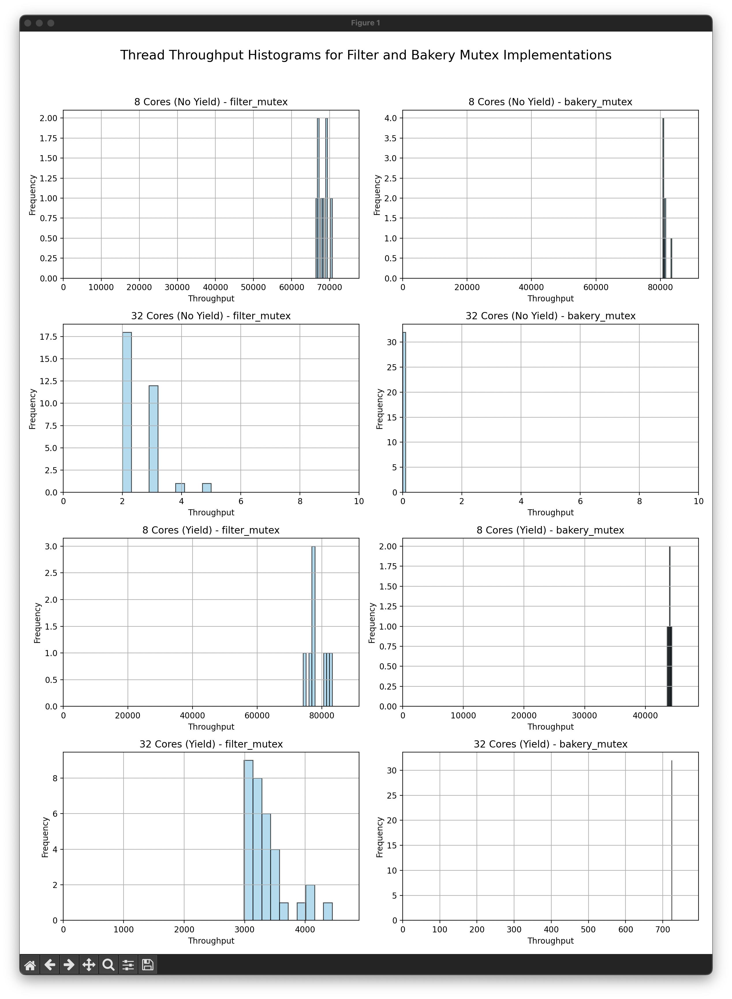
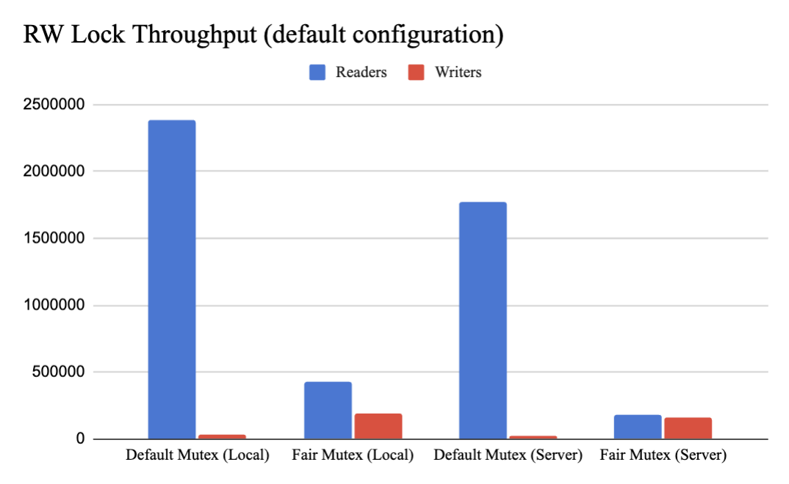

\tableofcontents

\newpage

# Implementing Mutexes
## Implementation
### Filter Mutex
The Filter Mutex implementation aims to provide mutual exclusion by assigning each thread a "level" as it attempts to acquire the lock, with the thread progressing through levels while competing with other threads. Each thread chooses a "victim" at each level, allowing other threads to make progress at higher levels. The spin loop utilizes `yield` to improve fairness by giving other threads the opportunity to execute when a thread is waiting at a particular level. This implementation is designed to reduce lock contention and improve fairness.

### Lamport Bakery Mutex
The Lamport Bakery Mutex is modeled after the "bakery algorithm," where each thread selects a "ticket" value before entering the critical section. The ticketing system ensures that each thread waits for its turn based on the ticket order, resembling the first-come, first-served system. This method is particularly effective in ensuring fair access among threads. Adding `yield` in the spin loop provides additional fairness by allowing other threads to progress if they are ready to enter the critical section.

## Experiment Results

The tables below summarize the throughput and coefficient of variation (CV) results for the Filter Mutex and Lamport Bakery Mutex implementations with and without `yield`. The local machine experiments were conducted with 8 cores, using both 8 and 32 threads. Server results were gathered from five runs with 32 threads. (L: Local, S: Server, 8: 8-core, 32: 32-core)

### Without Yield

|                     | Filter (L) | Bakery (L) | CPP (L) | Filter (S) | Bakery (S) | CPP (S) |
| ------------------- | -------------- | -------------- | ----------- | --------------- | --------------- | ------------ |
| **Throughput (8)**  | 544827         | 651157         | 4495737     | -               | -               | -            |
| **CV (8)**          | 2.11           | 1.09           | 24.7        | -               | -               | -            |
| **Throughput (32)** | 81             | 0              | 2927698     | 8.8             | 0.0             | 4031184.0    |
| **CV (32)**         | 28.35          | N/A            | 87.48       | N/A             | N/A             | 1.3          |

### With Yield

|                     | Filter (L) | Bakery (L) | CPP (L) | Filter (S) | Bakery (S) | CPP (S) |
| ------------------- | -------------- | -------------- | ----------- | --------------- | --------------- | ------------ |
| **Throughput (8)**  | 629326         | 351675         | 5364940     | -               | -               | -            |
| **CV (8)**          | 3.66           | 0.49           | 14.33       | -               | -               | -            |
| **Throughput (32)** | 107253         | 23160          | 3641573     | 72282.0         | 95352.4         | 4073409.4    |
| **CV (32)**         | 10.3           | N/A            | 21.89       | 5.14            | N/A             | 1.34         |

Note: Some coefficient of variation values couldn't be calculated due to insufficient unique data points for meaningful analysis.

\newpage

### Histogram Data

The histograms below depict the throughput for Filter and Bakery Mutex implementations on an 8-core local machine and 32-core server setup. In these histograms, `yield` noticeably improved throughput, especially on the high-contention 32-core configuration.

{ width=60% }

## Analysis of Results

The throughput results demonstrate that introducing `yield` in the spin loops greatly improved fairness and throughput, particularly in the 32-core environment. In the initial tests without `yield`, the `Filter Mutex` and `Lamport Bakery Mutex` suffered from low throughput, as threads were not efficiently yielding control, leading to prolonged contention. For example, the 32-core test without `yield` showed significantly low throughput for both mutexes, with Lamport Bakery Mutex achieving nearly zero throughput. The `cpp_mutex` (standard C++ mutex) outperformed both custom mutexes in the no-yield configuration, indicating the inefficiency of the custom mutexes in high-contention scenarios. With `yield` added, both mutex implementations saw improvements in thread throughput across cores. The local tests with 8 cores showed a throughput increase for both `Filter Mutex` (from 544,827 to 629,326) and `Lamport Bakery Mutex` (from 651,157 to 351,675). On the server with 32 cores, `Filter Mutex` and `Lamport Bakery Mutex` also showed notable throughput increases, reaching 107,253 and 23,160, respectively. The `cpp_mutex` showed fairness in the 32-core server configuration, with a throughput of 4,031,184, while it's fairness was not as great in the 8-core local configuration. The `cpp_mutex` throughput was consistently high across all scenarios, indicating its robustness in handling contention.The coefficient of variation (CV) provided insights into fairness, particularly with `yield`. The `Filter Mutex` saw a decrease in CV from 28.35 to 10.3 on the local machine in the 32-core configuration, indicating improved fairness among threads. However, the CV values couldn't be calculated consistently for all scenarios due to limited variation in the dataset. In the case of the `Lamport Bakery Mutex`, the CV valyes were often unable to be calculated because the data points were too similar. In other words, the lock was perfeclty fair. The reduction in CV with `yield` suggests that the use of `yield` improved overall fairness, allowing threads to progress more consistently. The CV values for the `cpp_mutex` showed varying results, which could be attributed to the different contention levels across. 

Outliers primarily resulted from threads being delayed in acquiring the lock due to high contention. These outliers were less prominent in the `yield` versions, as `yield` reduced the likelihood of prolonged contention. Removing outliers would likely yield a more consistent CV and improved throughput averages. In high-contention scenarios (like the 32-core configuration), contention among threads trying to acquire the lock caused the low throughput in the no-yield setup. Compared to the standard `std::mutex` in C++, both `Filter Mutex` and `Lamport Bakery Mutex` implementations with `yield` exhibited lower throughput but improved fairness in high-contention situations, with the latter being a key metric in assessing fairness across threads.

\newpage

# A Fair Reader-Writer Lock

## Solution
The implemented `fair_mutex.h` aims to address fairness in a reader-writer lock by prioritizing writers when necessary. The lock ensures mutual exclusion, preventing writer-writer and writer-reader conflicts by using a shared mutex (`m`). The lock maintains two key variables: `_num_readers`, which tracks active readers, and `_writer_waiting`, which indicates if a writer is waiting. When a writer requests access, `_writer_waiting` is set to `true`, signaling incoming writers. New readers are then prevented from acquiring the lock, allowing the writer to gain exclusive access once all current readers exit. This design effectively prevents writer starvation, ensuring that writers do not indefinitely wait when readers are continuously accessing the critical section.

## Experiment Results

The table below summarizes the throughput and fairness results for the `Default Mutex` and `Fair Mutex` implementations with the (6 2) configuration.

|            | Default Mutex (Local) | Fair Mutex (Local) | Default Mutex (Server) | Fair Mutex (Server) |
| ---------- | --------------------- | ------------------ | ---------------------- | ------------------- |
| **Reader** | 2382899               | 431023             | 1775347                | 184765              |
| **Writer** | 36026                 | 191396             | 26565                  | 162643              |

Below is a graph that visualizes the throughput of the `Default Mutex` and `Fair Mutex` implementations on the local machine.

{ width=60% }

## Analysis of Results

The throughput results indicate that the fair mutex implementation improves writer access significantly at the expense of reader throughput. On the local machine, the `default_mutex` achieved high reader throughput (2,382,899 operations) with minimal writer operations (36,026), demonstrating the potential starvation of writers. In contrast, the `fair_mutex` on the local machine displayed increased writer throughput (191,396 operations) but decreased reader throughput (431,023 operations), confirming that prioritizing writers achieved greater fairness. Similarly, on the server configuration, the `fair_mutex` increased writer throughput compared to the `default_mutex`, with `162,643` writer operations compared to `26,565`. However, this fairness adjustment slightly reduced reader throughput, as expected. Overall, the fair mutex improved writer fairness, but it required a trade-off in reader throughput, demonstrating a balanced approach to handling contention between readers and writers.

\newpage
# A Concurrent Linked List

## Solution to SwapTop
The `swaptop` function was implemented using a combination of a reader lock and writer operations. Initially, `swaptop` acquires a shared lock to perform a quick check to see if the stack is empty. If the stack is empty, the function simply returns, releasing the lock immediately. However, if the stack is not empty, `swaptop` proceeds to call `pop()` and `push()` sequentially, both of which acquire an exclusive lock internally. This design leverages the `shared_mutex` to allow multiple readers but prevents concurrent modifications by writers, ensuring thread-safe access. This implementation efficiently achieves the `swaptop` functionality without introducing data conflicts or excessive locking. To summarize, swaptop uses a "reader" lock to check if the stack is empty and "writer" locks to perform the actual swap operation, ensuring correct behavior and efficient access patterns.

## Experiment Results

The table below summarizes the throughput results for each operation in the concurrent linked list implementation using the `coarse_lock`, `rw_lock`, and `swaptop` mutexes. The local results are the average of three runs, while the server results are obtained from the autograder.

|                          | `Total` | `Push` | `Pop` | `Peek`  | `SwapTop` |
| ------------------------ | ------- | ------ | ----- | ------- | --------- |
| **coarse_lock (Local)**  | 433579  | 71821  | 72718 | 289040  | -         |
| **coarse_lock (Server)** | 73792   | 15960  | 10196 | 47636   | -         |
| **rw_lock (Local)**      | 422135  | 37836  | 38697 | 345603  | -         |
| **rw_lock (Server)**     | 959380  | 451    | 234   | 958695  | -         |
| **swaptop (Local)**      | 400718  | 11530  | 11896 | 340253  | 37038     |
| **swaptop (Server)**     | 1062274 | 114    | 94    | 1061780 | 286       |

## Analysis of Results

In both local and server configurations, `coarse_lock` generally yields the lowest throughput across operations due to its locking design, which limits all accesses—read or write—to a single lock. This approach significantly reduces concurrent access potential, especially in read-heavy scenarios. On the other hand, the `rw_lock` and `swaptop` implementations generally provide better throughput for read-heavy operations compared to the `coarse_lock`. The `rw_lock` achieves higher throughput in `peek` operations since it allows multiple readers to access the stack concurrently without blocking each other, in contrast to `coarse_lock` which forces all threads to wait for a single lock. This design makes `rw_lock` especially beneficial for applications where the majority of operations are read-based. However, we observe lower throughput for write operations (e.g., `pop` and `push`) since they require exclusive access, causing more contention in write-heavy scenarios.

The `swaptop` implementation introduces an additional `swaptop` operation with moderate throughput, leveraging the `rw_lock` for efficient read access. By using a shared lock to check if the stack is empty, `swaptop` avoids locking out other readers while retaining correct functionality. The local tests show that the `swaptop` implementation provides high throughput for `peek` operations, albeit slightly lower than `rw_lock` alone due to the additional overhead of handling swap operations. On the server, the `swaptop` results show consistent throughput, indicating that the implementation scales well under server conditions.

