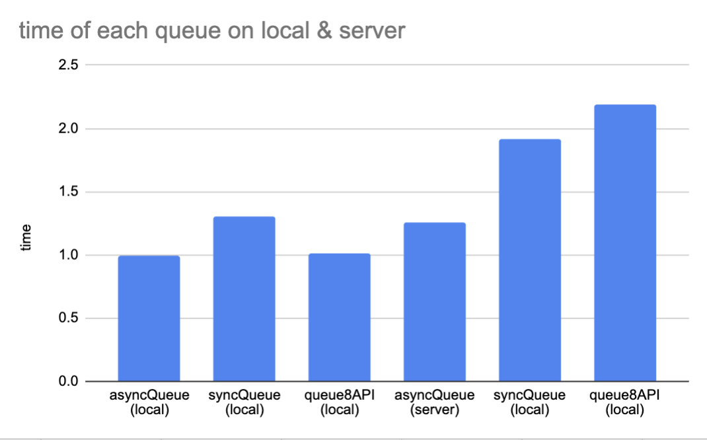

\tableofcontents

\newpage

# Producer-Consumer Queues

## Implementation Overview

My implementation includes three queue types—synchronous, asynchronous, and batched (8-element)—designed for a producer-consumer model where three threads communicate to process an array of floating-point values by computing the cosine of each element. The synchronous queue enforces strict blocking, leading to higher contention and slower performance, especially in local environments. The asynchronous queue reduces contention by allowing non-blocking operations, resulting in faster processing. The batch-based queue (8-element) further improves performance by transferring data in chunks, significantly reducing communication overhead. Timing results confirm that synchronous queues are the slowest due to contention, while asynchronous and batched queues demonstrate faster performance, with the batch queue performing best overall due to minimized queue access frequency.

## Timing Observations

{ width=60% }

From the graph, we observe that synchronous queues (local) and `queue8API (local)` take longer than the asynchronous queues. The synchronous queue’s longer processing time is expected, as it involves more overhead to ensure synchronized access to the data structure, which likely leads to contention among threads. In contrast, asynchronous queues perform faster since they allow threads to operate without waiting, which reduces contention and improves throughput. However, `queue8API` exhibits the longest time, likely due to the added complexity of handling batched API requests, which adds overhead on the local system. In the server environment, the asynchronous queue performs slightly slower than expected, potentially due to network latency or server-specific resource constraints. Overall, the results align with the theoretical expectations, demonstrating the impact of synchronization and batching on performance.

# DOALL Loop Parallel Schedules
## Implementation Overview
My implementation involves four scheduling strategies for parallelizing a loop with varying workloads across threads: Static, Global Worklist, Local Worklist (Stealing), and Local Worklist with 32-Element Stealing. Each approach manages work distribution differently to balance load and maximize efficiency. The Static schedule divides work equally across threads in fixed chunks, which works well when workloads are uniform. The Global Worklist schedule uses an atomic counter to dynamically assign tasks, allowing threads to retrieve work as they finish, balancing load more effectively for uneven tasks. The Local Worklist (Stealing) approach assigns each thread its own queue, with threads stealing tasks from others when they finish their own, aiming to reduce idle time. Local Worklist with 32-Element Stealing further optimizes this by allowing threads to steal tasks in larger chunks, reducing contention and improving efficiency in highly parallel environments.

## Timing Observations

{ width=60% }

{ width=60% }

The runtime results show that the Global Worklist schedule is notably slower, especially in the local environment, due to high contention on the shared atomic counter, which limits scalability as threads compete for access. The Static schedule is faster, as there’s no contention, but it only performs well when tasks are evenly distributed. In the local tests with 8 threads, both Local Worklist (Stealing) and Local Worklist with 32-Element Stealing show significant improvements, as work stealing allows threads to remain active by acquiring tasks from others, mitigating load imbalance. The 32-Element Stealing schedule performs best because it reduces the frequency of steal operations, minimizing contention and enhancing efficiency. The performance aligns with expectations, demonstrating that work-stealing and batched stealing strategies improve throughput by balancing workload dynamically while reducing communication overhead. Unfortunately, results for the server environment for stealing and stealing32 were unavailable due to failing the autograder tests (seems I have implemented something wrong). Hypothetically, stealing32 should perform best on the server as well, benefiting from reduced contention and improved load distribution across threads.

