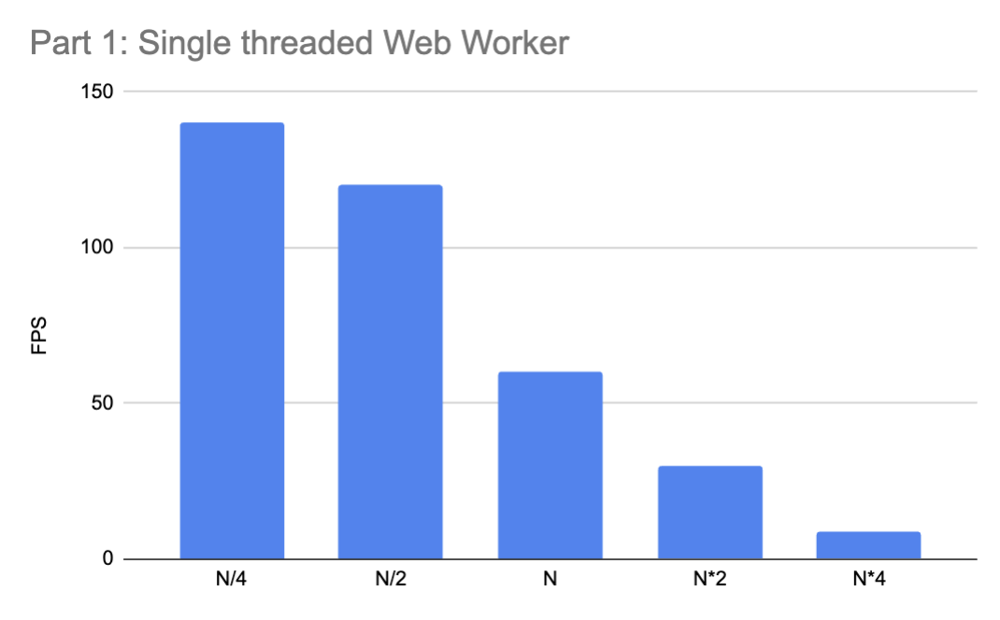
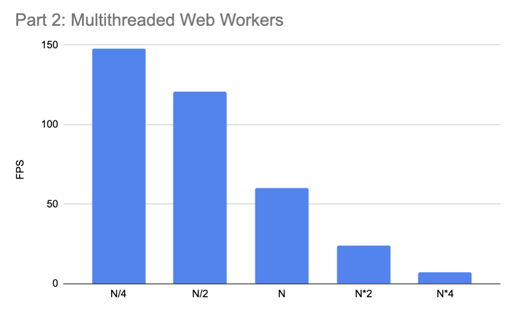
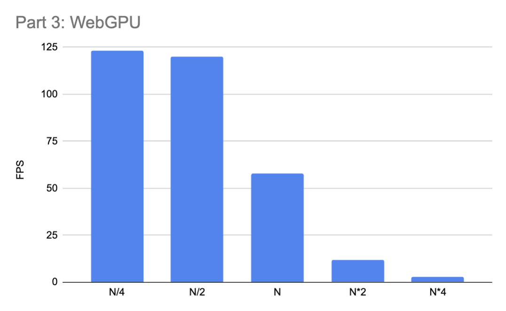

\tableofcontents

\newpage

# Part 1: Single threaded Web Worker
{ width=80% }

The single-threaded Web Worker implementation successfully simulates the nearest-neighbor attraction problem, as shown in the graph of FPS versus particle count. The value for `N` was set to 2048. The results indicate that for smaller particle counts, such as `N/4` and `N/2`, the simulation maintains high frame rates of 140 FPS and 120 FPS, respectively, providing smooth and visually consistent animations. However, as the number of particles increases, the computational load becomes significant, causing the frame rate to drop. At `N`, the FPS drops to 60, which is the threshold for smooth animation, while doubling and quadrupling the particle count results in FPS values of 30 and 9, respectively. This decline is expected due to the `O(N^2)` complexity of the nested-loop algorithm, where each particle must compute its distance to every other particle in the system.

The implementation uses nested loops to compute the nearest neighbor for each particle by calculating the Euclidean distance to all other particles. If a particle is within the clustering threshold (distance < 3), it is ignored to avoid unnecessary computations. The movement logic ensures that each particle moves one step (±1 unit) closer to its nearest neighbor along both axes, and the updated positions are stored in a shared buffer for rendering. While the implementation performs well for small particle counts, the performance degrades significantly for larger systems, emphasizing the computational limits of a single-threaded approach. This highlights the need for parallelization, which is explored in Part 2 to address the scalability issues encountered here.

# Part 2: Multi-threaded Web Worker
{ width=80% }

The multithreaded Web Worker implementation achieved a significant improvement in performance compared to the single-threaded version for larger particle counts. As shown in the graph, the frame rates for smaller particle counts such as `N/4` and `N/2` remain exceptionally high at 148 FPS and 121 FPS, respectively, showing no noticeable drop in smoothness. For the base particle count `N` (4096), the simulation maintained 60 FPS, meeting the standard for smooth real-time animation. However, for larger particle counts, `N*2` and `N*4`, the frame rates dropped to 24 FPS and 7 FPS, respectively. Although performance degradation still occurs as particle counts increase, the use of multithreading significantly delays this drop compared to the single-threaded implementation.

The implementation leverages multiple Web Workers to divide the computational workload into chunks, with each worker processing a subset of particles independently. The main thread coordinates the workers, ensuring that all computations are complete before rendering the updated particle positions. By using this parallel processing strategy, the overall computational load is distributed, allowing for better performance at larger particle counts. Compared to Part 1, the use of multithreading allows the simulation to maintain acceptable frame rates for higher particle counts, demonstrating the effectiveness of parallel computation in addressing the scalability challenges of the nearest-neighbor attraction simulation.

# Part 3: WebGPU
{ width=80% }

The WebGPU implementation demonstrates notable improvements in computational efficiency for smaller particle counts, but the performance drop-off for large particle counts remains significant due to the inherent computational complexity of the problem. At `N/4` and `N/2` (particle counts much smaller than `N = 33164`), the simulation achieves frame rates of 123 FPS and 120 FPS, respectively, maintaining smooth and visually seamless animations. For the base particle count `N`, the frame rate drops slightly to 58 FPS, which is comparable to the single-threaded and multithreaded implementations at this scale. However, for larger particle counts (`N*2` and `N*4`), the FPS drops to 12 and 3, respectively, highlighting the limitations of the algorithm even with GPU acceleration. Although WebGPU allows for massively parallel processing, the high computational demand of `O(N^2)` calculations still presents a bottleneck for extremely large particle systems.

The implementation leverages GPU parallelism, with each particle being processed by an individual GPU thread. The computation of the nearest neighbor involves iterating over all particles, and the particle positions are updated based on a normalized movement vector toward the nearest neighbor. The updated positions are written back to a secondary buffer for rendering. The use of WebGPU significantly increases the parallelization potential compared to both single-threaded and multithreaded CPU-based solutions. For smaller particle counts, the performance improvement is apparent due to the high degree of concurrency. However, for large particle systems, the quadratic complexity of the nearest-neighbor search diminishes the advantages of GPU acceleration. Despite this limitation, WebGPU offers the best performance across all three implementations for large-scale simulations, showcasing the power of GPU parallelism in handling computationally intensive tasks.