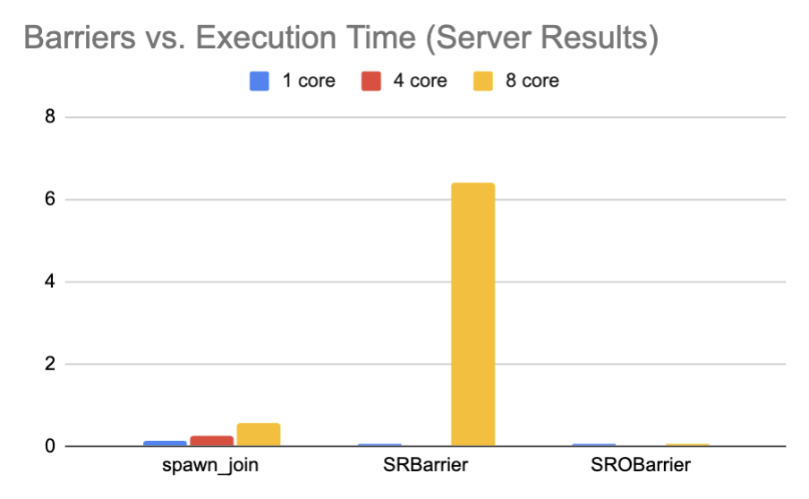
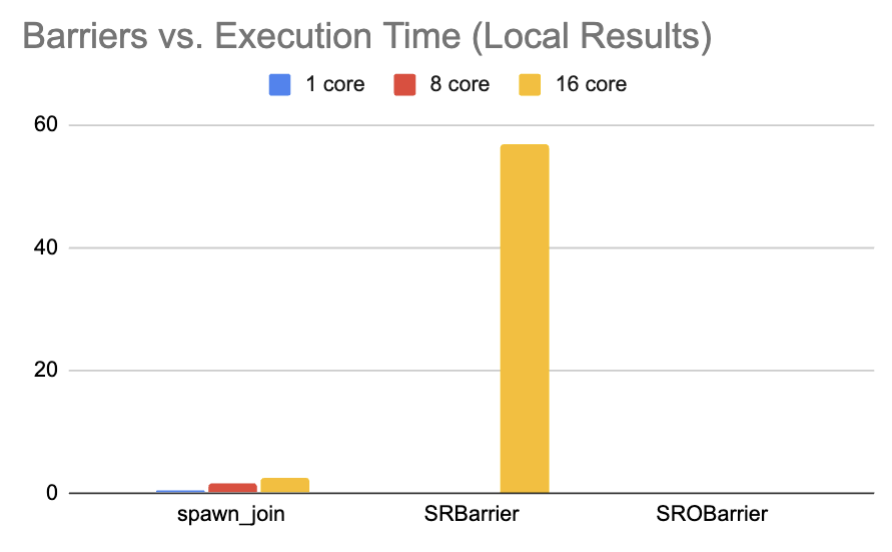
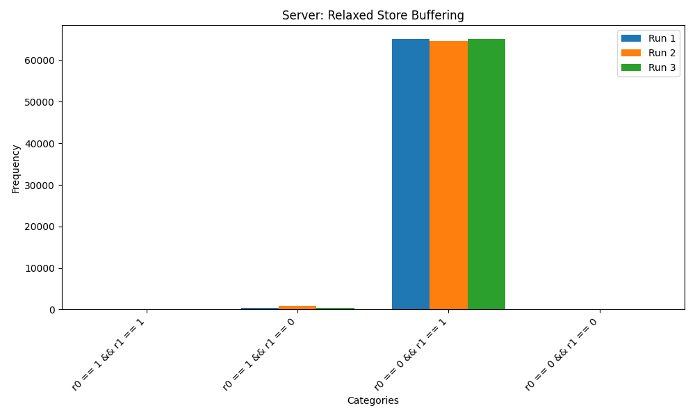
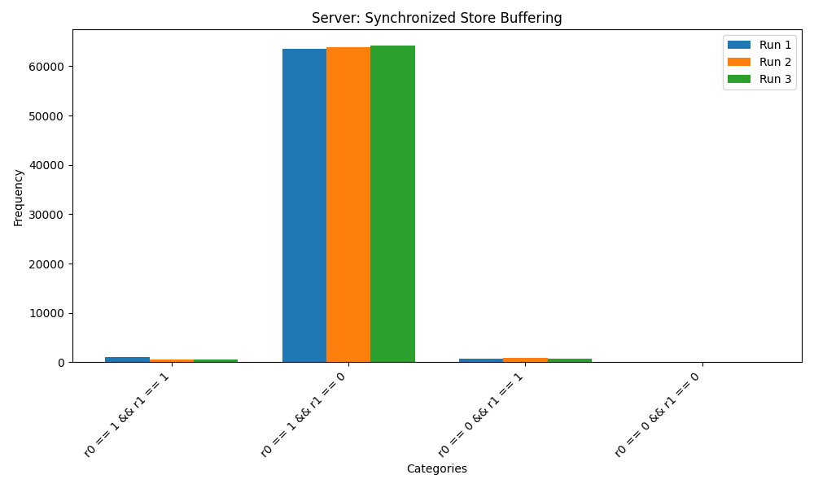
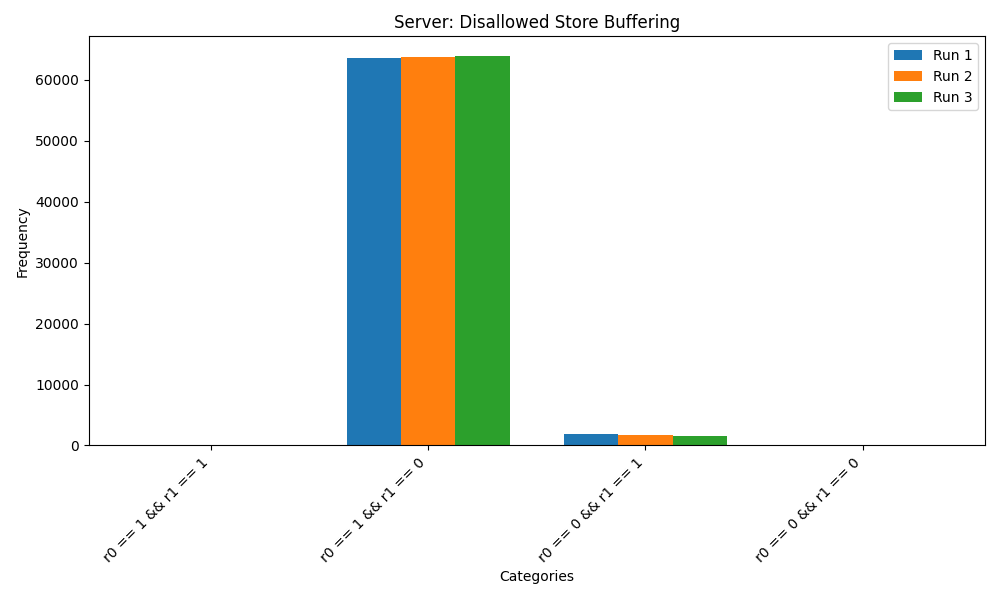
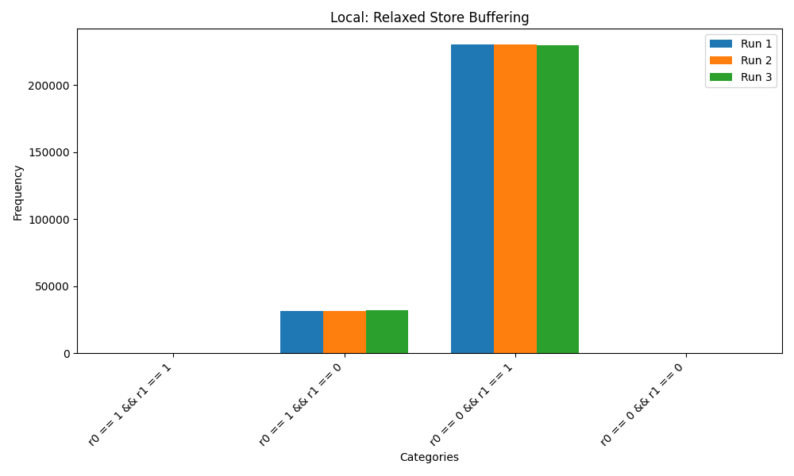
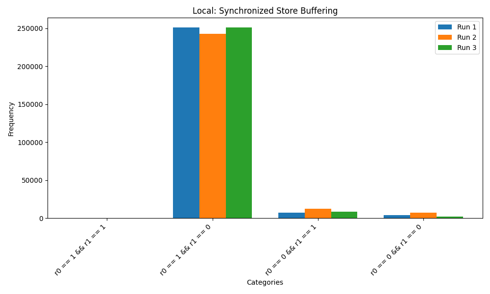
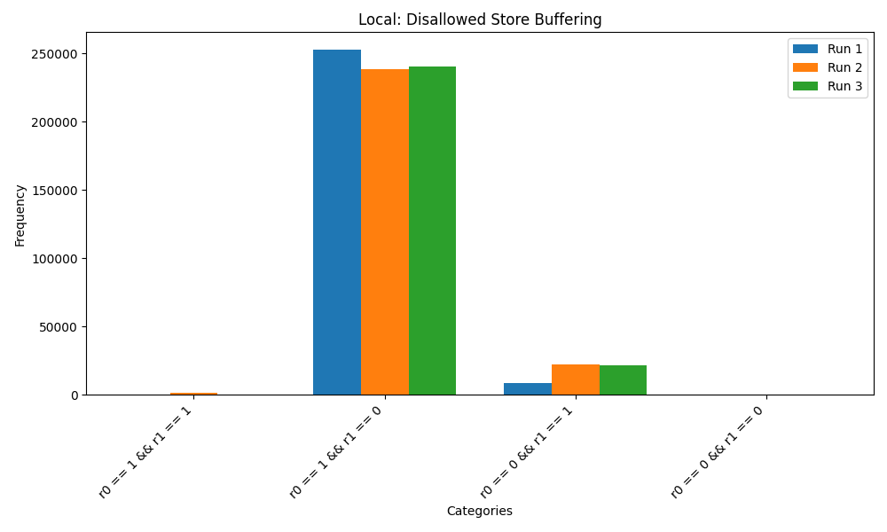

\tableofcontents

\newpage

# Barrier Throughput

## Implementation Overview

This part of the assignment required implementing the repeated blur operation using three different approaches for thread synchronization:

1. **Spawn and Join**: Threads are spawned and joined for each iteration of the blur operation. This approach is straightforward but incurs high overhead due to frequent thread creation and destruction.

2. **SRBarrier (Basic Sense Reversal Barrier)**: Threads are launched once, and synchronization is managed using a sense-reversal barrier. This reduces thread management overhead but introduces contention on shared variables.

3. **SROBarrier (Optimized Sense Reversal Barrier)**: An optimized version of the SRBarrier, where contention is reduced through techniques like yielding during busy-waiting. This approach is expected to offer the best performance.

Each executable takes the number of threads as a command-line argument, and the experiments were run with the following thread counts:
- **1 thread**, **CORES threads**, and **2 × CORES threads**.

## Timing Observations
### Graphs

{ width=55% }

{ width=55% }

### Server Results
| Threads       | Spawn Join (s) | SRBarrier (s) | SROBarrier (s) |
|---------------|----------------|---------------|----------------|
| **1 Core**    | 0.118043       | 0.0435064     | 0.0436983      |
| **CORES (4)** | 0.240609       | 0.0217753     | 0.0233747      |
| **2 × CORES** | 0.577876       | 6.42741       | 0.0442981      |

### Local Results
| Threads       | Spawn Join (s) | SRBarrier (s) | SROBarrier (s) |
|---------------|----------------|---------------|----------------|
| **1 Core**    | 0.492946       | 0.0801108     | 0.0829526      |
| **CORES (8)** | 1.45821        | 0.0789467     | 0.247056       |
| **2 × CORES** | 2.56325        | 56.8925       | 0.156844       |

## Analysis
The timing results indicate that the **Spawn and Join** approach performs as expected, with execution time increasing linearly with the number of threads due to the high overhead of repeated thread creation and destruction. The **SRBarrier** performs well for small thread counts but experiences significant performance degradation with higher thread counts, particularly at 2 × CORES (e.g., 56.8925 seconds for 16 threads locally), likely due to contention and busy-waiting inefficiencies in the implementation. In contrast, the **SROBarrier** consistently demonstrates low execution times across all thread counts, significantly outperforming SRBarrier at higher thread counts, with its optimizations effectively reducing contention and ensuring better scalability. These trends align with the expected behaviors based on the synchronization techniques used in each implementation.

\newpage

# Store Buffering on x86 Processors
The store buffering experiments analyzed the behavior of three implementations: **relaxed store buffering**, **synchronized store buffering**, and **disallowed store buffering**, under both local and server environments. The histograms reveal key differences in the occurrence of weak behaviors (`r0 == 0 && r1 == 0`) across the implementations.

## Graphs
**Server Results:**

{ width=80% }

{ width=80% }

{ width=80% }

**Local Results:**

{ width=80% }

{ width=80% }

{ width=80% }

## Relaxed Behaviour Frequency

| Implementation            | Local (1) | Local (2) | Local (3) | Server (1) | Server (2) | Server (3) |
|---------------------------|---------------|---------------|---------------|----------------|----------------|----------------|
| Relaxed Store    | 0.000175476   | 0.0000725     | 0.0000877     | 0.0000153      | 0.0            | 0.0            |
| Synchronized Store  | 0.0146942    | 0.0271072     | 0.00971603    | 0.00231934     | 0.00167847     | 0.00175476     |
| Disallowed Store  | 0.0           | 0.0           | 0.0           | 0.0            | 0.0            | 0.0            |

## Analysis
For **relaxed store buffering**, weak behaviors were rare in both environments, with a frequency of approximately 0.000175476 in the first local run and 1.53e-05 in the first server run. The majority of observed results corresponded to sequential consistency behaviors (`r0 == 0 && r1 == 1` and `r0 == 1 && r1 == 0`). These results align with the probabilistic nature of weak behaviors in TSO, where reordering is allowed but not guaranteed. Weak behaviors became increasingly rare in subsequent runs, particularly in the server environment, likely due to differences in thread scheduling and system load.

In the **synchronized store buffering** implementation, weak behaviors occurred more frequently than in the relaxed implementation, with a frequency of 0.0146942 in the first local run and 0.00231934 in the first server run. The use of barriers aligned thread execution, increasing the likelihood of overlapping critical sections and exposing relaxed behaviors. Despite this, weak behaviors remained relatively infrequent, especially on the server, where environmental factors further reduced the chances of thread overlap.

For **disallowed store buffering**, no weak behaviors were observed in any run across both environments, confirming the correctness of the sequential consistency implementation. Sequential consistency strictly orders atomic operations, ensuring that no reordering or weak behaviors can occur. All observed results aligned with the expected sequential consistency behaviors (`r0 == 1 && r1 == 1`, `r0 == 1 && r1 == 0`, and `r0 == 0 && r1 == 1`), validating the implementation.

The results highlight the impact of synchronization and memory models on thread behavior. The **relaxed store buffering** implementation demonstrates the probabilistic nature of weak behaviors under TSO. The **synchronized store buffering** implementation increases the probability of weak behaviors by aligning thread execution using barriers, while the **disallowed store buffering** implementation completely eliminates weak behaviors by enforcing strict memory ordering. These findings align with theoretical expectations and the behaviors discussed in lectures and the textbook.

\newpage

# Relaxed Behaviours in a Mutex

## Experiment Results
### Local Results

| Implementation | Throughput (critical sections/second) | Number of Critical Sections | Number of Mutual Exclusion Violations | Percent of Times Mutual Exclusion was Violated (%) |
|-----------------|----------------------------------------|------------------------------|----------------------------------------|---------------------------------------------------|
| SCDekkers       | 2.34E+07                              | 46899740                     | 0                                      | 0.0                                               |
| RDekkers        | 3.81E+07                              | 76130157                     | 34717246                               | 45.6025                                           |
| TSODekkers      | 2.64E+07                              | 52782192                     | 0                                      | 0.0                                               |

### Server Results

| Implementation | Throughput (critical sections/second) | Number of Critical Sections | Number of Mutual Exclusion Violations | Percent of Times Mutual Exclusion was Violated (%) |
|-----------------|----------------------------------------|------------------------------|----------------------------------------|---------------------------------------------------|
| SCDekkers       | 7.00E+06                              | 14004769                     | 0                                      | 0.0                                               |
| RDekkers        | 2.04E+07                              | 40797149                     | 14971704                               | 36.6979                                           |
| TSODekkers      | 4.74E+06                              | 9486403                      | 0                                      | 0.0                                               |

## Analysis

The results highlight the differences in performance and correctness between the three implementations of Dekker's algorithm under different memory models. **SCDekkers** enforces strict sequential consistency (`memory_order_seq_cst`), ensuring no mutual exclusion violations but at the cost of lower throughput compared to **RDekkers**. On the local machine, **SCDekkers** achieved a throughput of 2.34E+07 critical sections per second, while on the server, the throughput dropped to 7.00E+06 due to higher overhead in maintaining sequential consistency. The strict ordering guarantees no violations of mutual exclusion.

**RDekkers**, which uses relaxed memory ordering (`memory_order_relaxed`), achieved the highest throughput in both environments (3.81E+07 locally and 2.04E+07 on the server). However, this performance gain comes at the cost of correctness, as 45.60% of critical sections on the local machine and 36.70% on the server resulted in mutual exclusion violations. The absence of ordering constraints allows reordering of operations, leading to violations when threads simultaneously enter the critical section.

**TSODekkers**, which addresses the relaxed memory ordering by introducing fences (`FENCE`), successfully eliminates mutual exclusion violations while maintaining moderate throughput. The throughput was 2.64E+07 on the local machine and 4.74E+06 on the server. Although fences introduce some overhead compared to **RDekkers**, they strike a balance by ensuring correctness without the strict constraints of sequential consistency.

In **TSODekkers**, fences were strategically placed to ensure that relaxed memory ordering does not lead to reordering of critical operations. A fence was inserted after setting the `flag[tid]` in the `lock()` method to ensure the store is visible to the other thread before proceeding. Another fence was placed after clearing `flag[tid]` in the `unlock()` method to ensure that the critical section is fully exited before the next operation. Additional fences were placed around the waiting loop to ensure correct synchronization of the `turn` variable, preventing reordering that could allow simultaneous access to the critical section. These placements ensure correctness while minimizing the number of fences to reduce overhead.

The results confirm that **SCDekkers** ensures correctness with strict sequential consistency but at the cost of performance. **RDekkers** achieves high throughput due to relaxed memory ordering but suffers from frequent mutual exclusion violations. **TSODekkers** strikes a balance, eliminating violations by introducing fences to address relaxed behaviors, making it an optimal choice for ensuring correctness with better performance than sequential consistency. The results align with the theoretical expectations discussed in lectures and the textbook.