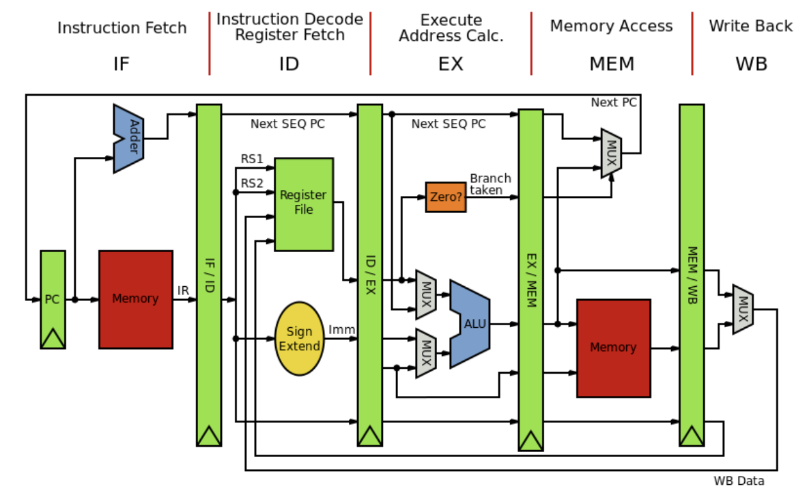

# Architecture & Compiler Overview

## Review

- hardware 개발 속도가 느려짐
- compilation:
  - c는 assembly로 거의 1:1로 매핑이 가능

## Instruction Level Parallelism

- parallelism for single stream of instructions
  - widely applicable (보통의 프로그래밍 언어는 sequential)
  - hardware 지원이 마련되어 있음
- done through a combination of programmer, compiler, and hardware

### type of instructions that can be done in parallel

- independent instructions!!
- ex:
  - ```c
    a = b + c;
    x = y + z;
    ```

### how does hardware support ILP?

> pipeline parallelism



- **N-stage pipeline => N instructions can be in flight at once**
- if instructions are independent, pipeline을 여러개 복사해서 동시 실행 가능!
- Dependencies stall the pipeline!!
  - 현재 instruction이 끝나야 다음 instruction이 시작됨
  - 해결: put independent instructions in between dependent instructions
- throughput: number of instructions per cycle
  - when pipelines are full, throughput increases

### How does hw execute ILP?

- VILW (Very Long Instruction Word) architecture
  - 원래는 컴파일러 encodes a big instr that combines multiple instrs
  - CISC에서 사용됨
  - not used anymore
- Superscalar architecture
  - sequential operation issues in parallel
  - 두개의 instr을 각 pipeline에 실행
  - issue-width: 한번에 parallel하게 내릴 수 있는 최대 instr 수
    - ex: pipeline이 4개면 issue-width가 4
- Out-of-order instructions
  - 다음 instr들을 보고 dependency가 없는 instr을 먼저 실행
- Example
  - Intel Haswell
  - Intel Nehalem
  - ARM
    - out-of-order execution가 많음 (x86는 조금 rigid함)
  - RISC-V

## Techniques to optimize for ILP

> try not to place dependent instr in sequence

### 1. independent for-loops (loop unrolling)
#### simple loop unrolling
```c
for (int i = 0; 1 < 12; i++) 1
    a[i] = b[i] + c[i];

// unrolling
for (int i = 0; i < 6; i+=2) 1
    a[i] = b[i] + c[i];
    a[i+1] = b[i+1] + c[i+1]; // independent from prev instr
```
- loop안에서 두배의 일을하지만 서로 independent하기 때문에 parallel하게 실행 가능!
- 총 loop의 iteration을 감소시키되, 한번에 더 많은 일을 함

#### unrolling for loops with independent chains of computation
```c
/*
SEQ(i) = instr1;
        instr2;
        ...
        a[i] = instrN;
instr(N) depends on instr(N-1)
*/
for (int i = 0; i < SIZE; i++) {
    SEQ(i);
}

// unrolling; instructions can be interleaved!
for (int i = 0; i ‹ SIZE; i+=2) {
    SEQ(i,1) ;
    SEQ(i+1,1);
    SEQ (i,2) ;
    SEQ (i+1,2) ;
    ...
    SEQ (i,N) ;
    SEQ (i+1, N);
}
```
- 근데 사실 이렇게 엮여있으면 instr이 dependent해서 도움이 안됨
- interleaving이 필요함!! 
  - ex: `SEQ_i(1)$ SEQ_{i+1}(1), SEQ_i(2), SEQ_{i+1}(2), ...`

### 2. reduction for loops (loop unrolling)
#### reduction loops
- entire computation is dependent
- typically short bodies (addition, mult, max, min)

### simple implementation
> 시프 5-1, 5-2 참고
```c
// apply some reduction operation with a[0] as the accumulator (REDUCE = OP)
for (int ¡= 1; 1 < SIZE; i++) {
    a[0] = REDUCE(a[0], a[i]);
}

// unrolling
// a[SIZE/2]에 accumulator를 하나 더 두었다고 생각하면 됨
// a[0]로 memory access하는 것보다 변수 두는게 더 효율적이긴 함
for (int 1= 1; i ‹ SIZE/2; i++) {
    a[0] = REDUCE(a[0], a[i]);
    a[SIZE/2] = REDUCE(a[SIZE/2], a[(SIZE/2)+i]);
}

a[0] = REDUCE (a[0], a[SIZE/2]); // combine the two accumulators
```

### caveats
- unrolling is great but can lead to register spilling!
  - register가 부족하면 memory에 저장해야함
  - memory access는 느림!
- resource model 제작
  - topological sort를 통해 resource 관리 => compiler가 복잡해짐 
    - register allocation이 어려워짐
  - compiler time도 고려 해야함!
    - compile time이 길면 리소스가 사라지는 경우 존재
    - scalar라는 언어가 그랫음...?
  