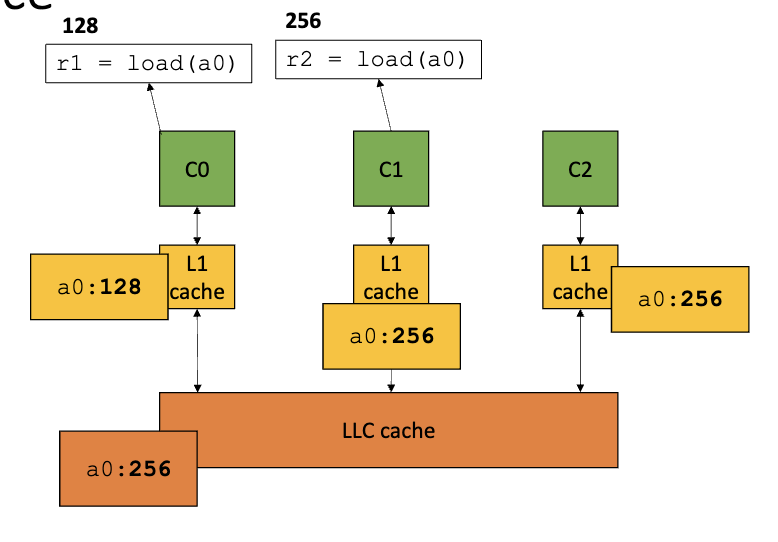
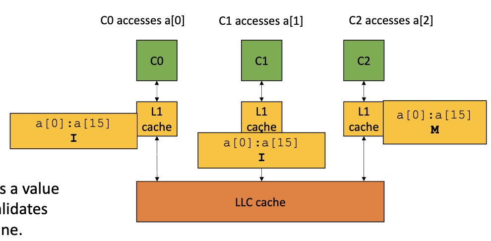
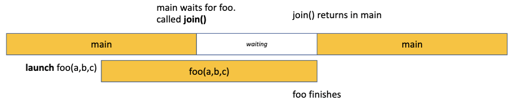

# Memory Hierarchy and C++ Threads

## Memory Hierarchy

### Core

- executes a stream of sequential ISA (Instruction Set Architecture) instr
- OS can preempt the cores (context switch)

### Memory 구조

- L1(4), L2(10), L3 cache
- LLC (Last Level Cache) (40 cycles)
- DRAM (200 cycles)
- main memory (너무 느려서 cache가 도입됨)

## overview of C/++ pointers & memory

- in C, pointers of array is 첫번째 element의 주소
  - pointer to integer location!

### passing arrays

```c
int increment(int * a){}; // recommended
int increment(int a[]){};
int increment(int a[10]){}; // the size here doesn't matter
```

- all the same
- 크기를 적어주는게 도움은 안되는데, helps compiler optimization & good documenting

### passing pointers

```c
int *a;
increment(a); // pass pointer directly
increment(&a[8]); // offset of 8
increment(a+8); // alternative offset
```

- 8의 offset을 더하면 compiler가 알아서 data type크기 만큼 곱해서 더해줌

### memory allocation

```c
int arr[10]; // stack

int *arr = (int *) malloc(10 * sizeof(int)); // heap
free(arr);

int *arr = new int[10]; // C++
delete[] arr;
```

## cache

- works with batches of memory locations (cache line)
- 한 메모리 주소를 읽으라고 내려오면, 그 주소를 포함하는 cache line을 가져옴
- 대다수의 프로그램은 locality를 가지기 때문!

### example

```c
int increment(int * a){
    a[0]++;
}
```

- `a[0]`를 load하려면 비쌈, but 한번에 cache line을 cache로 끌고 옴 (16byte)
- `a[1] - a[15]`는 다음번에 빠름
- `a[16]`은 다시 비쌈 => cache miss

### cache alignment

- 들고온 메모리가 한 cache line에 들어가도록 정렬
- 두개의 cache line으로 쪼개지면 메모리 접근을 두번할 수도 있음
- 더 나은 cache alignment를 위해 special aligned malloc function 존재
  - `posix_memalign` or `aligned_alloc`
- prefetching: 미리 메모리를 가져와서 cache hit을 높임

#### example

```c
int increment_several(int *b) {
    b[0]++;
    b[15]++;
}
int foo(int *a) {
    increment_several(&(a[8]));
}
```

- `b[0]`은 `a[8]`과 동일
- `b[15]`는 `a[23]`과 동일
- `a[0]`랑 `a[15]`같은 cacheline에 있어서 `a[15]` hit
- BUT `b[0]`는 `b[15]`와 다른 cacheline에 있어서 두개 다 miss 발생

### cache coherence

- how system manages multiple values for the same memory address
- incoherent views of values can happen since each core works locally with its own cache
- 

#### MESI protocol

- cache line can be in one of four states
  1. **Modified**: only in one cache, dirty --> needs to be written back to the main memory
  2. **Exclusive**: only in one cache, clean --> only one has a copy
  3. **Shared**: in multiple caches, clean --> multiple caches have a copy; they must all agree
  4. **Invalid**: data is stale and new value must be fetched from a lower level cache

> hardware informs other caches when one cache modifies a cache line

### false sharing
- reading location 0 and location 1 by two different cores
- 같은 cache line을 공유하기 때문에 같은 cache line을 가져와서 cache miss 발생!
- high level에서는 sharing이 없지만, low level에서는 sharing이 발생함
- padding을 이용해서 해결 가능



## C++ Threads
- `std::thread` in C++ and `pthread` in C
- run functions concurrently

### example

```c++
#include <thread>
using namespace std;

void foo(int a, int b, int *c){ // returns void!
    *c = a + b; // must pass a pointer or global variable! thread는 각자의 stack을 가지기 때문
}

int main(){
    int ret;
    thread t1(foo, 1, 2, &ret); // runs foo(1, 2, ret) concurrently
    t1.join(); // wait for t1 to finish

    cout << ret << endl; // if join() is not called, ret may not be updated (코드 순서 중요!)

    return 0;
}
```


- waiting을 하는 동안 main은 block되어 있음 (시간 낭비)
- `join()`을 하지 않으면 main이 먼저 끝날 수 있음
  - thread가 아직 안 끝났으면 error 발생
- thread는 `void`를 return하므로, return value를 받기 위해 pointer를 사용!!
  - global variable을 사용할 수도 있음
  - `std::ref`를 사용하면 reference로 넘길 수 있음

## SPMD Programming Model

- Single Program Multiple Data
- multiple threads run the same program but on different data

### example

```c++
#define THREADS 8
#define SIZE 1024

void increment_array (int *a, int a_size, int tid, int num_threads) {
    for (int i = tid; i < size; i += num_threads) {
        a[i]++;
    }
}

int main(){
    int a* = new int[SIZE];

    thread threads[THREADS];
    for (int i = 0; i < THREADS; i++) {
        threads[i] = thread(increment_array, a, SIZE, i, THREADS);
    }
    for (int i = 0; i < THREADS; i++) {
        threads[i].join();
    }
    delete[] a;
    return 0;
}
```
- 주의: thread를 사용하면 느려지기도 한데
  - if they have contention on the same cache line, 계속 cache miss 발생!
  - put them on different cache lines

#### improved
```c++
#define CACHE_LINE_SIZE 16

void repeat_increment(volatile int *a){
    for(int i = 0; i < iterations; i++){
        int tmp = *a;
        tmp++;
        *a = tmp;
    }
}

int main(){
    int arr[NUM_ELEMENTS * CACHE_LINE_SIZE];

    thread threads[NUM_ELEMENTS];

    for(int i = 0; i < NUM_ELEMENTS; i++){
        arr[i * CACHE_LINE_SIZE] = 0;
    }

    auto start = chrono::high_resolution_clock::now();

    for(int i = 0; i < NUM_ELEMENTS; i++){
        threads[i] = thread(repeat_increment, &arr[i * CACHE_LINE_SIZE]);
    }

    for(int i = 0; i < NUM_ELEMENTS; i++){
        threads[i].join();
    }

    auto end = chrono::high_resolution_clock::now();
    auto duration = chrono::duration_cast<chrono::microseconds>(end - start);
    double seconds = duration.count()/1000000000.0; // 나누기 확인

    cout << "Time: " << seconds << "s" << endl;

}
```
- `volatile`을 사용하면 compiler가 optimization하지 않음
  - don't read the value from the register/cache, but from the memory
  - embedded system에서는 가끔 이 변수가 change가 있었는지 모름 --> memory에서 읽는게 안전
  - depracated in C++11
- array공간을 낭비함으로써 같은 cache line 때문에 miss가 발생하지 않도록 함
  - 만약 cache line이 4라면, 0, 4, 8, 12, ...에 값을 넣어줌
  - cache line 전체를 끌고 와도 다른 thread가 접근하지 않음
    ```
    | 0 | - | - | - | 1 | - | - | - | 2 | - | - | - | 3 | - | - | - |...
    ```
