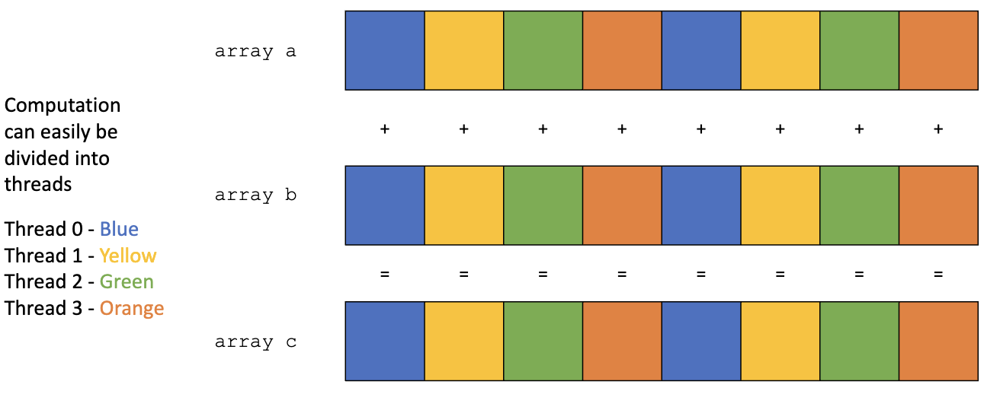
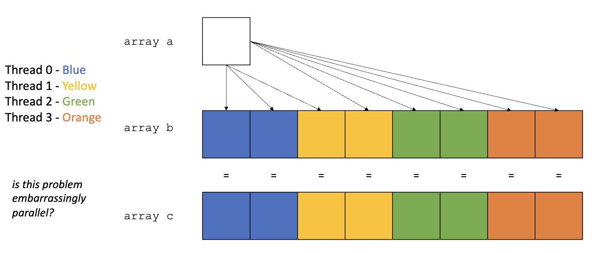
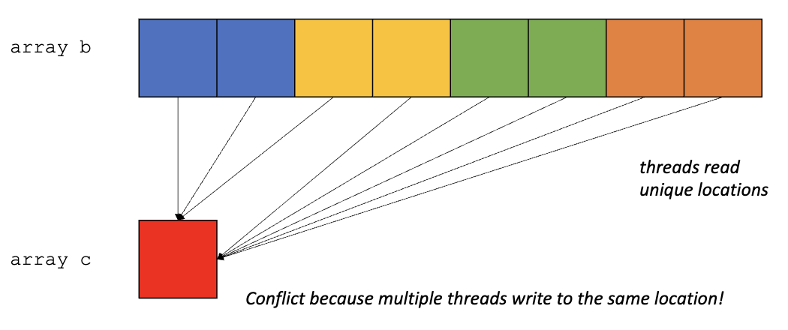
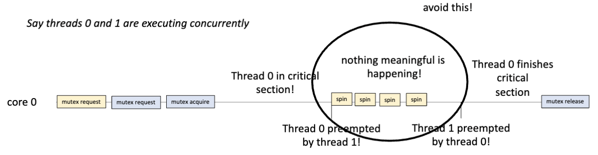
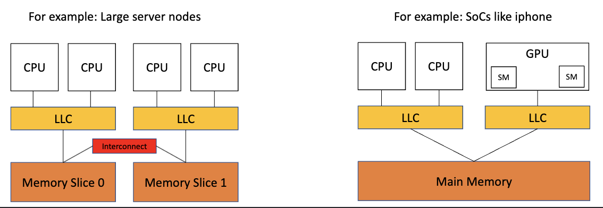
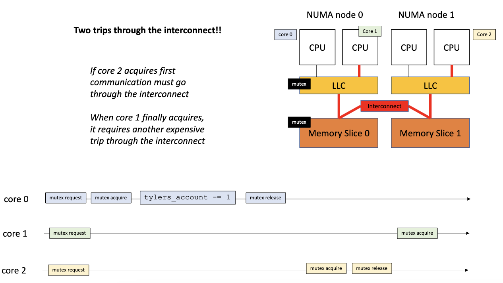

# Intro to mutual exclusion

## Concurrency vs. parallelism

- abstract: given an input, produce an output
- concrete tasks: application, function, loops, instr., etc.
- **Concurrency**: point in the execution where both tasks have started and neither has finished
  - interactive app들이 자주 사용 (even-driven)
    - used more by interactive apps (event-driven interfaces)
- **Parallelism**: if there is a point in the execution where computation is happening simultaneously
  - used to accelerate computation
    - often used by high performance computing

### sequential execution

```
          +------------+------------+
Core 0 =  |   task 0   |   task 1   |
          +------------+------------+
```

- Neither parallel nor concurrent (sequential)

### concurrent execution, but not parallel

```
          +------------+------------+------------+------------+
Core 0 =  |   task 0   |   task 1   |   task 0   |   task 1   |
          +------------+------------+------------+------------+
```

- context switching의 비용이 들어감 --> overhead
  - register 저장, cache flush, cache locality lost, etc.

### parallel & concurrent execution

```
          +------------+
Core 0 =  |   task 0   |
          +------------+
          +------------+
Core 1 =  |   task 1   |
          +------------+
```

- both tasks are running at the same time

### parallel, but not concurrent

```
          +------------+------------+
Core 0 =  |   task 0   |   task 1   |
          +------------+------------+
          +------------+------------+
Core 1 =  |   task 0   |   task 1   |
          +------------+------------+
```

- two tasks are running at the same time, but task 0 & 1 are not running at the same time
- 쪼개진 tasks끼리는 concurrency가 존재

> side note: condition이 금방 true가 될거 같으면 spin, 오래 걸린다 하면 yield (sleep)

## embarrasingly parallel

- tasks are independent of each other; no data conflicts!!
  - data conflicts: where one thread writes to a memory location that another thread reads or writes to concurrently and without sufficient synchronization

### ex:

- compute: `c[i] = a[i] + b[i]`



- false sharing 발생
- 같은 cache line을 이용하기 때문에 cache miss 발생

### ex:

- compute: `c[i] = a[0] + b[i]`



- all threads can read from the same val
- write가 아니라서 dependency가 없음

### ex:

- compute: `c[0] = b[0] + b[1] + b[2] + ... + b[N]`
- Not embarrasingly parallel --> 같은 곳에 write하기 때문에 dependency가 존재



## Use cases

> Many applications are NOT embarrasingly parallel

- graph algorithms
  - raking pages on the web
  - info spread in social media
- matrix multiplication
- UI
  - GUI thread & worker thread
  - [Therac 25: synchronization issue로 사람 사망](https://en.wikipedia.org/wiki/Therac-25)

## demo

- `account`에 race condition이 발생
- `thread 0` has N events and `thread 1` has M events
  - 총 interleaving의 경우의 수: $\frac{(N+M)!}{N!M!}$
- conflicts:
  - data tearing: when one thread reads a value that another thread is in the middle of writing
  - instr reordering: when the CPU reorders instructions to optimize performance
  - compiler optimization: when the compiler reorders instructions to optimize performance

## Synchronization

- resolve conflicts that arise from concurrent execution
- defines how to safely access shared resources
- (race-free programs are safe)

## Mutual Exclusion

## Mutexes

- synchronization object
- `lock`을 통해 critical section에 하나의 thread만 들어갈 수 있게 함
- 끝나면 `unlock`을 통해 다른 thread가 들어갈 수 있게 함
- expensive
  - cache flush, overhead to acquire lock, reduced parallelism, etc.
- locks need to be acquired and released in the same order!!!!
  - 같은 순서로 잡지 않으면 circular wait 발생
  - deadlock: when two threads are waiting for each other to release a lock!!
- assign different mutexes to access different data
  - ex: `mutex1` for `personal account` and `mutex2` for `business account`

### properties

1. mutual exclusion
   - only 1 thread at a time
   - critical sections cannot interleave
2. deadlock freedom
   - mutex 요청을 했을때, free하다면 바로 얻을 수 있어야 함
3. starvation freedom
   - fairness
   - mutex를 요청한 thread는 언젠가 mutex를 얻을 수 있어야 함
   - preemption 때문에 같은 thread가 계속 mutex를 차지 하는 경우는 많지 않음

## Atomic Instructions (RMW)

- Atomic Read-Modify-Write
  - primitive instructions that implement a read event, modify event, and write event indivisibly, (i.e. it cannot be interleaved)
- work as mutex alternatives
  - BUT not all architectures support atomic instructions
  - limits critical sections


## Atomic Properties

### atomic primitives
- `atomic_int`
- load, store is overloaded; will always to go memory (flush cache to DRAM)
- compiler & hardware memory fence 제공
- atomic이 안 들어가는게 훨씬 빠름
  - compiler `-O3` flag를 사용하면 그냥 `x = 1000`으로 바뀜 (no loops)

```c
#include <atomic>

int foo(atomic x) {
    x.store(1);
    for(int i = 0; i < 1000; i++) {
      x.fetch_add(1);
    }
    return x.load();
}
```

### compiler fence
- compiler can be aggressive w memory operations

#### example:
```c
a[i] = 0;
a[i] = 1;
// => a[i] = 1;로 optimized

x = a[i];
y = a[i];
// => x = a[i]; y = x;로 optimized

a[i] = 6;
x = a[i];
// => x = 6;로 optimized
```
- valid for non-atomic memory locations
- compiler가 바로 memory에 write하지 않고 register에 write하고 나중에 memory에 write함
  - but 이렇게 optimize되면 memory가 coherent하지 않음
- 언제 memory access가 발생하는지 알기 어려움

### memory fence
- 하드웨어는 instr 순서를 바꾸는 것을 좋아함 => 이것을 방지해야 lock, critical section이 순서대로 실행됨
- ensures that all memory operations before the fence are completed before any memory operations after the fence are started

## mutex implementation
### 1. first attempt
```c
void lock(){
  while(flag.load() == 1);
  flag.store(1);
}

void unlock(){
  flag.store(0);
}
```
- 둘다 load할떄 0이라고 뜸; store 하기 전에 context switch
- thread가 동시에 들어오면 존재하면 fail

### 2. second attempt
```cpp
class Mutex {
public:
  Mutex() {
    flag[0] = flag[1] = 0;
  }

  void lock(){
    int i = thread_id;
    flag[i].store(1);
    int j = i == 0 ? 1 : 0;
    while(flag[j].load() == 1);
  }

  void unlock(){
    int i = thread_id;
    flag[i].store(0);
  }

private:
  atomic_bool flag[2];
}
```
- thread마다 다른 flag를 사용 --> 서로 다른 thread의 flag를 보고 있음
- 동시에 lock을 걸면 deadlock 발생
  - 둘다 자기 flag에는 1을 넣으니까, 상대방 flag를 load하면 1이라서 무한루프
  - no deadlock freedom
- `lock()` 부분 생각해보기
- thread가 동시에 들어오면 존재하면 작동

### 3. third attempt
```cpp
class Mutex {
public:
  Mutex(){
    victim = -1;
  }

  void lock(){
    victim.store(thread_id);
    while(victim.load() == thread_id);
  }

  // no unlock

private:
  atomic_int victim;
}
```
- victim에다가 thread_id를 넣고, victim이 자기 thread_id가 아닐때까지 기다림
- 다른 thread가 mutex request를 하면 그떄서야 victim이 바뀌어서 lock을 얻을 수 있음
- volunteer to be the victim
  - if you are the victim, spin
- only works when they request at the same time
  - if one thread is already in the critical section, the other thread will spin forever
- both spin forever

### 요약
- flag version:
  - 동시에 요청 안 하면 작동
- victim version:
  - 동시에 요청할떄만 작동

## Peterson Lock
```cpp
class Mutex {
public:
  Mutex(){
    flag[0] = flag[1] = false;
    victim = -1;
  }

  void lock(){
    int j = thread_id == 0 ? 1 : 0;
    flag[thread_id].store(1);
    victim.store(thread_id);
    while(flag[j].load() && victim.load() == thread_id);
  }

  void unlock(){
    flag[thread_id].store(0);
  }

private:
  atomic_bool flag[2];
  atomic_int victim;
}
```
- mutual exclusion, deadlock freedom, starvation freedom
  - 자기가 victim이 되겠다고 자원을 하니까 starve가 발생하지 않음
- 상대방의 flag를 보고 있고, 자기가 더 이상 victim이 아닐때까지 기다림
- BUT only works with 2 threads
  - filter lock으로 확장 가능
> review!!!!!!

## Thread sanitizer
- `g++ -fsanitize=thread -g -o main main.cpp`
- provided in clang
- checks for data races
- just because you pass doesn't mean the code is correct
- also, overhead!

## Atomic Read-Modify-Write (RMW)
- primitive instruction that implements a read event, modify event, and write event indivisibly

### atomic_fetch_add

``` c
int atomic_fetch_add(int* ptr, int val){
  int old_val = *ptr;
  *ptr = old_val + val;
  return old_val;
}
``` 
- load and store 사이에 원래 interleaving이 가능헀지만, atomic_fetch_add는 그것을 방지함

### exchange lock
- atomic_exchange
- N-threaded mutex with 1 bit
- simplest
- 새로운 값을 저장하고 이전 값을 반환
- mutex가 false면 lock을 얻음
  - mutex가 true면 계속 기다림

```cpp
value atomic_exchange(atomic *a, value b) {
  value temp = a->load();
  a->store(b);
  return temp;
}

void lock() {
  while (atomic_exchange(&flag, 1) == 1);
}
```

### compare and swap
- atomic_compare_exchange
- x86에서는 instruction이 있음 // ARM/POWER에서는 load linked and store conditional
- most versatile
- 주어진 값이랑 expected가 같으면 desired로 바꿈
  - return true
- actual $\neq$ expected
  - return false
- expected is passed by reference

```cpp
bool atomic_compare_exchange(atomic *a, value *expected, value desired) {
  if (a->load() == *expected) {
    a->store(desired);
    return true;
  }
  return false;
}

void lock() {
  while (atomic_compare_exchange(&flag, 0, 1) == false);
}

void lock() { // 다른 버전인듯..?
  bool expected = false;
  int acquired = false;
  while (!acquired) {
    acquired = atomic_compare_exchange(&flag, &expected, true);
    expected = false;
  }
}

void unlock() {
  flag.store(0);
}
```
- starvation 발생할 수도
  - 대기 순서대로 lock을 얻는게 아님

### ticket lock
- ticket, turn을 이용해서 starvation 방지
- `int atomic_fetch_add(int* ptr, int val)`를 사용
- fairness

```cpp
int counter = 0; // 더 이상 1 bit으로 표현 불가
int current_ticket = 0; // 어느 티켓이 다음인지 tracking 필요

void lock() {
  int my_ticket = atomic_fetch_add(&counter, 1);
  while (current_ticket.load() != my_ticket);
}

void unlock() {
  current_ticket.store(current_ticket.load() + 1);
}
```

## Pessimistic Concurrency
- lock을 걸고 unlock을 할때까지 다른 thread가 접근하지 못하게 함
- x86 => locks the memory location
- 실제로 content이 있을때는 좋은 방식
  - 하지만 contention이 별로 없을 경우 (many threads accessing the same place), overhead가 큼
- assume conflicts will happen and defend against them from the start
  - paying upfront for the cost of synchronization

## Optimistic Concurrency
- ARM의 load/store exclusive instruction
- assumes no conflicts will happen
  - if a conflict happens, it will retry (CAS를 loop로 돌림)
- contention이 적을때 좋음 

## Optimizations
### Relaxed Peeking
- RMW's are expensive --> 매번 modify를 하지 않고, peek만 함

```cpp
void lock(){
  bool e = false;
  bool acquired = false;
  while(!acquired){
    while(flag.load() == true);
    e = false;
    acquired = atomic_compare_exchange(&flag, &e, true);
  }
}
```
- cache does not need to be flushed bc we are not modifying the value
  - lock을 잡은건 아님
- BUT loads still cause bus traffic (RMW보다는 덜 하지만)
- in non-parallle systems, concurrent threads can get in the way of progress
  - context switching 이후 의미 없는 spinning이 발생
  - 

### Backoff
- tell the operating system to not schedule the thread for a while
  - mutex를 가지고 있는 다른 thread가 실행될 수 있게 함

```cpp
void lock(int tid) {
  bool e = false;
  bool acquired = false;
  while(!acquired) {
    while(flag.load(memory_order_relaxed) == true)
      this_thread::yield();
    e = false;
    acquired = atomic_compare_exchange(&flag, &e, true);
  }
}
```
- `sleep()` can be used instead of `yield()`
- exponential backoff
  - every time thread wakes up, 2배만큼 sleep
  - `sleep(2^k)` where `k` is the number of times the thread has tried to acquire the lock
- tuned sleep time
  - keep track of sleep time
  - every time you spin, increase sleep time
  - acquire --> reduce sleep time

### try_lock
- one-shot mutex attempt
- if lock is not acquired, return false or go to sleep/yield


### reader-writer lock
- multiple readers can access the data at the same time
- only one writer can access the data at a time
- reader & writer 동시 접근 불가

```cpp
int num_readers = 0;
bool writer = false;
mutex m;


void reader_lock() {
  bool acquired = false;
  while(!acquired) {
    m.lock();
    if(!writer) {
      num_readers++;
      acquired = true;
    }
    m.unlock();
  }
}

void reader_unlock() {
  m.lock();
  num_readers--;
  m.unlock();
}

void lock() {
  bool acquired = false;
  while(!acquired) {
    m.lock();
    if(!writer && num_readers == 0) {
      writer = true;
      acquired = true;
    }
    m.unlock();
  }
}

void unlock() {
  m.lock();
  writer = false;
  m.unlock();
}
```
- potentially starves writers

### hierarchical locks
- multiple locks with different levels of granularity
- NUMA (non-uniform memory access) systems & heterogeneous systems (CPU GPU)
  - any sort of communication is expensive
  - spinning triggers coherence protocols
  - cache flushes between NUMA nodes is expensive (transferring memory between critical sections)

    

  - mutex가 memory slice 1에 있는데, numa node 1이 mutex를 request하면 mem slice 1 & 2가 연결이 되어야 함



  - core 1 & 2가 요청을 하면 interconnect trip을 2번 해야함
  - 근데 LLC로 소통이 가능한 core 1이 먼저 lock을 받으면 interconnect는 core 2에게 줄때 한번만 통과함
  - 즉, if thread T in NUMA node N holds the mutex, 
    - the mutex shuould prioritize other threads in NUMA node N to acquire the mutex when T releases it

#### Code
- CAS 살짝 수정 + targetted sleeping
  
```cpp
int m_owner = -1; // -1 means the mutex is free

void lock(int tid) {
  int e = -1;
  int acquired = false;
  while(!acquired) {
    acquired = atomic_compare_exchange(&m_owner, &e, tid); // 이 전에 CAS는 tid대신에 true를 넣었음
    if(tid / 2 != e/2) // not in the same NUMA node, sleep for longer
      this_thread::sleep_for(10ms);
    else
      this_thread::sleep_for(1ms);
    
    e = -1;
  }
}

void unlock(int tid) {
  m_owner.store(-1);
}
```
- Given a thread ID, we can compute the NUMA node ID of the thread using integer division (floor)
  - $\frac{tid}{{num\_threads\ per\ NUMA\ node}}$
  - GPUs give this as a builtin
- tune sleep time to avoid starvatioin
  - have internal mutex tstate to count how long the mutex stayed within the same NUMA node
  - ex: 같은 노드가 mutex를 가질때 마다 counter를 증가 시킴
    - 다른 노드가 mutex를 가지면 counter를 초기화

## When to use what
- spinning
  - short waits on non-oversubscribed systems
  - over-subscribed systems are systems where there are more threads than cores
- sleeping
  - useful for regular tasks
  - tasks that occur at set frequencies
  - critical sections take roughly the same time
  - sleep time can be tuned
- yielding
  - useful in over-subscribed systems w irregular tasks
  - modern systems --> yield is usually sufficient