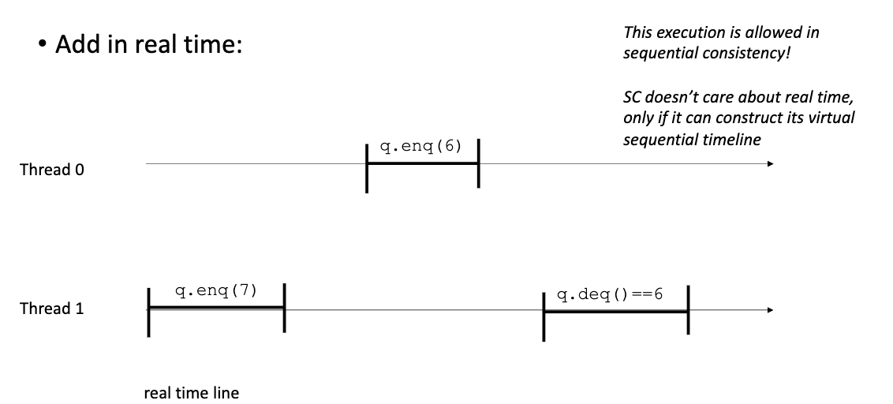
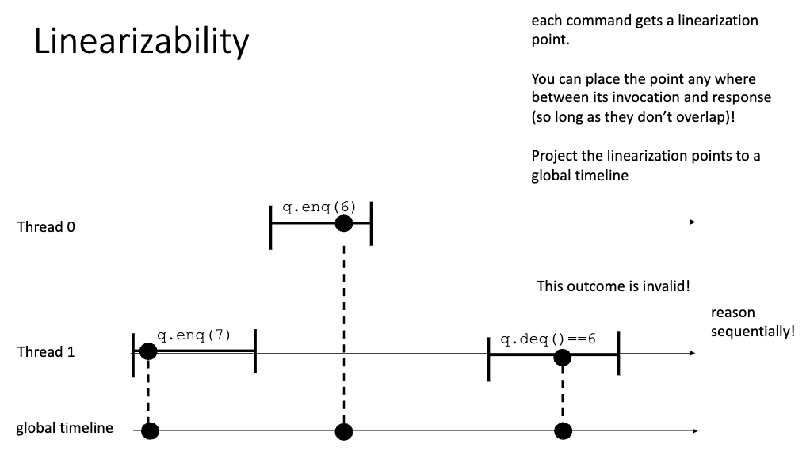

# Concurrent Data Structures

## Data Conflicts/Races Catastrophes
> There are no benign data races

- Therac 25: radiation therapy gone wrong
- 2003 NE power blackout

## Tools to find data conflicts
- hapens before
  - build partial order of mutex locks and unlocks
  - any memory accesses that can't be ordered in this partial order is a conflict
  - transitive closure of the critical sections
- lockset
  - every shared memory location is associated with a set of locks
  - refine lockset on every access
  - if location is later access without the previous locks for the location --> report conflict
- thread sanitizer
  - dynamic analysis tool passed to the compiler
  - 10x overhead 
  - identifies data conflicts & deadlocks
- Meta Infer    
  - statically check for many issues (works on source code)
  - check for races in concurrent classes

## Concurrent Data Structures
- objects: user-sepcified abstrctions
  - collection of data & methods representing something more complicated than primitives types
- abstraction, encapsulation, and modularity/composability
- no need to use locks to access/mofify the data structure
- mutexes reduce parallelism & require many RMW operations

### examples
- `fflush`를 사용해서 buffer를 비워주는 것도 가능 (slow)
- threads can access the same data structure concurrently
- quadtree
  - 각 네모의 computation 양이 비슷하도록 그림을 쪼갬
  - this also uses a concurrent data structure

### Properties
- correctness
  - how they should behave (specification)
- performance
- fairness
  - under what conditions can they deadlock

## Concurrent queue
- sequential specification
  - `enqueue` and `dequeue` operations

### example
- thread 1
  - `enqueue(6)`
  - `enqueue(7)`
- thread 2
  - `t = dequeue()`
- t가 될 수 있는 값은 {None, 6, 7}
  - BUT 7이 되기 위해서는 thread 1은 out of order로 실행되어야 함
    - like: `enqueue(7)` -> `enqueue(6)` -> `dequeue()` 
    - 이는 sequential consistency를 만족하지 않음

### sequential consistency
- valid executions correspond a sequentialization of object method calls
- 함수가 불려지는 순서들은 바뀌어도, 함수 안에 있는 instruction들의 순서들이 바뀌진 않음
  - instructions inside methods cannot be interleaved
  - per thread "program order" must be respected
- not enough specification for concurrent data structures
  - 실제 함수의 순서에 대한 제약을 제공하지 않음
- sequentialization must respect per-thread 'program order'
  - order in which the object method calls occur in the thread
  - ex: enqueue1 -> enqueue2 -> dequeue2 -> dequeue1
- interleaving의 경우의 수
  - $\frac{(N+M)!}{N!M!}$
  - N, M are events not instructions!!!

### reasoning about concurrent data structures
- 만약 어떤 outcome이 가능하다면, 그 outcome을 만들어내는 interleaving이 존재한다
- 가능한 sequential sequence가 없다면, 그 outcome은 불가능하다
- BUT sequential consistency는 충분하지 않음
  - even if objects in isolation are sequentially consistent, programs composed of multiple objects might not be
  - only considers its virtual sequence timeline
  - ex: 만약 각 process의 virtual sequence timeline이 다르다면, 이는 sequential consistency를 만족하지만, 이는 concurrent data structure의 spec을 만족하지 않음
  - 

## Linearizability
- defined in term of real-time histories
- sequential consistency + real-time
  - sequential은 약간 lego brick 쌓는 느낌 vs. linearizability는 slider 느낌
- linearization point
  - each operation has a linearization point (unique)
  - can be anywhere between invocation and response (event가 시작하고 끝나는 지점 사이 어딘가,, 겹치지만 않으면 ok)
  - indivisible computation
  - object update/read occurs at this point
  - mapped to a global time line
  - 
- strictly stronger that sequential consistency
  - if a behaviour is disallowed under SC, it is also disallowed under linearizability
  - locked data structures are linearizable

## Progress Properties
- blocking
  - a thread is blocked if it is waiting for an event that will never occur
- linearizability does not dictate that one needs to wait for another thread to finish
- non-blocking
  - every thread is allowed to continue executing REGARDLESS of the behaviour of other threads
  - specification property (not an implementation property)