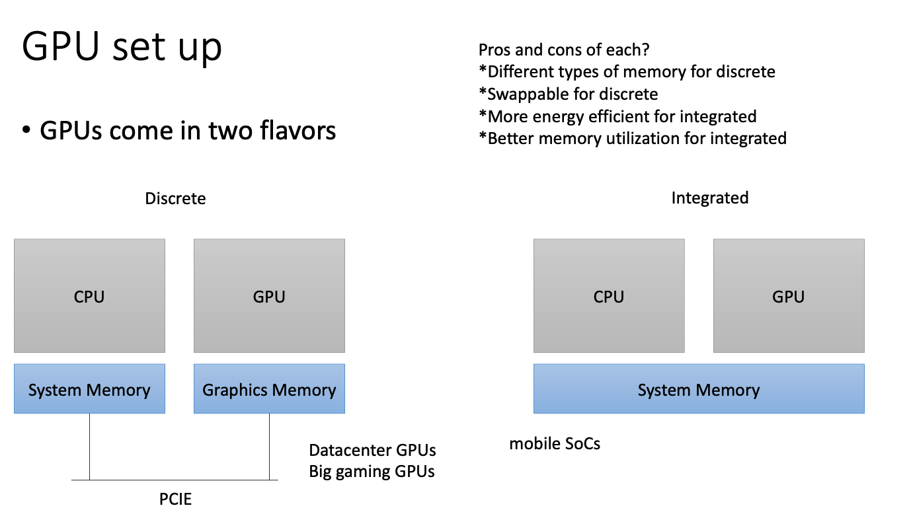
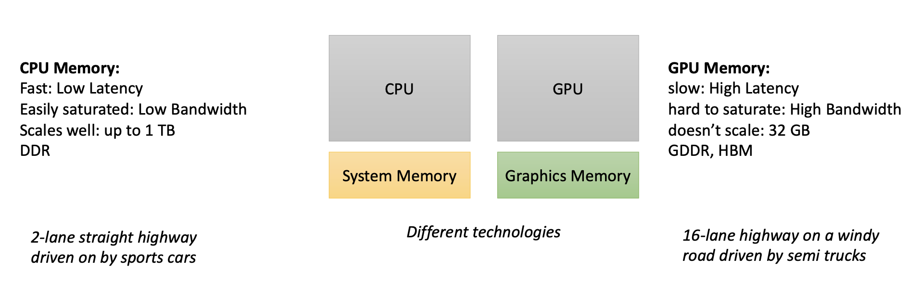
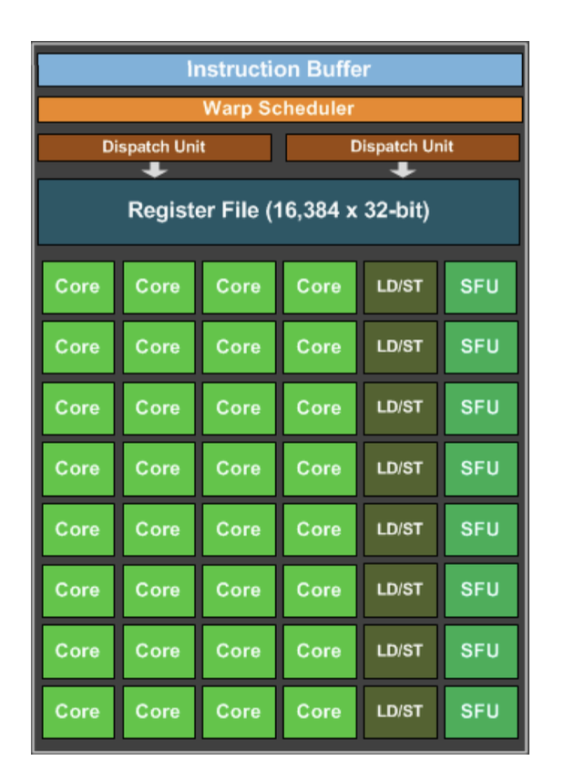
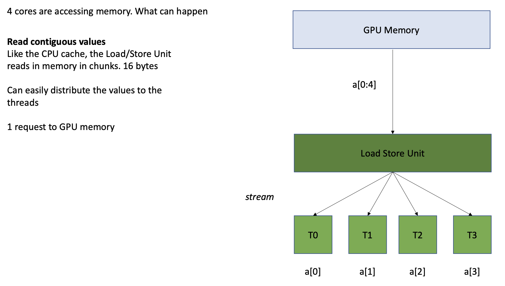

# GPU


## GPU set up
- allocate and initialize memory
 
### types


- although mobile GPUs share the system memory, most still require you to program as if they didn't have shared memory
- CPU-GPU communication is not fully supported
  - coherence, fences, and RMWs might not be supported
- left-side
  - heterogenous, parallel, programming model
  - CPU is the host, GPU is the device
  - need to allocate GPU memory on the host
    - `cudaMalloc(&d_x, SIZE*sizeof(int));` (CUDA)
    - `*d_x` is a pointer in the CPU memory that points to the GPU memory
    - pointer can be passed around but CPU can't access the memory
    - GPU has no access to input devices (e.g. disks)

### GPU program
- kernel: special function that runs on the GPU
  - keyword: `__global__`

example:
```cpp
__global__ void add(int *d_a, int *d_b, int *d_c, int size) {
  for(int i = 0; i < size; i++) {
    d_a[i] = d_b[i] + d_c[i];
  }
}

// calling the function
// pass in pointers to GPU memory
// constants cant be passed the same way
vector_add<<<1, 1>>>(d_a, d_b, d_c, size); 
e |= cudaDeviceSynchronize();

// $ nvcc main.cu -o main
```

- use `cudaMemcpy` to copy data between CPU and GPU
  - `cudaMemcpy(d_a, h_a, SIZE*sizeof(int), cudaMemcpyHostToDevice);`
  - `cudaMemcpy(h_a, d_a, SIZE*sizeof(int), cudaMemcpyDeviceToHost);`
- OS expects GPU kernel to be fast to render graphics
  - if it takes too long, OS will kill the kernel


## First Parallelization Attempt
```cpp
_gLobal__ void vector_ add (int * d_a, int * d_b, int * d_c, int size) {
  int chunk_size = size/blockDim.x; 
  int start = chunk_size * threadIdx.x;
  int end = start + end;
  for (int i = start; i ‹ end; i++) {
    d_a[i] =d_b[i]+d_c[i];
  }
}


vector_add<<<1, n>>>(d_a, d_b, d_c, size);  // n threads
```
- about 14 times speedup

## GPU memory


- bandwidth:
  - GPU: ~700 GB/s
  - CPU: ~50 GB/s
- memory latency:
  - GPU: ~600 cycles
  - CPU: ~200 cycles
- cache latency
  - GPU: ~20 cycles for L1 hit
  - CPU: ~4 cycles for L1 hit

### using preemption to hide latency
- preemption: switching between threads
- since memory loads are slow, the GPU can switch to another thread while waiting for the load to finish
- registers all stay on the chip so the context switch is fast and less expensive
- dedicated warp scheduler
  - warp: group of 32 threads
  - scheduler can switch between warps


### optimizing memory access


- streaming multiprocessor
- warp execution
  - instruction fetched from the buffer and distributed to all the cores
  - all cores need to wait until all cores finish the first instruction
  - then move on to the next instruction
- why?
  - to have more cores (share program counters)
  - efficient to share hardware resources

#### broadcasting reads



- memory chunk can be distributed like that
- or a single value can be broadcasted to all threads
- reading non-contiguous memory is slow
  - need to make 4 requests to GPU memory

> [!TIP]
> Access the memory in a strided way to take advantage of broadcasting!!! <br>
> ex: `| A | B | C | D | A | B | C | D |` <br>

updated code:
```cpp
__global__ void vector_add (int * d_a, int * d_b, int * d_c, int size) {
  for (int 1 = threadIdx.x; 1 < size; i += blockDim.x) 
    d_a[i] = d_b[i] + d_c[i];
}

vector_add<<<1, 1024>>>(d_a, d_b, d_c, size);
```
- about 4 times faster

### multiple streaming multiprocessors
- most GPUs have multiple SMs (streaming multiprocessors)
- CUDA provides virtual streaming multiprocessors called blocks
  - hide memory latency
  - very efficient at launching and joining blocks
  - no limit on blocks
    - launch as many blocks as you need to map 1 thread to 1 data element

```cpp
_global__ void vector_add (int * d_a, int * d b, int * d_c, int size) {
  int i = blockIdx.x * blockDim.x + threadIdx.x;
  d_a[i] = d_b[i] + d_c[i];
}


vector_add<<<1024, 1024>>>(d_a, d_b, d_c, size); // 1024 elements, 1024 threads
```

## javascript multithreading
- `async`
  - concurrent (executes on same thread)
  - good for I/O and user interactions
- web workers
  - execute on multiple cores
  - better for computing intensive applications
  - better performance

## WebGPU
- language: wsgl (WebGPU Shading Language)
- wsgl is compiled (vulkan (linux), metal (mac), hlsl (windows))
  - no printing --> difficult to debug
  - not javascript!! -> js is interpreted (not possible on GPUs)

### variable types
- variable type is optional
- compilers can infer types
- sometimes you need to specify types (ex: double precision instead of float)
- types: `i32`, `u32`, `f32`, `vec2<f32>`, `array<type>`
- structures
- built-ins (global id)
- built-in functions
  - arrayLength, sqrt, pow, distance

```wsgl
var a = 1; // inferred as int
```


> [!NOTE]
> overloading: 
> - same function but different paramters <br>
> - compiler can infer types <br>
> - ex: `f(int i)` & `f(vec2 v)` both `f()` but different parameters<br>
>

> [!TIP]
> example interview question: <br>
> function overloading vs overriding <br>
> - overriding: redefine a function in a subclass; used with inheritance
>   - the function is actually in the superclass, but the subclass has a different implementation
> - overloading: same function name but different parameters


### for loops
```wsgl
for (var i : u32 = 0u; i < arrayLength(a); i = i + 1u) {
  // do something
}
```