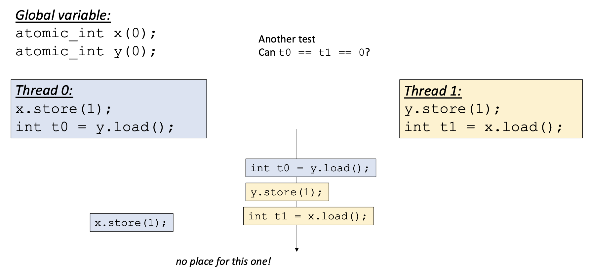
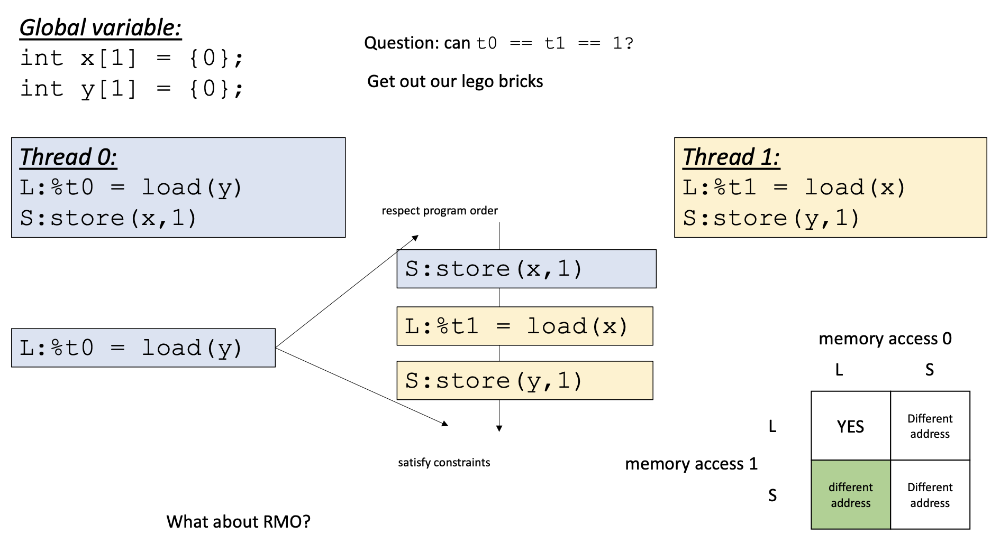
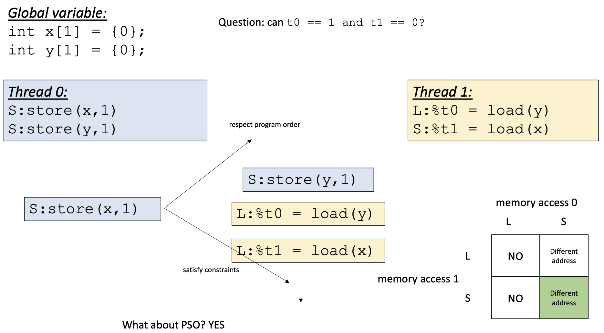
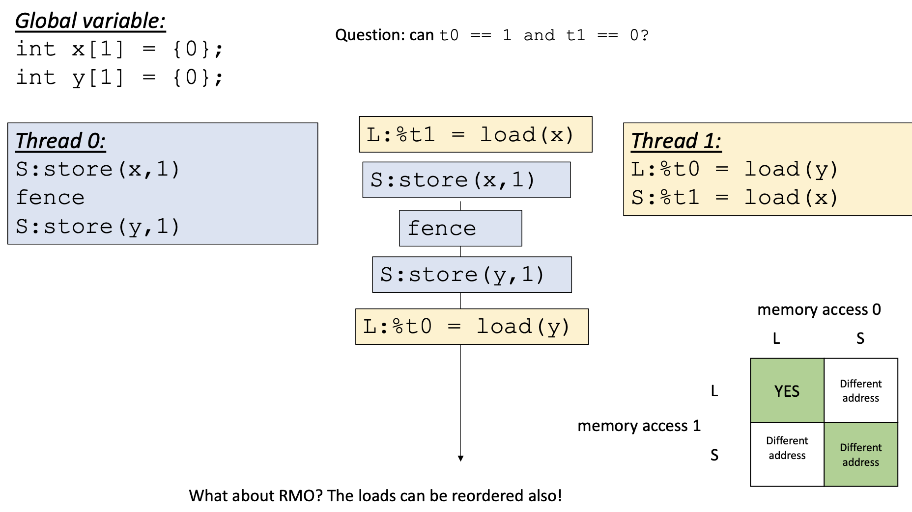
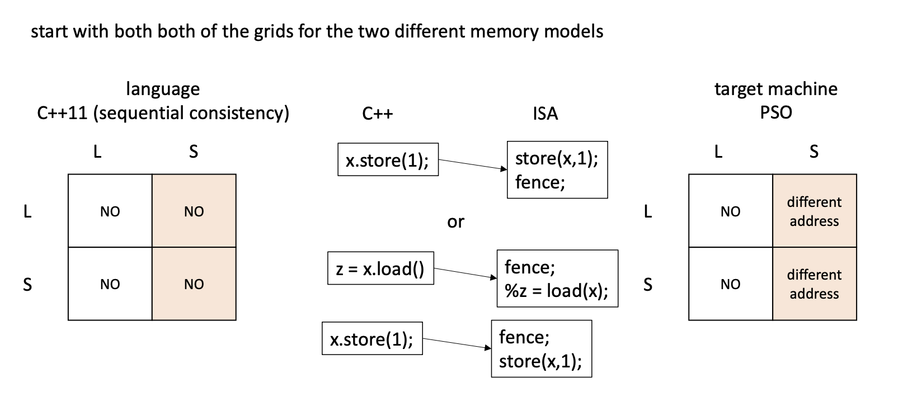

# Memory Models
## memory consistency
- sequential consistency --> you can only order threads; instructions within a thread cannot be reordered
  - program order is sequential
- plain atomic accesses are documented to be sequentially consistent
  - SC doesn't work compossibly
  - two objects that are SC might not be SC when combined (no compossibility)
  - BUT programs contain only 1 shared memory; no reason to compose diff main mems
    - c++ provides atomic sequential consistency
- ISA
  - not SC
- 

## relaxed memory model
- has a store buffer where stores are held before being written to memory
- threads check store buffer before going to main mem
  - cheap and close to check
- x86 (most conservative)

### relaxed memory consistency
- store buffer can reorder stores execution that is not allowed by SC
- weak memory behaviour
- x86, c++ (but if you use atomic, it's SC)
  - relaxed memory model due to store buffer
- sometimes, reordering is useful for performance and doesn't affect the program
  - provides special instructions that disallow weak memory behaviour (aka. fences)
  - ex: `mfence` instruction
- they try to delay to store as much as possible (flush together)
  - store buffer is kept as a queue (FIFO)
  - order is preserved
- loads are done earlier so the data is prepared before it is even needed


### litmus test
- collection of tests to check memory consistency
- small concurrnet programs that check for relaxed memory consistency

### fences
- restore sequential consistency
- special instructions that disallow weak memory behaviour

## TSO (total store order)
### rules
- all behaviours that can be observed in x86
1. stores followed by a load do not have to follow program order
2. stores cannot be reordered past a fence in program order
3. stores cannot be reordered past loads from the same address

```plain
      mem access 0
       L        S
   +-------+-------+
L  |  NO   |  YES  |
   +-------+-------+
S  |  NO   |  NO   |
   +-------+-------+

YES = diff address
```
- it would be all NO if it was SC
- if memory access 0 appears before mem access 1 in program order, can it bypass program order?

## PSO (partial store order)
```plain
      mem access 0
       L        S
   +-------+-------+
L  |  NO   |  diff |
   +-------+-------+
S  |  NO   |  diff  |
   +-------+-------+
```

## RMO (relaxed memory order)
```plain
      mem access 0
       L        S
   +-------+-------+
L  |  YES  |  diff |
   +-------+-------+
S  |  diff |  diff  |
   +-------+-------+
```

## other memory models
- fences can always restore order!!
- accesses cannot be reordered past fences
- so all NO

## example 1


- Not allowed in SC, TSO, and PSO
- in order to disallow in RMO
  - place a fence before `S: store x = 1`

## example 2


- Not allowed in SC and TSO
- RMO
  - 


## C++11 atomic operation compilation
- C++ is SC while target architecture might not be
- to keep C++ atomic, compiler needs to generate fences
- 

### memory orders
- `memory_order_relaxed`
  - weakest
  - all four boxes are `diff address`
- `memory_order_seq_cst`
  - default
  - all four boxes are `NO`
  - basically no ordering except accesses to the same address