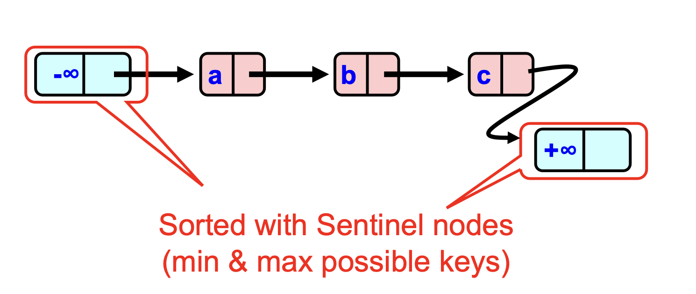

# Concurrent General Set

> [!NOTE]
> stacks have high contention because all operations are on the top of the stack  
> queues have relatively lower contention because operations are on both ends of the queue  

## Set Interface
- unordered collection of elements
- no duplicates
- list-based set
  - `add`, `remove`, `contains`
  - 

## Coarse-Grained Locking
- one lock for the entire set
- simple but inefficient

## Fine-Grained Locking
- split object into multiple pieces
  - each piece has its own lock
  - methods that work on disjoint pieces need not exclude each other 
- pros
  - threads can traverse in parallel
- cons
  - acquires and releases locks for every node traversed
    - long chain of acquires and releases
  - reduces concurrecy (traffic jams) --> inefficient

### One method: Hand-over-Hand Locking
- have two locks for each node
  - one for the node itself
  - one for the next node
- having two locks ensures that the node is not removed while traversing the list

## Optimistic Synchronization
- assume no conflicts
- check before committing
- if conflict, retry