# Lab 1: Intro to Networks, Unix, and Python Primer

> Name: Rachel (Younwoo) Park <br>
> Student ID: 2172344 <br>
> Due: 10/5/2024 by 11:59pm <br>

## Unix Practice [20 points]

In this section you will learn or review some useful Unix commands. Test your commands and your Python program on a
Linux machine.

### 1. Practice with directories and files

a. From a shell/ command prompt on either a linux device or a PC, what is the complete command to log in to the UCSC
Unix Timeshare (unix.ucsc.edu)? Test your command by logging in and include a screenshot.

- `sudo ssh ypark55@unix.ucsc.edu`
- 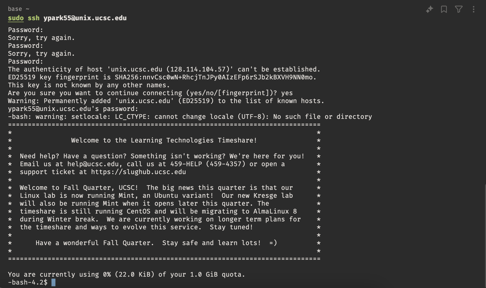

b. What command can be used to list all the files and directories (including hidden files) in the present working
directory? Run the command in one of your directories and include a screenshot of the command and the resulting
output. (If you don't have files, create a few random ones, you will need them later on).

- `ls -a`
- 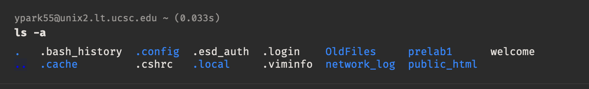

c. What command can be used to list all the files and directories in the present working directory in chronological
order (based on the last modified date)? Run the command and Include a screenshot showing the resulting output.

- `ls -lt`
- 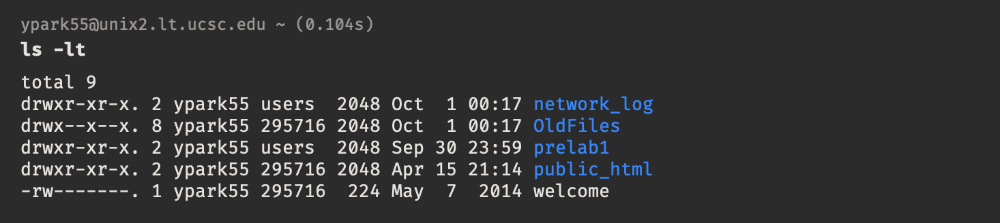

- if you want to see the hidden files, you can use `ls -alt`
- 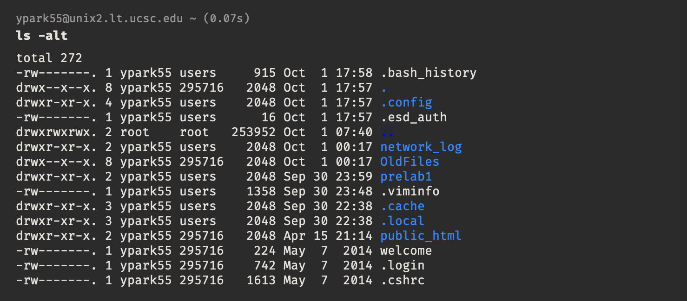

d. What command is used to display the current directory?

- `pwd`
- output: `/afs/cats.ucsc.edu/users/u/ypark55`

e. What command is used to create a directory named "prelab 1" in your home
directory? What is the complete path name to this directory?

- `mkdir ~/prelab1`
- path: `/afs/cats.ucsc.edu/users/u/ypark55/prelab1`

f. What command is used to move to the root directory?

- `cd /`

---

<div style="page-break-after: always;"></div>


### 2. Working with Files

Copy the two files file1.txt and file2.txt into your directory and use them for questions (a),(b) and (c)

a. What is the single line command to display the contents of the two files?

- `cat file1.txt file2.txt`

b. What complete command allows you to see the line by line differences between these two files? Run the command and
include a screenshot showing the results of running the command.

- `diff file1.txt file2.txt`
- 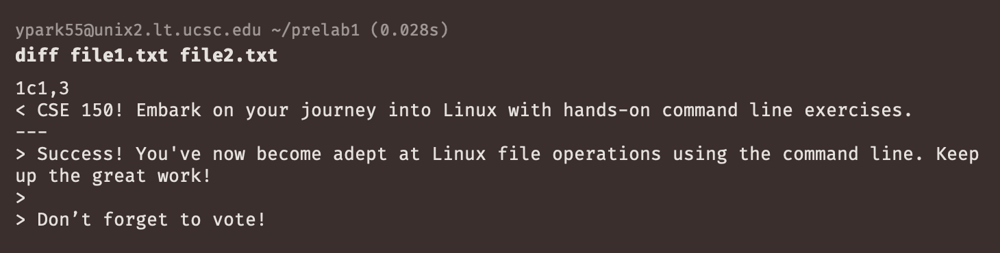

c.
What complete command is used to concatenate these two files and store the output to a new file named file3.txt? Run the
command and Include screenshot showing the command and the resulting contents of file3.txt

```
cat file1.txt file2.txt > file3.txt
cat file3.txt
```

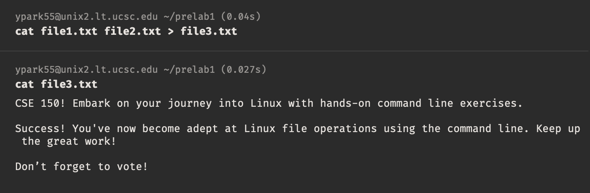

d. What complete command would you use to move file3. txt from your current
directory to a directory having relative path "/dir2"?

- `mv file3.txt ../dir2/`

e. What complete command would you use to delete a file named file 1 .txt? Can the file be recovered once this command
is issued? Why or why not? Explain.

- `rm file1.txt`
- After using the `rm` command, it cannot be recovered. Although, the file data may still exist on the disk until it is
  overwritten. (If you know the inode number, it may be possible to recover the file.)

f. What command would you use to search for the string "vote" in "file.txt" in the same directory as "file3.txt" is
located in?

- `grep "vote" file3.txt`

---
<div style="page-break-after: always;"></div>

### 3. Moving files around the network

Create a directory named “network_log” (as shown below) in your home directory on the Unix Timeshare Server. In that
directory, create the structure below with three .txt files, a png and a pdf file.

```text
<user_directory>
└── network_log
├── f1.txt
├── f2.txt
├── f3.txt
├── a.png
└── b.pdf
```

What is the complete command to non-recursively copy all of the .txt files into your local computer’s current working
directory? (This can either be on your own laptop or the lab computer.)
Using this command, demonstrate that your command works by displaying a screenshot of the directory listing on the Unix
server and then after the copy, show the directory listing on your local machine.

```bash
scp ypark55@unix.ucsc.edu:/afs/cats.ucsc.edu/users/u/ypark55/network_log/\*.txt .
```

Unix server:

- 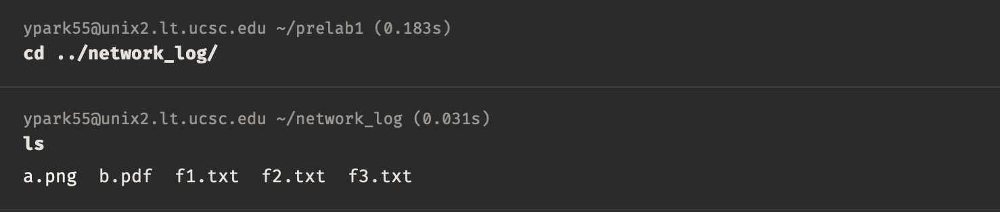

Local machine:

- 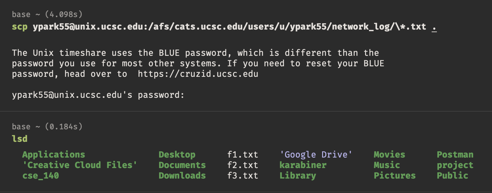

---
<div style="page-break-after: always;"></div>

## Traceroute

The Traceroute program sends a series of probes (messages carried in a packet) from a source
to a destination over the network. Each probe travels part-way to the destination until finally the destination is
reached. The probes travel “hop by hop”, meaning from one router to the next on
the path to the destination. In each iteration the probes incrementally get one hop closer to the destination until
finally, in the last iteration, the destination is reached.

Note: When working on the problems, if Traceroute is hanging and doesn’t complete, talk to
your TA. Multiple lines with **_ and no completion is not what we are looking for in this exercise
and will not receive credit. _** most likely means the router receiving the probe is not
responding. Overall the majority of lines must display a normal response from the router

### 4. Basic traceroute

Run Traceroute between your computer and www.vote.org. Include a screenshot of the output and answer the following
questions based on the output in your screenshot:

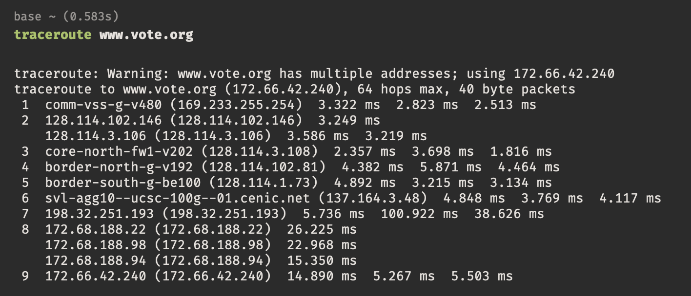

a. What does each of the numbered lines represent?

- Each numbered line represents a hop
  - A hop is move that data makes as it goes from one network device/router to another
  - Each hope shows the network latency between the source and the destination.
  - The first hop is the source, and the last hop is the destination.

b. Choose one of the output rows and circle the 3 time measurements displayed. Explain what they represent.

- The three time measurements represent the length of time (in ms) to send the ICMP(Internet Control Message Protocol)
  packet from the source to the destination and back to the source.

c. How do you expect the time measurements in row #1 to differ from row #2? Greater? Less? The same? Explain your
reasoning by focusing on the operation of each row in the program output

- It is expected that time measurements in row #1 is **less** than row #2 because the first hop is typically the local
  router which is close to the source. As the packets move further from the source, the latency tends to increase due to
  greater physical distance and other factors. (row #1 time < row #2 time)

d. Define hop count. Based on your definition, how many hops are there between your computer and the final destination?
Mark up your screenshot as needed

- Hop count refers to the number of network devices that a packet travels until in reaches its destination. There are 9
  hops in this traceroute output.

[source](https://www.fortinet.com/resources/cyberglossary/traceroutes)

---
<div style="page-break-after: always;"></div>

### 5. North America

Run Traceroute between your computer and a destination on this continent (North America) at three different run times:
morning, mid-day and night. Make sure that you are in the SAME location - i.e. at home or at school etc. for each of the
runs. Record your results in the table below capturing the time to reach the final destination.

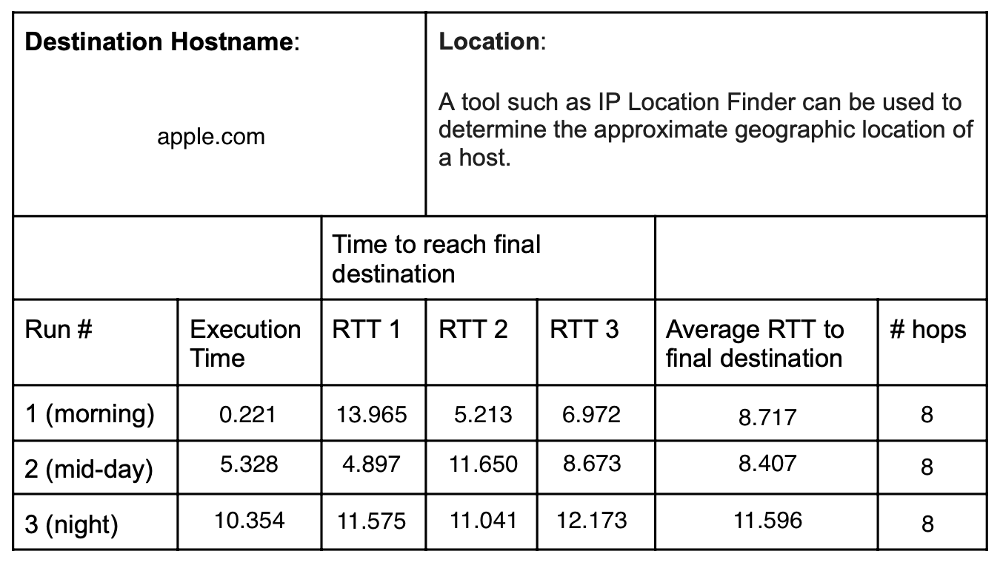

a. Include a screenshot of Run #1 (only) and circle all data used to calculate the average RTT to the destination host.

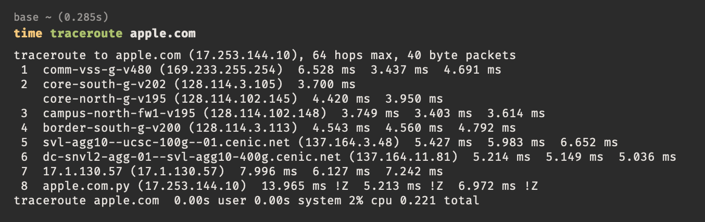

b. Did the number of routers in the path change during your 3 different runs? If so, why do you think it changed? If not, why do you think it didn’t?

- The number of routers in the path did not change during the 3 different runs. They all had 8 hops.
- I think the number of routers did not change because of stable network conditions. Because the network path is stable, the routers and routes would not change unless there is an issue like congestion or link failure. There was likely no congestion or failures, leading to the consistent number of routers.

---
<div style="page-break-after: always;"></div>

### 6. Different Continents

Repeat process to a destination on a different continent.

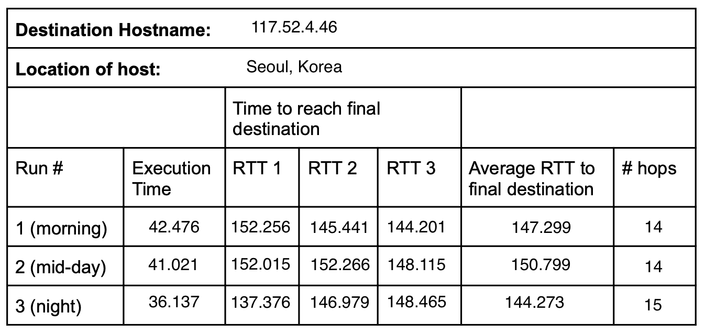

a. Include a screenshot of Run #1 (only) and circle all data used to calculate the average RTT to the destination host.

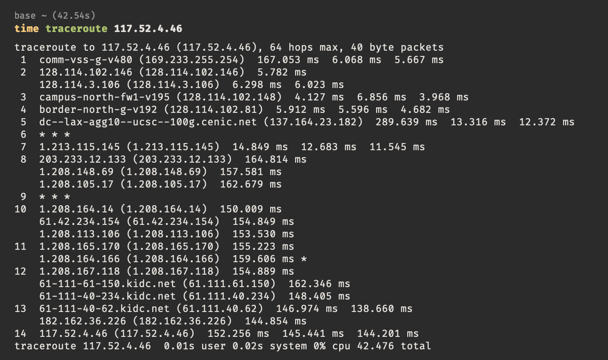

b. Try to identify an overseas link with increased delay and mark/label it in your screenshot.

- Hop 5 is the overseas link with increased delay. There is a significant increase in the latency at hop 5 compared to the other hops.

---
<div style="page-break-after: always;"></div>

### 7. General questions about your experiment

a. Compare the average intra-continent and inter-continent results. Are your results what you would expect? Explain

- The results were as expected. The intra-continent traceroute has lower RTT compared to the inter-continent traceroute.Since there is a greater physical distance between the source and destination, the inter-continent traceroute has higher RTT.

b. For a given source and destination, find a row in your table for which the reported RTT values are different. What could account for the difference in delay?

- When looking at the reported RTT values of the three runs of the destination 117.52.4.46 (seoul, korea), the RTT for mid-day is slightly higher compared to the others. There might have been more traffic during the mid-day run, causing congestion and increased latency. Furthermore, while Korea itself may have been experiencing lower traffic (because it is night time), the backbone networks may still be handling significant global traffic, impacting the RTT. 

### 8. Draw the North America network path

Think about our “Model Network on Paper” from the lecture and consider the traceroute output in Question 5. Make a drawing of the network. Make sure your drawing uses Nodes and Edges (routers and links) and include your computer as the starting Terminal.

- Identify your Access Network – mark and label it on your drawing. (An Access Network is the network used to connect to the Internet.)
- Routers with similar names and/or similar IP addresses can be considered as part of the same ISP. Put a dotted circle around any such groupings of nodes in your drawing to indicate these networks.
- Try to identify the number of ISPs that your packets traversed from the source to destination and write this number on the drawing

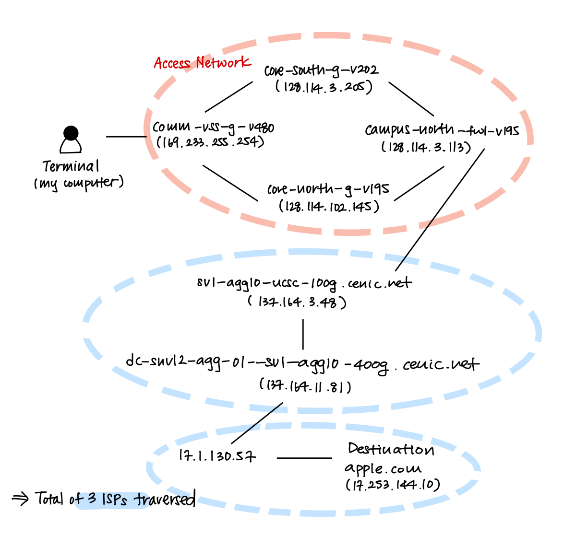
---
<div style="page-break-after: always;"></div>

## Practice with Python

References: Refer to the Python tutorial above and to the previous section for Traceroute.

### 9. Practice with Python

Every time you surf the web, your browser displays a web document that is hosted on a web server. In order to display
the web document, a request message must first be sent from your computer to the web server. Then, when a response
message is returned and received by the browser, the requested page is displayed. Sometimes the messages must be
forwarded by many routers on the path from your computer to the web server. In this exercise we will use traceroute to
look at the “length” of such paths.

Write a simple utility program that accepts a web server name as input and then invokes the traceroute program to
determine the number of hops from the source (where the program is invoked ) to the web server.

Program operation:

- prompt the user for a host name (a web server)
- Hard coding is not allowed:
  - read the host name from the command line
  - print the output to stdout
- invoke the ‘traceroute’ command to determine the number of hops to a web server. Allow Traceroute to run for 20
  seconds before checking its output

**Results**

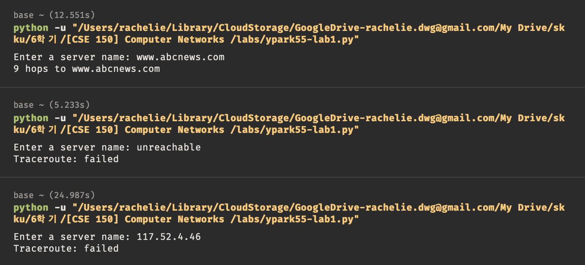

- In my program, when the host could be reached within 20 seconds, the program prints the number of hops.
- If the host does not exist or is unreachable within 20 seconds, the program prints `Traceroute: failed`
- The program had the same output as the expected output.
