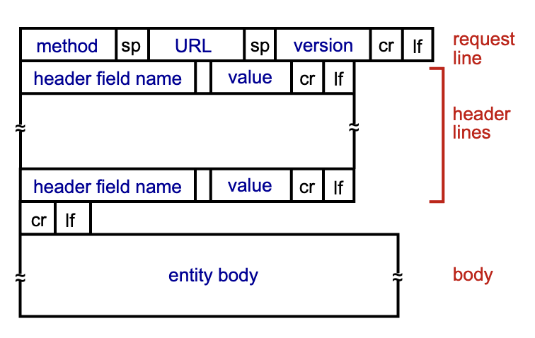
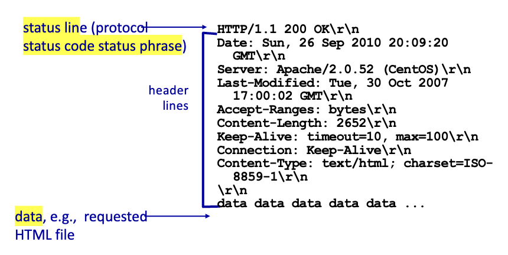
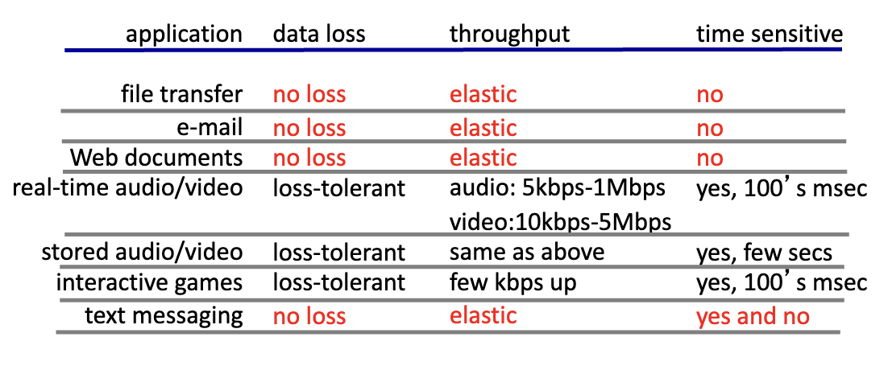
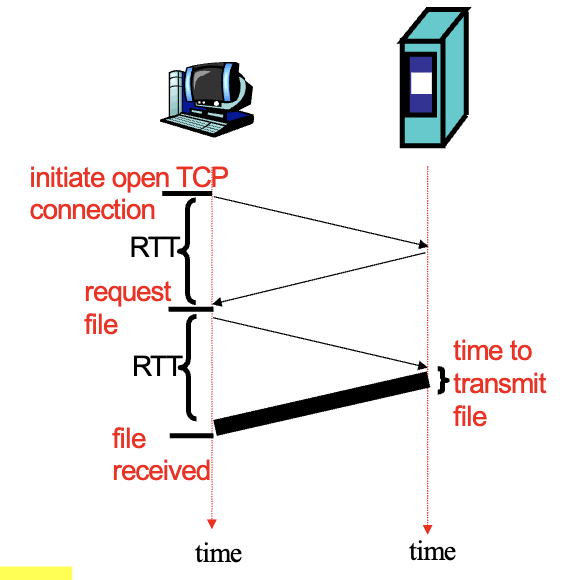
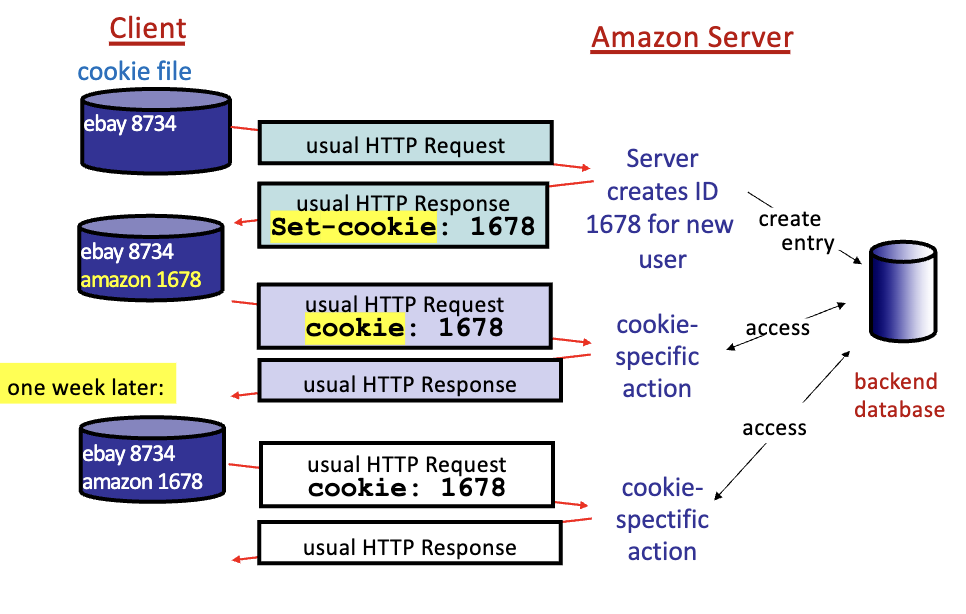
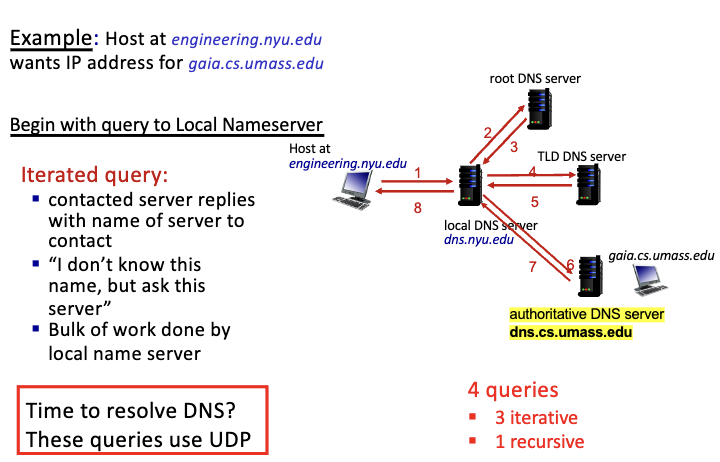
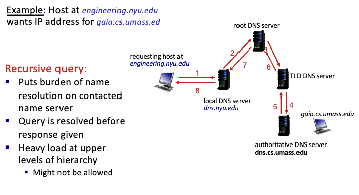
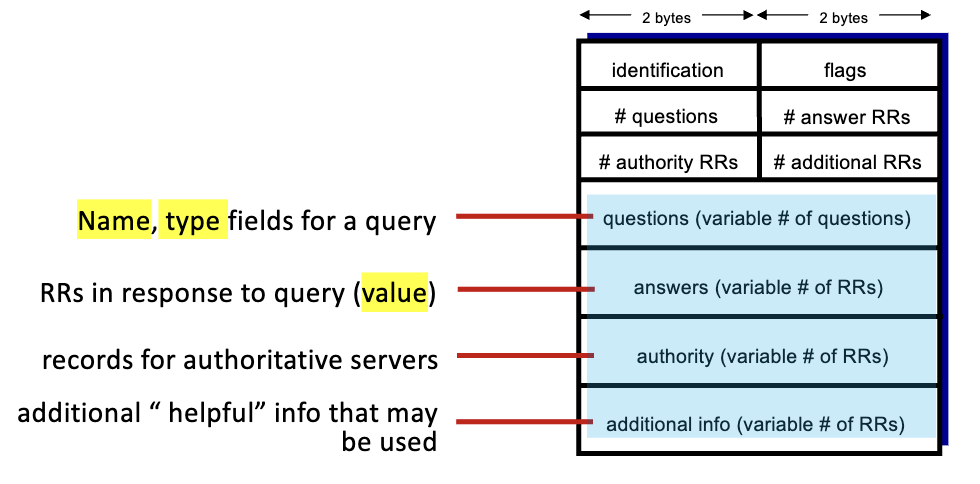
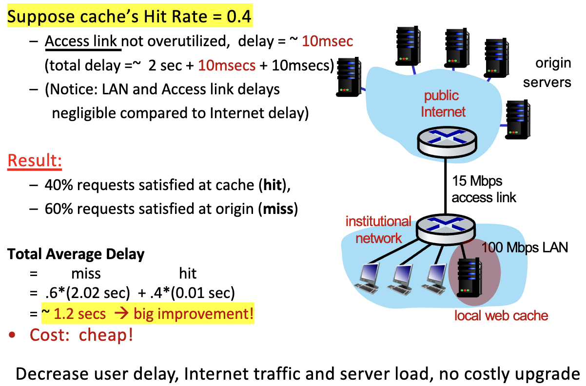

# Chapter 2: Application Layer

## network app

- processes running on different end systems that communicate with each other over the network
  - 실제 네트워크가 어떻게 작동하는지 몰라도 됨
  - API를 통해 네트워크에 접근 가능
  - packet만 잘 전달하고 받으면 됨 --> fast development 가능

## client-server paradigm

- no direct communication between end systems
- 다 서버를 통해 통신함
- HTTP, DNS protocol 둘다 client-server paradigm을 가정함

### server

- always-on host
- permanent IP address
- data centers for scaling/robustness
- trust
  - ex: cnn에 접속하면 cnn의 컨텐츠를 받을 수 있음

### client

- contact, communicate with server
- intermittently connected
- may have dynamic IP address
- 서로 직접적인 통신 불가능

## P2P (Peer-to-Peer) - ad hoc
- no always-on server
- arbitrary end systems directly communicate
- self-scalability
  - new peers bring new service capacity

## Application Layer Protocols

- defines:
  - types of messages exchanged (request, response)
  - message syntax: what fields in messages & how fields are delineated
  - message semantics: meaning of information in fields
  - rules for when and how processes send & respond to messages
  - open protocols: defined in RFCs
    - ex: HTTP, SMTP, FTP, DNS
  - proprietary protocols: e.g., Skype
    - owned by an organization
    - can be modified only by the organization

## Web

- distributed repository of information/documents that can be located by URL / hyperlink
- usage:
  - display web pages requested & received from web servers
  - HTML defines display format
- components:
  - client: browser
  - server: web server
  - protocol: HTTP
  - documents stored on web servers
  - TSL if https is being used (TLS: Transport Layer Security)

## HTTP

- HyperText Transfer Protocol
- defined messages transferred, format, and expected actions upon receiving messages
- stateless protocol
  - server maintains no information about past client requests --> no history (cookie가 대신 저장함)
  - each request/response is independent
  - scalable

### message flow

- client server model (request-response)
- client: sends browser request to server + received & displays response
- server: receives request, sends response

### basic web page

- base HTML file + embedded objects
  - base HTML file: text, links to objects
  - embedded objects: images, audio, java applet, html files, ...
    - aka. referenced objects
- address of object: URL
  - 

### client request message

> request, response 종류 두가지

- `GET` method
  - request an object from a server
  - 
  - header lines: `name:value`
    - extra useful info about request
    - ex: `Accept-Language: en`
  - blank line: end of header

#### general format



#### example

- `POST`, `HEAD`, `PUT`, `GET`

### server response message



- status line:
  - indicates if request succeeded or failed
  - ex: `HTTP/1.1 200 OK`
- header lines
  - key-value pairs
  - ex: `Content-Length: 3495`, `Content-Type: text/html`
- data
  - object requested
  - ex: HTML file, image, audio, video, ...


## Cache
- copy of recently accessed objects
  - reduces response time
  - reduces traffic
  - ex: browser cache
- if the cache has the up-to-date object, the server will not send the object again
  - cache sends conditional get to origin server
  - if requested object is up-to-date, server does not return the file
    - cache forwards response to client
  - 근데 없거나 최신이 아니라고 판단되면 cache forward request to server
    - cache updates its copy and returns objects to client
- server랑 client의 중간다리 느낌
- if object modified, 
  - cache --> conditional GET to origin server
  - server --> if object modified, returns file
  - cache --> updates its copy
  - `last-modified` field로 up-to-date 여부 판단
  - known as `conditional GET`
    - `if-modified-since` field를 헤더에 넣어서 보냄
    - `304 Not Modified` response를 받으면 cache에 있는걸 사용
    - `200 OK` response를 받으면 cache를 업데이트

## Process Communication

1. same hosts
   - two processes communicate using inter-process communication (IPC)
2. different hosts
   - processes communicate by exchanging messages over a network

### IPC (Inter-Process Communication)
- two processes on the same host communicate with each other
- defined by the OS
- ex: pipes, message queues, shared memory, sockets

### remote host
- server process: process that waits to be contacted
- client process: process that contacts server

#### address
- unique id, shared infrastructure to identify user within a network
- 32 bit IP address + 16 bit port number
  - ex: 128.119.245.12:80
- ports: 16 bit number
  - 0 ~ 65535
  - well-known ports: 0 ~ 1023
    - ex: 80 (HTTP), 21 (FTP), 25 (SMTP), 53 (DNS), 443 (HTTPS)
  - registered ports: 1024 ~ 49151
  - dynamic/emphemeral ports: 49152 ~ 65535

## App Implementation
- application layer uses services of transport layer and network to send/deliver data
  - API = hook (os의 abstraction 이용)
  - send/receive data
- transport protocols implemented within the OS
- data integrity, throughput, delay, security, ...
  - bandwidth sensitive vs. elastic apps



## Socket Interface
- allows processes to communicate with each other
- API (TCP/IP sockets)
  
## RTT (Round Trip Time)
- time elapsed for a small packet to travel from client to server AND back

## UDP
- unreliable data transfer
- does not provide reliability, flow control, congestion control

## TCP Connection
- Reliable transport, connection-oriented, flow control, congestion control
- 3 way handshake
  - SYN, SYN-ACK, ACK
- Set bits in TCP header
  - SYN: synchronize sequence numbers
  - ACK: acknowledgment (can include data)
    - 3rd step ack는 데이터를 포함할 수 있음
  - and more...
- Response time
  - 1 RTT to establish TCP connection
  - 2 RTT to send HTTP request and receive HTTP response (ignore data transmission time)
  


### Persistent HTTP
- existing connection used for multiple requests/responses
- http header - keep-alive
- Response time
  - Base Page: 2RTT + transmission time
  - additional embedded objects: (1RTT + transmission time) * n
    - n = number of embedded objects
    - TCP remains open

### Non-Persistent HTTP
- OS overhead for each connection
- server reclaims resources
- http header - close
- parallel - multiple TCP connections
  - wire shark에서 ack, syn의 갯수가 적음
- Response time
  - Base Page: 2RTT + transmission time
  - additional embedded objects: (2RTT + transmission time) * n
    - n = number of embedded objects
    - TCP remains open

### pipelining
- client sends multiple requests without waiting for responses
- server sends responses in the same order as requests
- reduces response time
  - Persistent: 1RTT + transmission time * n
  - Non-Persistent: 2RTT + transmission time * n


## Cookies
- User-server state management
- benefits:
  - authentication
  - shopping carts (remember items)
  - recommendations
  - user session state (web mail)



- client: sends a request to server
- server: sends cookie to client (`Set-Cookie: <cookie>`)
- client: stores cookie
  - 다음번에 request를 보낼때 cookie를 같이 보냄 (`Cookie: <cookie>`)
  - cookie는 브라우저가 관리

### four components
1. server sets cookie with HTTP header `Set-Cookie: x` in response
2. when send requests, per domain, client return cookie with HTTP header `Cookie: x`
3. clients store cookies in cookie file, managed by user's browser
4. web server keeps track of whatever it can in its backend db

## Domain Name System (DNS)
- IP address: 32 bit number
- domain name: human-readable address

### Distributed hierarchical database
- replicated servers distributed worldwide
- DNS servers organized in a hierarchy
  - root DNS servers
  - top-level domain (TLD) servers
  - authoritative DNS servers
  - local DNS servers

### Application Layer Protocol
- core internet protocol
- client-server architecture
  - clients query servers to resolve domain names and obtain RRs (Resource Records) (Name to IP address mapping)
- Define messages
  - syntax, format, semantics, etc

### DNS Nameserver
- on port 53
- stores DNS RR for a domain
  - RR: Resource Record

### DNS Services
- mapping
  - host --> IP address translation
  - host aliasing
    - canonical, alias names
  - mail server aliasing
    - ex: `cs.virginia.edu` --> `stardust.cs.virginia.edu`
- Load distribution
  - replicated web servers
  - multiple IP addresses for one name
    - DNS returns list of IP addresses
- resolver
  - local name server specified by your local ISP --> starting point of DNS query

### DNS Distributed Hierarchical Database
- minimum three levels, each layer has a different role

- client queries the root server --> get IP address for `.com` server 
  - doesn't have all the info
  - guaranteed to know the top-level domain (TLD) server
- client queries the `.com` server --> get IP address for `amazon.com` TLD DNS server
  - `CNAME` record
- client queries the `amazon.com` authoritative DNS server --> get IP address for `www.amazon.com`
  - `A` record
  - ip를 가지고 있는건 authoritative DNS server!!

#### DNS Root Name Servers
- top of hierarchal distributed database
- holds address of every TLD server
- root returns IP address of 
  - TLD 
  - or authoritative server 
  - or whatever name server is cached
- returns NS record pointing to the TLD server

#### TLD (Top-Level Domain) Servers
- responsible for suffixes in name
- responsible for authoritative servers within a suffix
  - returns their IP address
- returns NS records that point to the authoritative DNS server for a domain
- typically doesn't return CNAME record directly, but if domain record points to a CNAME, the authoritative DNS servers for that domain would return those records

#### Authoritative DNS Servers
- an organization's DNS server responsible for all mappings of publicly addressable hosts within its domain
- cached mappings are NOT considered authoritative
- benefit
  - updates/changes done locally
  - can further sub-divide the name and install additional name servers
- returns A records (maps domain to an IP address)
- returns CNAME (provides an alias for a domain)
- returns MX (specify mail servers for the domain)

### centralized vs. distributed DNS
- centralized: single point of failure & load too high for single server, scalability issues
- decentralized: no single point of failure, but consistency issues

### DNS Name resolution: iterated query
- begin with local name server
- root server: if it knows the IP address, it returns the IP address
- if not, it returns the IP address of the TLD server
- always a final answer or referral to another server
- 

### DNS name resolution: recursive query
   - return either the IP address or an error message
   - 정확한 ip 알떄까지 돌아오지 마라 느낌
- iterated query
   - return the IP address or the IP address of the next server to query
- UDP 사용 
  - faster bc no connection setup
- 

### DNS Caching
- once a server learns a mapping, it caches the mapping
- only authoritive NS guaranteed to have up-to-date mapping
  - chached mappings are NOT considered authoritative
- benefits
  - reduced response time
  - reduced traffic
  - reduced load on root servers
- drawbacks
  - mapping may become stale
  - DNS poisoning

### DNS records
- RR format =`(name, value, type, ttl)`

#### type
1. A
   - name: hostname
   - value: IP address
2. NS
   - name: domain
   - value: authoritative name server
3. MX
   - name: domain
   - value: mail server associated with name
4. CNAME
   - name: alias hostname
   - value: canonical hostname
   - returned by 
   - ex: ibm.com --> servereast.backup2.ibm.com

### DNS protocol messages
- both query & reply have same format



- message header
  - identification = 16 bit for query & reply matching
  - flags
    - query or reply
    - recursion desired
    - recursion available
    - reply is authoritative

### Using DNS
```
gethostbyname() --> Local DNS Server (필요하면 그 위로, TLD 등) --> get reply and connect with web server --> open tcp --> request web page
```
- all steps incur delay

## cache
- goal: satisfy client request without involving origin server
- holds content previously requested by other users
- advantages
  - reduced response time
  - reduced traffic
  - reduced load on origin server
- acts as a middleman between client and origin server
  - both a client and a server (depends on the pov)
  - conditional GET이 필요할떄가 있음

> difference bt cache and replication?
> - cache: temporary storage
> - replication: permanent storage

### placements
#### client-side
- put cache close to client
- reduce response time for client requests
- access network --> usually the bottleneck
- access link/ISP/Internet
  - if there is a good hit rate, not as much traffic on the access link

#### middle-box
- put cache near the access ISP
- reduced path

#### server-side
- put cache close to server
- access link/ISP, user에게는 베네핏이 없음
- origin server: benefits from reduced load

## delay
- `Internet delay + access delay + LAN delay`
- Internet delay
  - RTT (~2sec)
  - ISP router to origin server
- access delay
  - if link not over-utilized (load/intensity < 0.8), delay over access link = ~10ms
  - if over-utilized (intensity >= 0.8), delay over access link delay increases to many seconds
    - packets potentially dropped
- LAN delay
  - high speed, low delay
  - ~10ms
- total delay under heavy load
  - delay >> ~2sec + *access delay* + 10ms

### improvements
1. pay access ISP to upgrade access link rate
2. install cache
   1. hit rate에 따라 delay가 달라짐
   2. 
  