# Chapter 3 - Transport Layer

## Transport services & protocols
- Logical communication between application processes running on different hosts
- TCP & UDP
- end systems
  - TCP sender: breaks app messages into segments, sends segments to TCP receiver(network layer)
  - Reconstruction at receiver

## Network Layer
- logical communication between **hosts**

## Transport Layer
- logical communication between **processes**
- relies on, enhances, network layer services

## Internet transport protocols
### TCP
- Transmission Control Protocol
- Reliable, in-order delivery
- Flow control
- Congestion control
- connection set up

### UDP
- User Datagram Protocol
- Unreliable, unordered delivery
- no frills extension of "best-effort" IP

> [!NOTE]
> Internet does not have delay or bandwidth guarantees

## Multiplexing & Demultiplexing
> extends network layer host-to-host delivery to process-to-process delivery

- Multiplexing: handle data from multiple sockets, add transport header
  - pulls data from multiple sockets, add necessary header info, sends down to single network layer
- Demultiplexing: deliver data to correct socket
  - single network layer delivers segment to transport layer
  - TL uses header info to deliver to correct socket
- ports are key!!
  - makes sure data is delivered to correct socket

### Transport Layer 
- sender (multiplexing):
  - gathers application layer msgs via sockets
  - encapsulate segments with important header field values
  - pass segments (msg + TL header) to "single" network layer (IP)
- receiver (demultiplexing):
  - accepts segments from network layer (IP)
  - examines header fields & extract application layer messages
  - devliers message to app layer via socket

### Network Layer
- IP header (src/dest) & payload (transport layer segment)

### Transport Layer
- TL header (src/dest port)
- payload (application data)
- clients (ephemeral ports)
- servers (well-known ports)

### TCP Demultiplexing Example
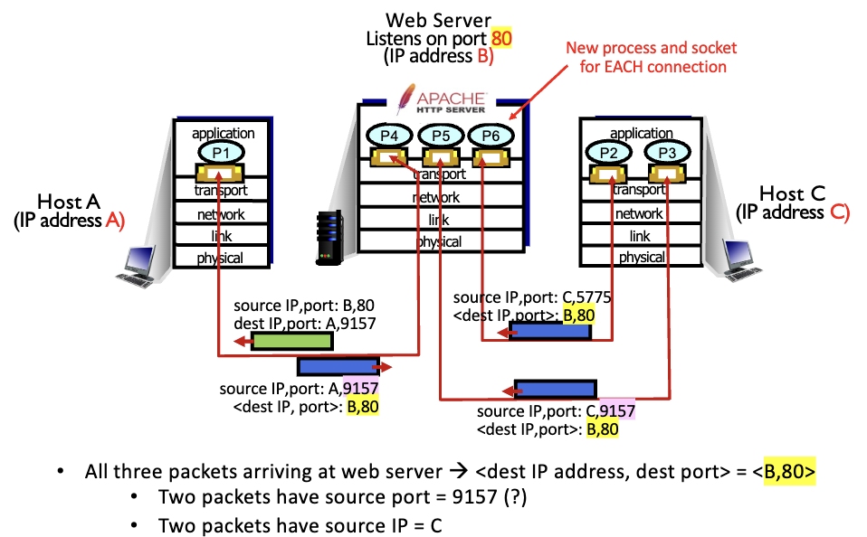

## Reliable Data Transfer
- all transmitted data is delivered, in order, without corruption or duplicates
- implmented at the link or transport layer
- transport layer: gives app layer impression that network is reliable

### principles
1. transport layer presents "service abstraction" to app layer
2. transport layer implements service using network layer
3. complexity of reliable data transfer protocol will depend (strongly) on characteristics of unreliable channel
   1. impairments are introduced by channel
4. sender and receiver do not know the state of each other
   1. e.g. sender doesn't know if receiver received packet
   2. messages need to be exchanged to ensure reliable data transfer

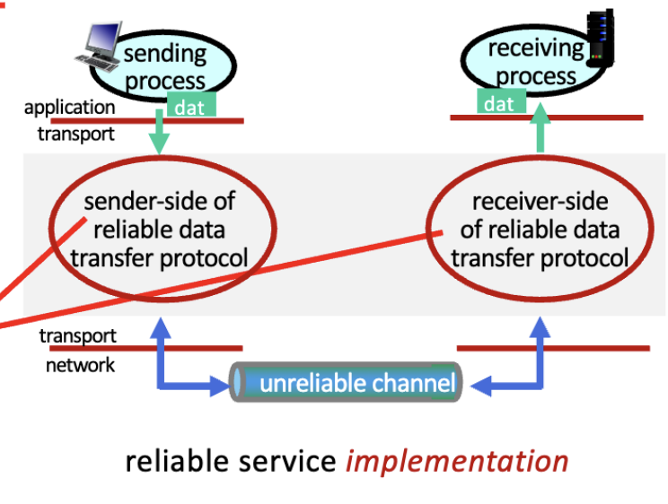

### sources of data loss:
1. bit errors
2. Congestion
   - packet loss

### error detection
#### checksum
- 16 bits
- at the transport, network, link layer
- weak protection against errors
- mathematical computation performed on the payload of the data
- sender: 
  - compute checksum (addition of segments, take 1's complement)
  - put into outgoing packet header
- receiver:
  - compute checksum
  - compare with checksum in header
- 1's complement:
  - add two 16-bit words
  - if carry, add to result
    - 16bit에 들어가야하니까 넘친거를 맨 뒤에 더해줌
  - take 1's complement of result (invert bits)
  - result is checksum
  - overhead:
    - 16 bits + processing time
    - transport layer에서 하는건 end-to-end에만 영향을 줌
    - network layer에서 하는건 hop-by-hop에 영향을 줌 (router마다 checksum을 확인해야함)

> [!NOTE]
> - The Network Layer handles the routing and packet forwarding between networks, using IP addresses.  
> - The Data Link Layer is responsible for framing and addressing within the local network, using MAC addresses.  
> - Routers move down to the Data Link Layer when they need to forward packets between different network segments or technologies, handling the encapsulation of packets into the appropriate frames for transmission.

### impairments
- packet loss --> retransmission
- bit errors --> error detection 
- out-of-order delivery --> reordering
- duplicate packets --> duplicate detection

## rdt protocols
- rdt = reliable data transfer

### primitives
`rdt_send(data)` --> `udt_send(data)` --> `rdt_rcv(data)` --> `deliver_data(data)`

1. `rdt_send(data)`
   1. called by sender, to transfer data to receiver
2. `rdt_rcv(data)`
   1. called when packet arrives at receiver
3. `udt_send(data)`
   1. called by `rdt` to transfer data to network layer (unreliable channel) to receiver
4. `deliver_data(data)`
   1. called by `rdt` to deliver data to upper layer
   
   
- 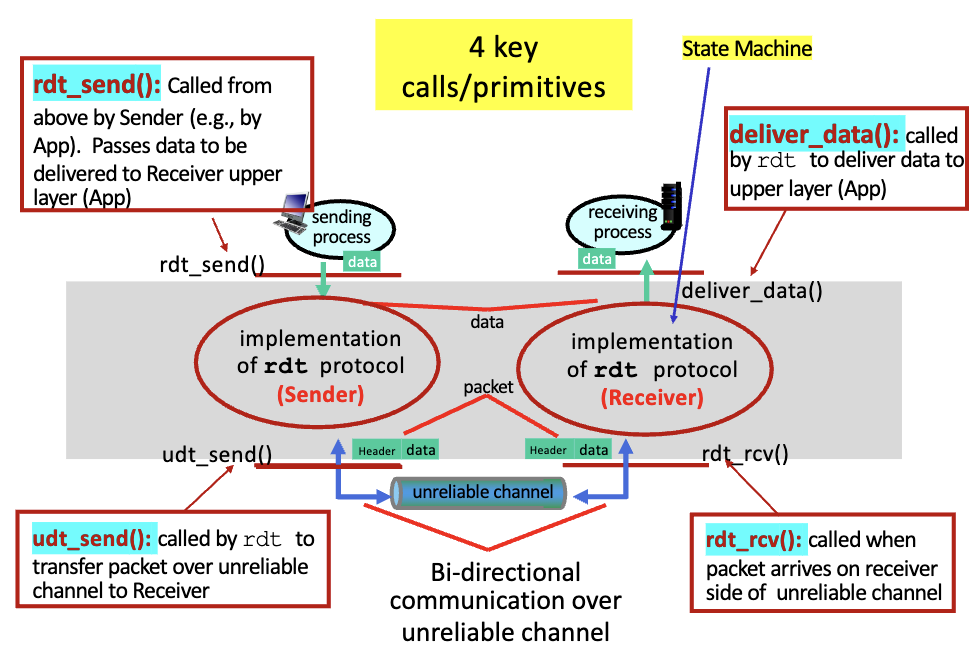

### Finite State Machine (FSM)
- FSM: set of states, events, transitions
- always in one state at a time
  - state: certain conditions are true at a given time
- transitions based on events (define how you move from one state to another)

> rdt is stop-and-wait: sender sends one packet, waits for ack, then sends next packet

### rdt 1.0: perfect channel
- assumption: underlying channel is perfectly reliable
- separate FSM for sender and receiver
  - sender: sends data into underlying perfect channel
  - receiver: reads data from underlying perfect channel
  - no feedback necessary bc channel is perfect
- 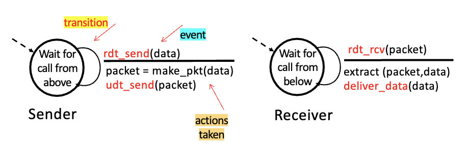
- above is event
- below is action

### rdt 2.0: lossy channel (bit errors)
- assumptions:
  - bit errors on channel
  - no packet loss
- mechanism
  - checksum
  - receiver feedback (ack/nak)
  - sender retransmission
- stop-and-wait
  - sender sends one packet, waits for ack, then sends next packet
- 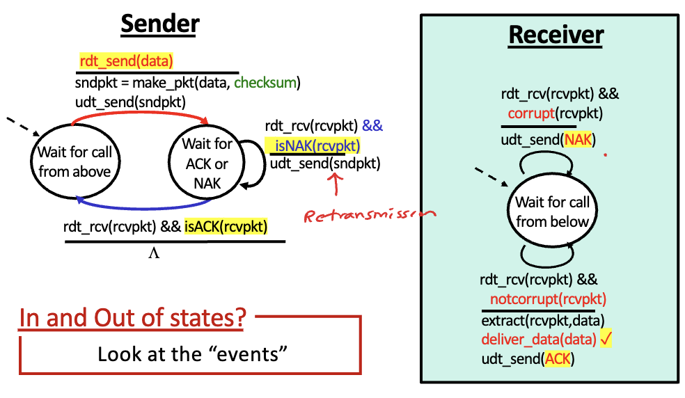
- BUT: what happens if ack/nak is lost/corrupted?
  1. if receiver transmits ack, but sender receives nak --> sender retransmits
    - receiver has duplicate packet but doesn't know
  2. receiver sends nak, but sender receives ack --> sender doesn't retransmit
    - receiver doesn't get packet
    - next packet is sent, but receiver is waiting for retransmission

### rdt 2.1: lossy channel (bit errors in both directions)
- assumptions:
  - bit errors in **both directions**
  - no packet loss
- goal:
  - detect corrupted acks & naks
  - detect duplicate packets
- receiver:
  - checksum to feedback packets ack/nak
  - duplicate detection
    - examine the sequence number of the packet
    - if it's the same as the previous packet, it's a duplicate
- sender:
  - add sequence number to packet
  - if ack or nak is corrupted, sender will timeout and retransmit
    - retransmit on nak or corrupted feedback
- 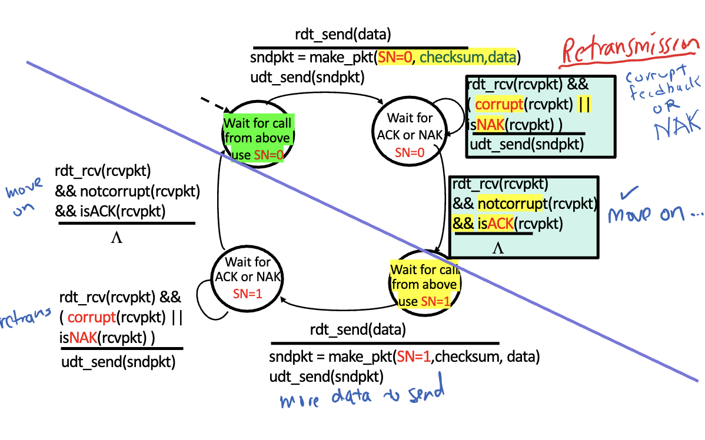
- 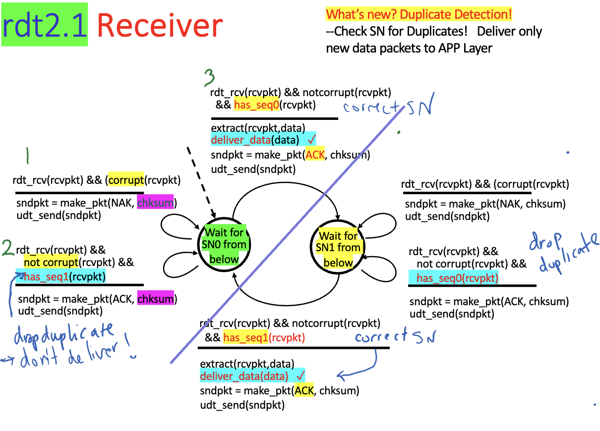

### rdt 2.2: lossy channel (nak free)
- same as rdt 2.1, but no naks (only acks)
- instead of nak, receiver sends SN of last correctly received packet

### rdt 3.0: lossy channel (packet loss)
- assumptions:
  - underlying channel can drop packets (or acks)
- sender waits reasonable amount of time for feedback
  - if no ack, retransmit
    - this may lead to duplicates, but duplicates can be detected via sequence numbers
  - countdown timer required
- ack가 늦게 오면 timeout이 발생하고 retransmit이 일어남
  - ack가 늦게 오는 이유: network delay, congestion, etc.
- 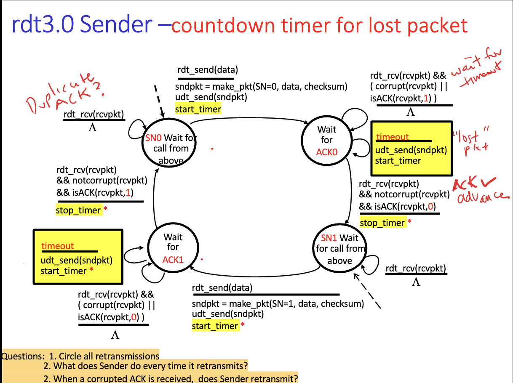
- 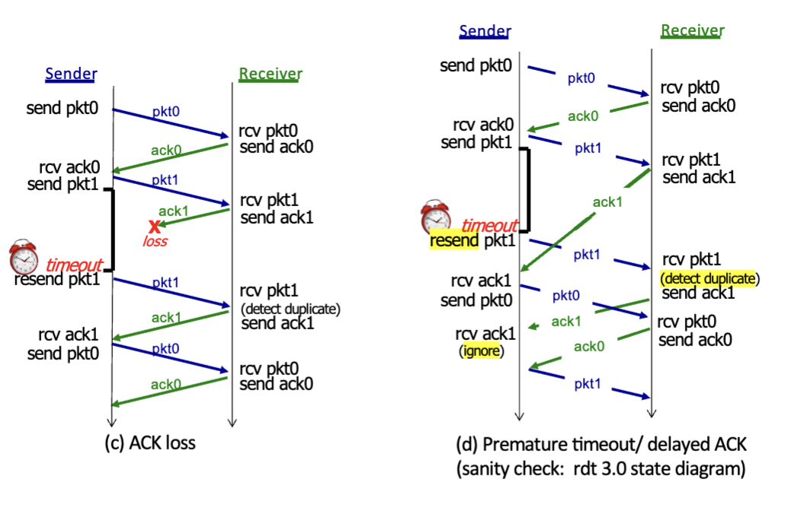

#### performance
- 1Gbps link, 15ms propagation delay, 8000 bits packet
- $D_{trans} = \frac{L}{R} = \frac{8000}{10^9} = 8 \mu s$
- $RTT = 2 \times 15ms + 8 \mu s = 30ms + 8 \mu s$

#### stop-and-wait
- sender sends one packet, waits for ack, then sends next packet
- to fully utliize bandwidth, match transmission rate to link rate
  - link utilization: fraction of time link is busy (aka. traffic intensity)
- next packet transmitted at time: $t = D_{trans} + RTT$
- 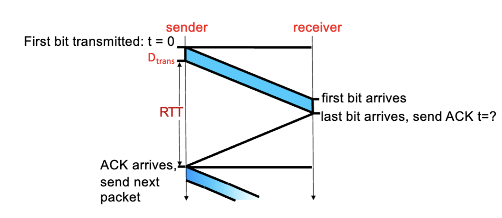
  
  - first bit transmitted at $t = 0$
  - last bit transmitted at $t = \frac{L}{R}$
  - next packet transmitted at $t = \frac{L}{R} + RTT = D_{trans} + RTT$
  - Utilization: $U_{sender} = \frac{work}{time} = \frac{L}{\frac{L}{R} + RTT}$

## Pipelined Protocols
- use network as storage
- BWDP (Bandwidth Delay Product): maximum number of bits on the link at any given time
  - $BW \times RTT$
- aka. ARQ (Automatic Repeat reQuest) protocols
- send multiple packets before receiving ack (severl in-flight packets)
- sender can transmit multiple packets before receiving ack for the first packet
- 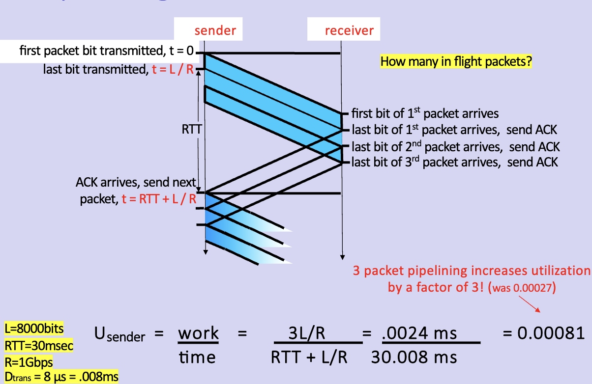

### Go-Back-N
- "window" of packets (up to N) can be sent before ack is received
- each packet laebeled with sequence number in increasing order
- cumulative ack
  - ack(n) - all packets are received are in-order upto and including n
- if `ack(n) > sned_base`, slide window
  - send_base = N + 1
- set timer for oldest unacked packet
- `timeout(n)`: retransmit all packets in window
- 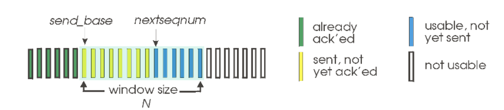

#### cumulative ack
- sent for each pacekt received (ack # of highest in-order seq # received)
  - may generate duplicate acks
  - only remember rcv_base
- if received packet is out-of-order, discard or buffer
- if received packet is in-order, deliver to app layer
- ex:
  - if packets 1, 2, 3, 4, 5 are sent
    - ack 1, 2, 3, 4, 5
  - if packet 3 was lost
    - ack 1, 2, none, 2, 2 --> 이런식으로 ack를 보내줌
    - packet 3이 제대로 올때까지 ack 2를 계속 보내줌

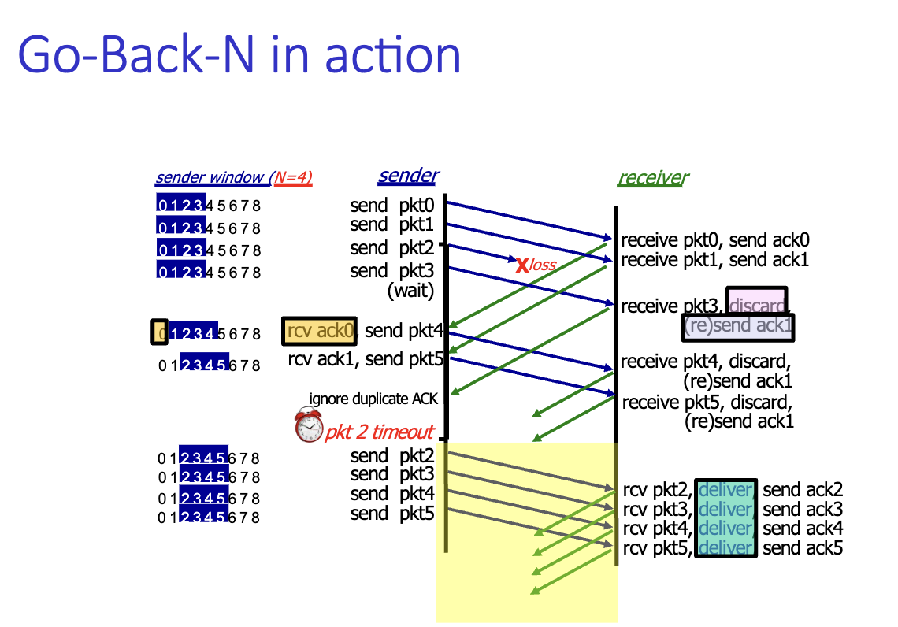

- advantages:
  - simple
  - powerful ack
  - sender can send multiple packets before receiving ack
  - rdt
  - higher utilization than stop & wait
- disadvantages:
  - if packet is lost, all packets after it are retransmitted
  
### Selective Repeat Protocol
- "window" of packets (up to N) can be sent before ack is received
- each packet laebeled with sequence number in increasing order
- individual ack
  - ack(n) - packet n is received
  - selective ack  - echo the received SN
- buffer out-of-order packets
- sender keeps track of acks from receiver
  - sets a timer for each un-acked packet
  - retransmit one packet based on timer
- 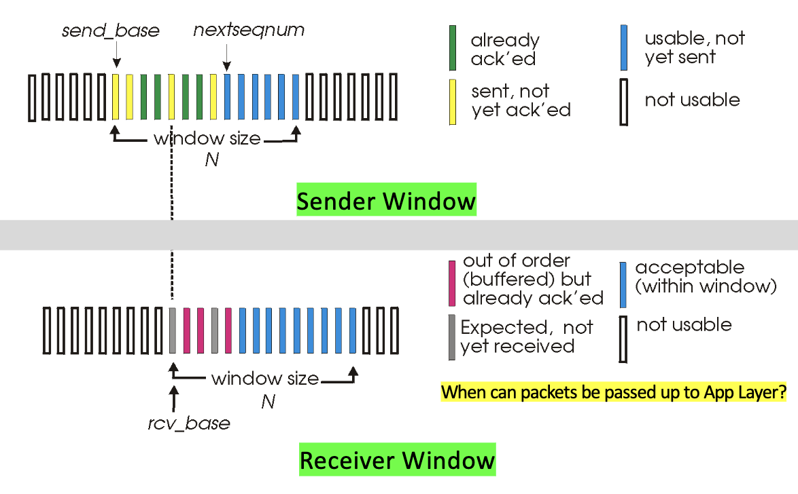
- 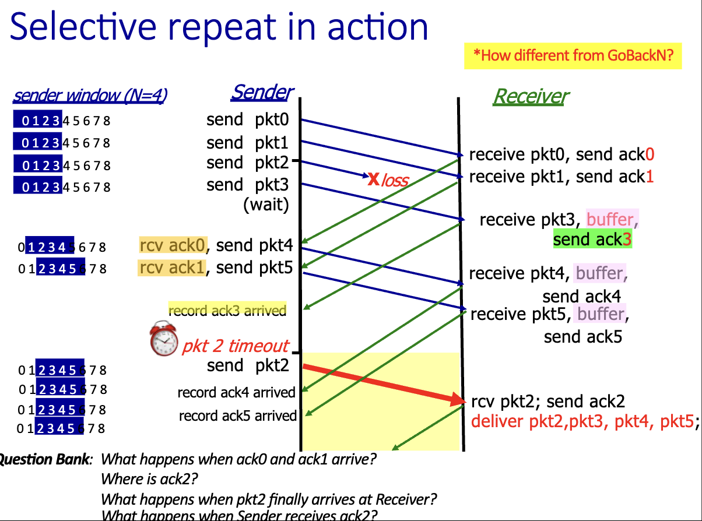

  - ack2가 도착하지 않았지만, 그 이후에 도착한 packet에 대한 ack은 제대로 보내줌
  - ack2가 도착 timer가 끝나면 ack2에 대한 retransmit을 보내줌
  - 그 전까지 나머지 packet들은 buffered

## UDP
- User Datagram Protocol
- unreliable, unordered delivery
- connectionless
  - no handshaking
  - each packet is independently handled
- data transmisson
  - udp socket
  - datagram is carried in a single IP packet
  - limited to a max payload of 65,507 bytes in IPv4
  - usually 'fragmented' into multiple IP packets
- 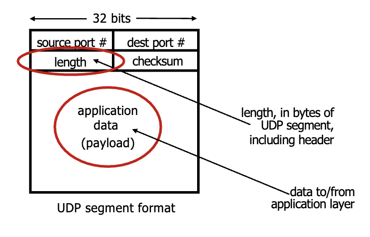

  - overhead of udp is less than tcp because of smaller header size, no connection setup, etc.
- example: DNS, multimedia streaming, etc.

## TCP
- point-to-point
  - one sender, one receivers
- Connection-oriented Multiplexing
  - handshake before data exchange
  - initialize sender & receiver state
- full duplex
  - data flows in both directions
- reliable, in-order byte stream
  - retransmission, acks, etc.
  - byte stream: data is sent as a stream of bytes
  - no message boundaries (e.g. no message length)
  - tcp segment: mss is the maximum segment size
- send & receive buffers
- pipelined
  - variable window size set by TCP congestion and flow control
- server supports many simultaneous TCP sockets
  - each socket associated with a different client
  - can be non-persistent, persistent, pipeline, etc.
- identified by 4-tuple: (src IP, src port, dest IP, dest port)
- demux: 4-tuple cal used to direct segment to appropriate socket

### TCP header
- 20 bytes
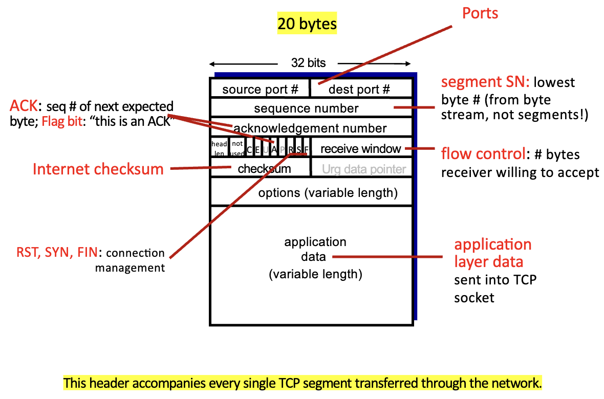

### reliable in-order byte stream
- app layer writes 40 bytes
- sequence number is the next expected byte!!
  - if 8 bytes are sent, next sequence number is 8
    - 0-7의 byte-총 8byte를 전송한거니까, 다음 sequence number는 8
  - after the next 8 bytes are sent, next sequence number is 16
- if packet is lost, usually buffered

### MSS & MTU
- MSS: maximum segment size
  - transport layer에서 사용하는 segment의 최대 크기
  - usually 1460 bytes
- MTU: maximum transmission unit
  - link layer에서 사용하는 packet의 최대 크기
- 1460B payload + 20B header + 20B IP header = 1500B
  - ethernet frame size (MTU) 

### reliable data transfer in TCP
- creates rdt service on top of IP's best-effort service
  - cumulative acks, pipelined, single retranmission timer
- retransmission triggered by:
  1. timeout
  2. duplicate acks

#### sequence numbers & acks
- sequence number
  - number of first byte in segment of the byte stream
- ack
  - cumulative ack
  - sn of the next next byte expected
  - "send me sn = x"
- out of order segments handling it not defined (up to the implementation, but usually buffered)

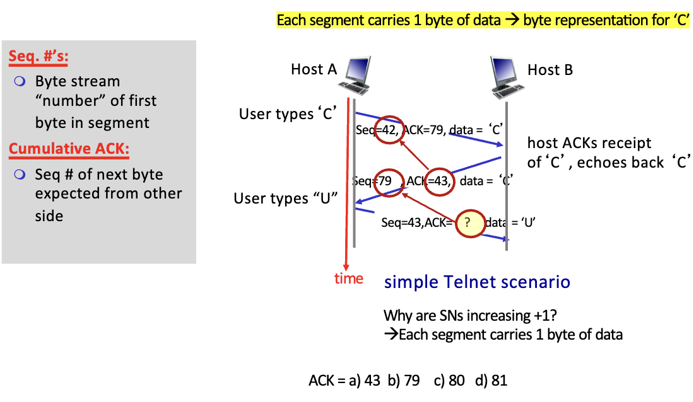

- ack는 80이 됨
- A의 SN은 B의 ack + 1이 됨

### TCP connection management
#### 3-way handshake
- agree to communicate and set up state
- allocate resources, agree & acknowledge connection params
- establish state vars (inital SN, rcv buffer, etc.)
- SYN, SYN-ACK, ACK
- 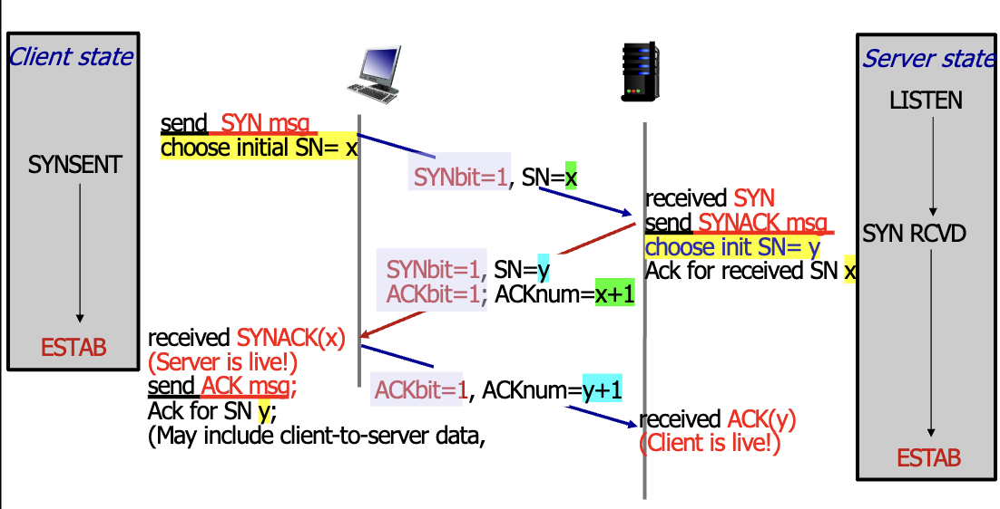

#### 4-way handshake
- terminate connection (FIN, ACK, FIN, ACK)
- 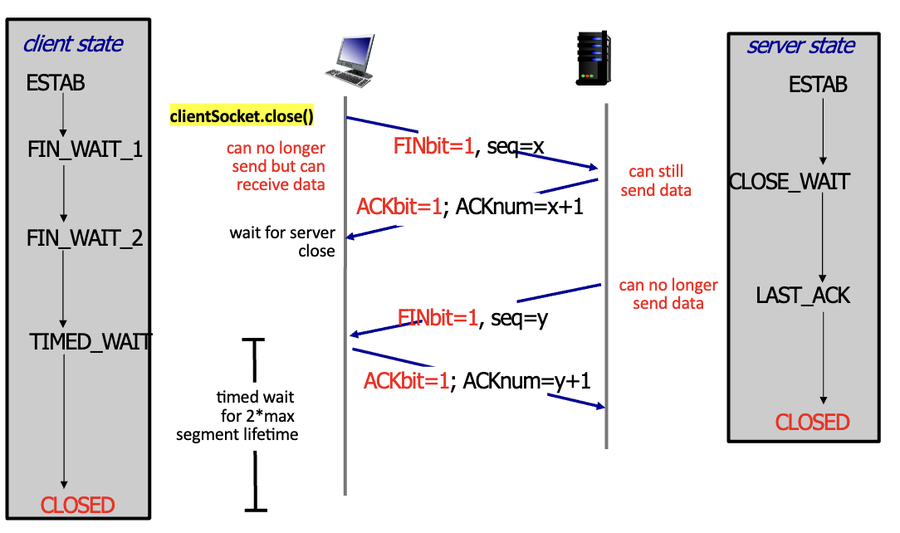

### retransmission timer
- if timer too short, unnecessary retransmissions
- if timer too long, long delays

#### RTO (Retransmission Timeout)
- longer than RTT
- estimate RTT via sample RTT
  - mesaured time interval from segment transmission until ack received
  - ignore retransmissions
- EWMA (Exponential Weighted Moving Average)
  - $EstimatedRTT = (1 - \alpha) \times EstimatedRTT + \alpha \times SampleRTT$
  - $DevRTT = (1 - \beta) \times DevRTT + \beta \times |SampleRTT - EstimatedRTT|$
    - how much does the sample RTT deviate from the estimated RTT
    - basically a safety margin (large variation -> larger safety margin)
  - $TimeoutInterval = EstimatedRTT + 4 \times DevRTT$
  - $\alpha = 0.125, \beta = 0.25$ (usually)
    - larger alpha: more weight on recent samples

### TCP ack generation
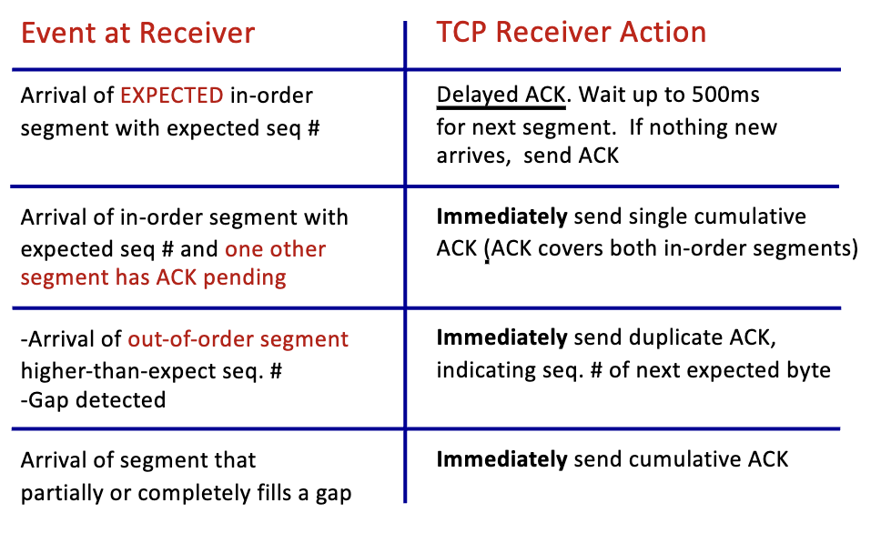

### duplicate acks
1. data from app layer
2. timeout
3. ack (new ack or duplicate ack)

### tcp fast retransmit
- fast retransmit: retransmit segment before timeout
- if 3 duplicate acks are received, retransmit

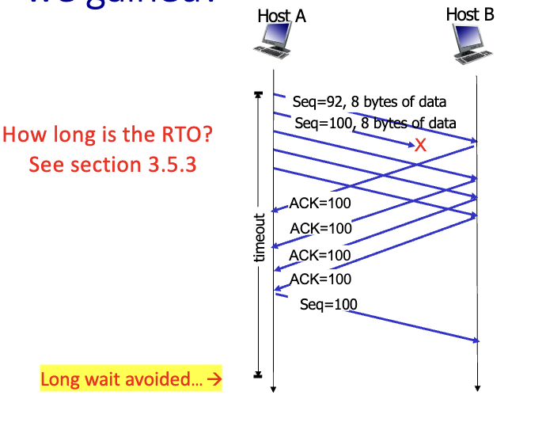

## TCP flow control
- pace sender to prevent overwhelming receiver
- sender won't overflow receiver's buffer by transmitting too much data too fast
- speed-matching service 
  - send rate = receive app's read rate
- `receive window` is noted in the TCP header

## TCP congestion control
- don't overwhelm network
- receiver advertises free buffer space
- sender limits its window size accordingly
  - sender's window <= `rwnd`
  - `rwnd = RcvBuffer - [LastByteRcvd - LastByteRead]`
  - guarantees that receiver won't overflow
- assumption of the scenarios: 
  - sending hosts share router on path from source to destination

> [!NOTE]
> TCP congestion control vs. flow control
> - flow control: receiver controls sender
> - congestion control: network controls sender

## sending rate vs throughput
- sending rate: rate at which sender sends data
- throughput: rate at which receiver receives data
  - rate original data is delivered to the app layer (omit duplicates & retransmissions)

### scenario 1 - infinite buffer
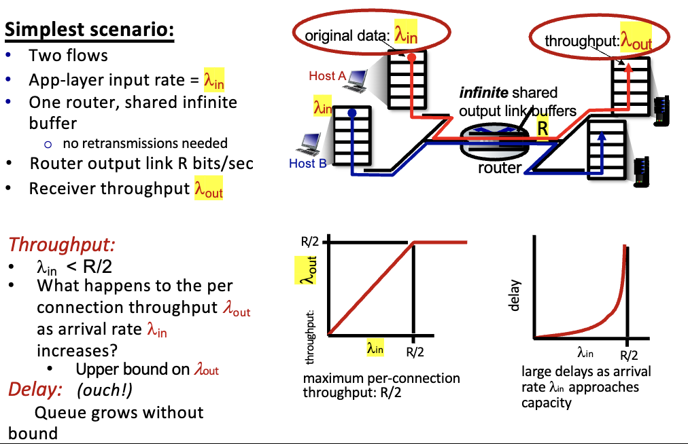

- large queueing delays as packet arrival rate nears link capacity

### scenario 2 - packet loss

- finite buffer & multiple routers
- packets can be dropped at router (requires retransmission)
  - sender knows exactly when packet is dropped (perfect timer)
- sender can also timeout prematurely, sending two copies, both of which are delivered
  - un-needed duplicates
  - once again $\lambda_{out}$ will be reduced even more because of the duplicates

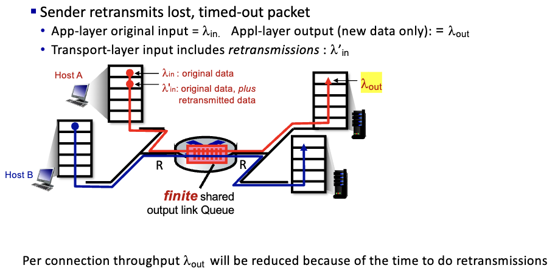

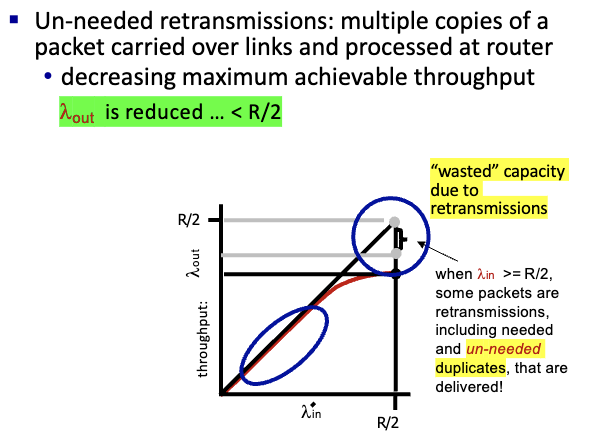

### scenario 3 - multihop path
- output capacity/rate of routers = R bits/sec
- finite buffer
  - timeout & retransmission

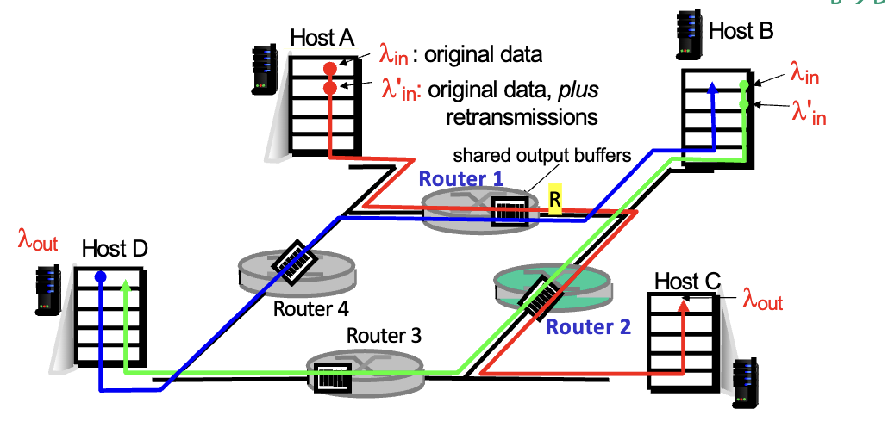

- $\lambda_{in}' \leq \lambda_{in}$

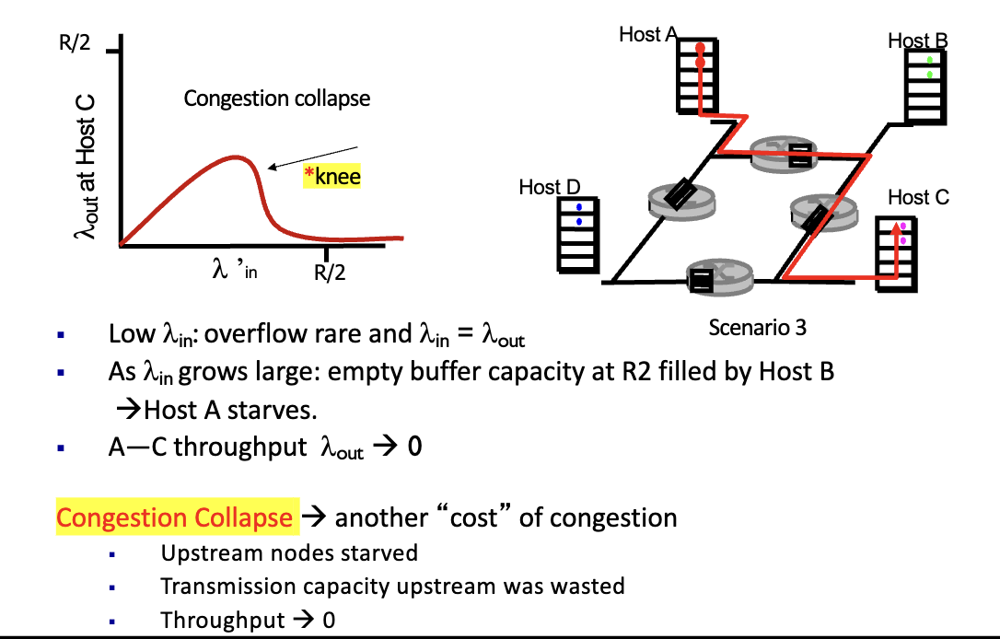

### congestion insights
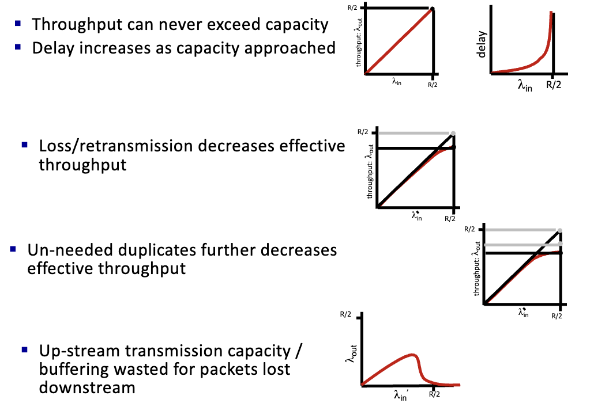

## Congestion Control
1. Network-assisted congestion control
   - help from the network
   - router monitors state and provides direct feedback from the network
2. End-to-end congestion control
   - no explicit feedback from the network

### finding out packet loss
1. RTO timer expires --> probably a packet loss
   - packet loss = congestion
   - an ack arrives
2. 3 duplicate acks --> probably a packet loss

## TCP congestion control
- goal: optimal transmission rate given network conditions
  - transmit at max rate BUT
    - slow down when network is congested
    - speed up when network is not congested
- issues
  - only feedback is from receiver (acks) or timeouts at sender
  - no feedback from network
- pipelined protocol!!

## cwnd: congestion window
- rwnd: receiver's limiting window
- sender window = min(cwnd, rwnd)
  - usually `rwnd >> cwnd` so we can focus on `cwnd`
- dynamic variable, function of perceived congestion
- sender's view of ideal window size for current network conditions
- number of unACKed bytes in flight
- TCP sending rate = cwnd / RTT bytes/sec
- sender limits window size: lastByteSent - lastByteAcked <= cwnd

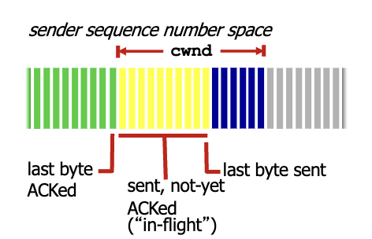

## TCP slow start: exponential increase
- used when connection is established or after timeout
- initially, `cwnd = 1 MSS`
- increase rate exponentially
  - `cwnd = cwnd * 2`
  - increment `cwnd` for every ack received
- stop when `cwnd` reaches `ssthresh` or packet loss

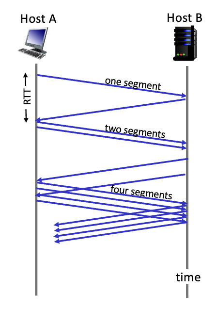

## TCP congestion avoidance: linear increase
- after slow start, increase rate linearly
- increase `cwnd` by 1 MSS for every RTT

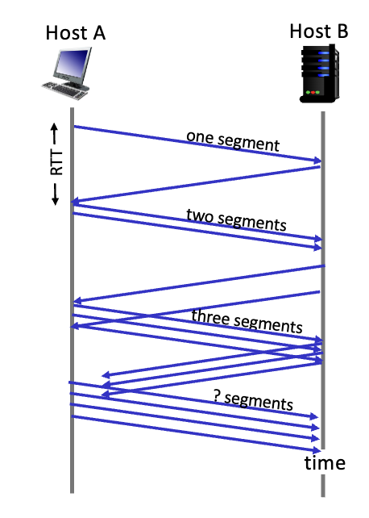

## ssthresh
- initially set to 64KB (RFC 5681)
- exponential increase until `ssthresh` is reached
  - then switch to linear increase
- ssthresh is set to half of the current `cwnd` when packet loss occurs

## transition into/out of slow start
- sender maintains ssthresh and cwnd
- when `cwnd >= ssthresh`, transition from slow start to congestion avoidance
- on loss event:
  - ssthresh = cwnd / 2
  - allows remembering rate when congestion/loss occured

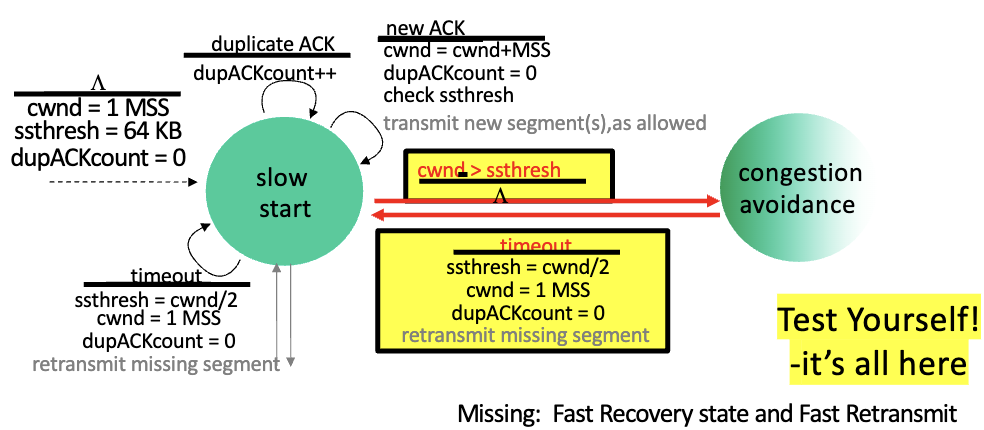

## Reaction to packet loss
### TCP congestion control: AIMD
- Additive Increase, Multiplicative Decrease
- Additive Increase
  - increase sending rate by 1 MSS for every RTT until loss detected
- Multiplicative Decrease
  - decrease `cwnd` by half when packet loss is detected
  - `ssthresh = cwnd / 2`
- sawtooth behaviour
  - increase rate linearly, decrease rate exponentially

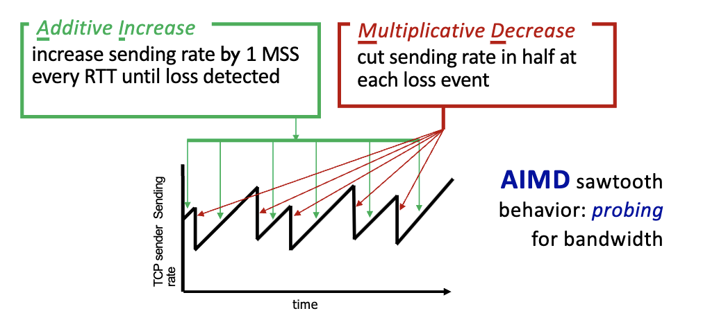

### TCP Tahoe
- any packet loss `cwnd` = 1 MSS

### TCP Reno
- loss recovered by fast retransmission: `cwnd` = `ssthresh` + 3MSS
  - `ssthresh` = `cwnd` / 2
- timeout: `cwnd` = 1 MSS

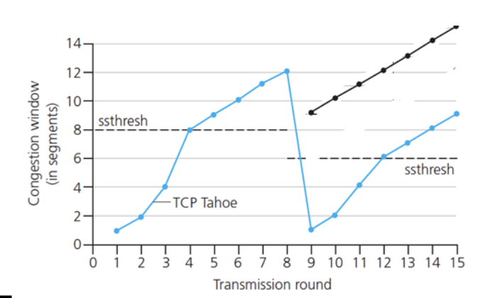

- fast recovery allows
  - once 3 duplicate acks have been received
  - for each additional duplicate ack received, temporarily increase `cwnd` by 1 MSS
  - once recovered, reset `cwnd` and transition to congestion avoidance state

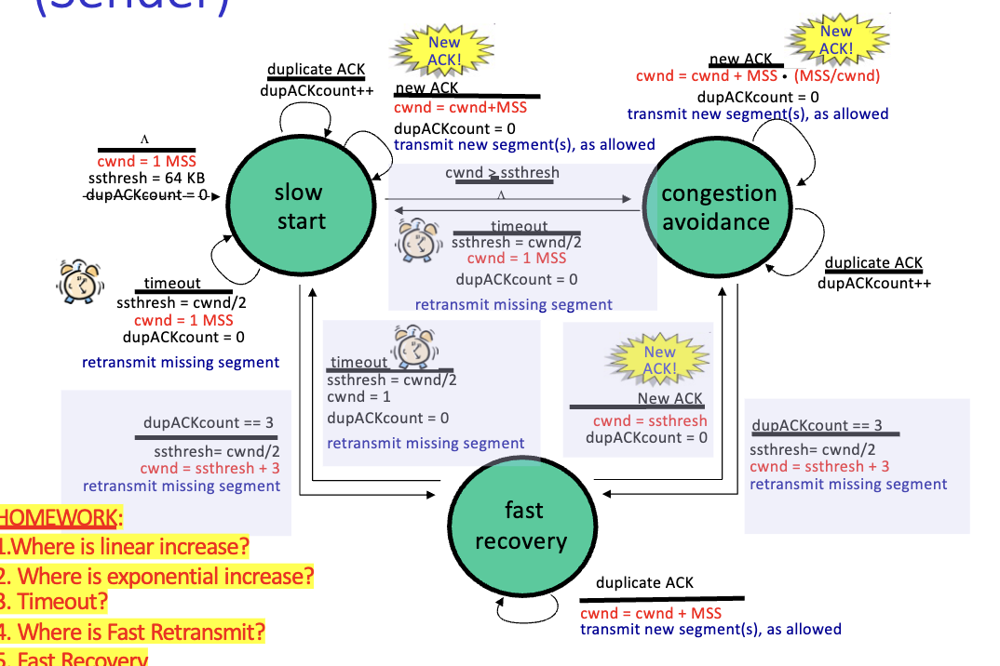

> [!TIP]
> ON EXAM: How do you transition out from a slow start?

