# Chapter 4 - Network Layer

## Network Layer
- transport segment from sending to receiving host
  - sender: encapsulates segments in IP datagrams
  - receiver: delivers segments to transport layer
- every hop needs to examine IP datagram header to determine the next hop

## functions
### 1. forwarding
- move packets from router's input to appropriate router output
- process of getting through single interchange

### 2. routing
- determine route taken by packets from source to destination
- process of planning trip from source to destination
- routing algorithm: determines end-to-end path

## forwarding table
- determines next hop for packet
- each router has its own forwarding table
  - the routing protocol updates the forwarding table
  - routing algorithm local to router (builds the forwarding table)
- 들어온 packet의 header를 보고 ip range에 따른 output link를 forwarding table에서 찾아서 packet을 보냄
  - everything is in a range bc there are 4 billion ip addresses

## router
- control plane: run routing algorithms/protocol (RIPE, BGP, OSPF)
- data plane: forward packets from incoming to outgoing link (in to out ports)

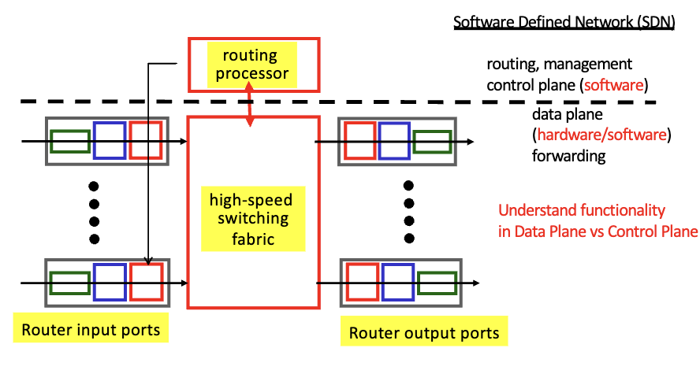

- switching is mostly done in hardware (점선 아래는 다 hw)
- software is used for routing, management, control plane

### input port functions
- link layer protocol is running
- 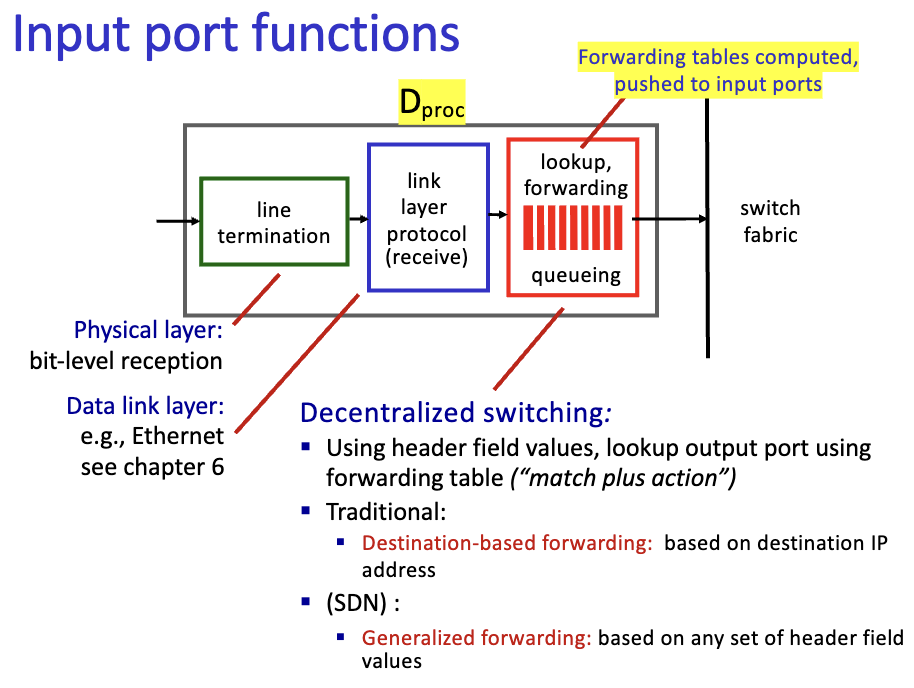


### forwarding by address range
- 앞에서부터의 ip가 몇개가 matching 하느냐를 비교하고 각 case에 해당하는 output port 지정
- `<IP>/<mask>` 형태로 표현
  - `<mask>`: the number of bits that are fixed
    - if mask is 32, then it's a specific ip address
    - if mask is 0, then it's a default route
- 여러개의 range랑 matching 되면 longest prefix match를 사용
  - 가장 많은 bit가 matching 되는 것을 선택
  - choose longest dest address prefix that matches the destination address

### output port (after switch fabric)
- delay & loss at output port
- when arrival_rate > departure_rate
  - queueing delay
  - packet loss
- 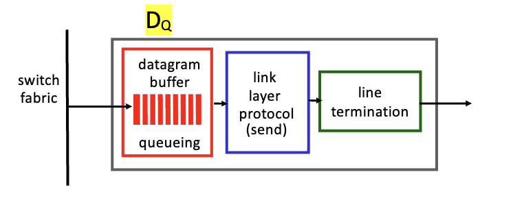


## Network Layer (L3)
- host, router network layer functions
  - forwarding
  - routing
- routing protocols (forwarding table), IP protocol/IP forwarding, ICMP protocol
- bt transport layer and link layer
  - transport layer: logical communication between processes
  - link layer: physical communication between devices

## IP Datagram
### header
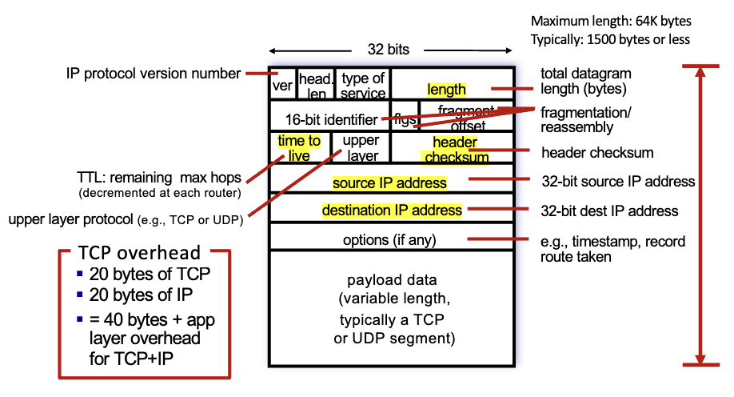

- TTL이 header에 있음 (time to live)
  - each router decreases TTL by 1
- header checksum: checks for errors in header

## ip address
- 32 bits
- identifier associated with each host or router interface
  - network wide unique/identification
- interface
  - boundary bt host/router and physical link
  - routers have multiple interfaces each with an ip address
  - host typically has one or two interfaces (wired, wireless)
    - ex: phone has two interfaces (wifi, cellular(4g))

```plaintext
+-----------------+-----------------+
| network portion | host portion    |
+-----------------+-----------------+
```
- network portion: identifies network (fixed)
  - aka. subnet
  - group of devices that can communicate directly (without intervening router)
    - uses mac address to communicate?
  - `/24` means first 24 bits are network portion
    - 32 - 24 = 8 bits for host portion
    - 2^8 = 256 hosts
- host portion: identifies host on that network
  - aka. host address
  - changes for each host on the network
- subnets are useful for forwarding
  - routers use subnet to determine where to forward packets
  - aggregation of hosts into subnets helps reduce forwarding table size
  - keeps internal network private

> [!CAUTION]
> network prefix: exact bits that are fixed <br>
> network address: prefix + 0s for the host portion <br>
> ex: network prefix: 223.1.3 vs network address: 223.1.3.0

### Dividing IP address space
#### CIDR (Classless InterDomain Routing)
- subnets can be of any size
- determined by variable-length subnet mask (VLSM)
- notation: `<IP>/<mask>` or `a.b.c.d/m`
  - `<mask>`: number of bits that are fixed (in network portion)
  - ex: 200.23.16.0/24
- 2 reserved addresses per subnet
  - all 0s: network address
  - all 1s: broadcast address

#### Classful addressing
- old way of dividing ip address space
- fixed-length subnet mask
- class A, B, C

| subnet | network portion (mask)  | host portion | IP addresses |
|--------|-------------------------|--------------|--------------|
| A      | 8 bits                  | 24 bits      | 2^24         |
| B      | 16 bits                 | 16 bits      | 2^16         |
| C      | 24 bits                 | 8 bits       | 2^8          |

- class A is huge (over 16 million hosts)


## masks
> most likely to be asked on exam

### 1. binary
- ex: `11111111.11111111.11111111.00000000`
  - 24 bits are fixed
  - 8 bits are variable (host portion)

### 2. dotted decimal
- ex: `255.255.255.0`
- basically the same as binary but in decimal form

### 3. CIDR
- ex: `/24`
  - 24 bits are fixed
  - 8 bits are variable (host portion)

### methods
1. bitwise AND
2. shortcut for easy mask
   
- ex: `200.23.16.54/24`
  - you can just AND with the mask to get the network address
  - `200.23.16.54` & `255.255.255.0` = `200.23.16.0`
  - subnet: `200.23.16`
  - host: 8 bits
    - 2^8 = 256 hosts
    - 0-255 (0: network address, 255: broadcast address)

## Fly-by-night
- route aggregation
- hierarchical routing
- anything that matches the prefix will be forwarded to the same router
  - ex: anything that starts with `200.23.16.0/20` will be forwarded to the same router
- vs. ISPs-R-Us
  - no aggregation
  - each router has to have a forwarding table for each host
- 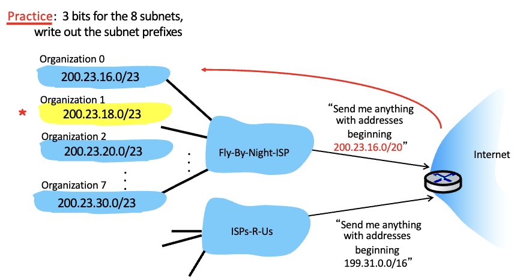
- 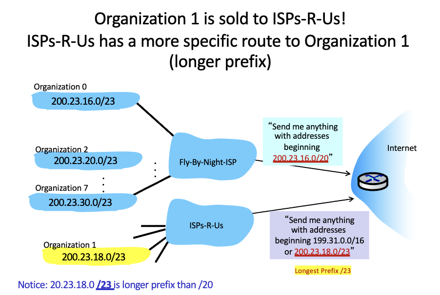

## DHCP (Dynamic Host Configuration Protocol)
- dynamically assigns IP addresses to hosts
- `discover` -> `offer` -> `request` -> `ack`
  - host broadcasts "DHCP discover" msg
  - DHCP server responds with "DHCP offer" msg
  - host requests IP address with "DHCP request" msg
  - DHCP server sends "DHCP ack" msg
- 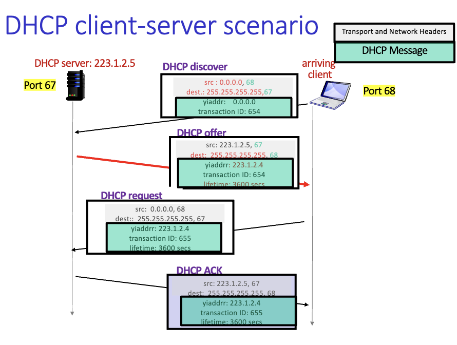
  
  - leasing mechanism
    - IP address is only valid for a certain amount of time
    - host must renew lease before expiration
    - if host leaves network, IP address is returned to pool
- DHCP is more than an IP address
  - first-hop router
  - DNS server (Name & IP address)
  - network mask

## dynamic routing
- routing algorithm updates forwarding table
- internet keeps on changing so topology and link costs change
- "good path"
  - least cost
  - fastest
  - least congested

## routing algorithms
1. global/centralized
  - all routers have complete topology, link cost info
  - "link state" algorithms
    - Dijkstra's algorithm
    - OSPF (Open Shortest Path First)
2. decentralized
   - router knows physically connected neighbors
   - routers initially only know link costs to neighbors
   - "distance vector" algorithms
     - Bellman-Ford algorithm
     - RIP (Routing Information Protocol)
3. static
   - routes are fixed
   - manually configured
   - not used in practice
4. dynamic
   - routes change
   - routing algorithms are used
   - periodically updates or in response to changes

## graph abstraction
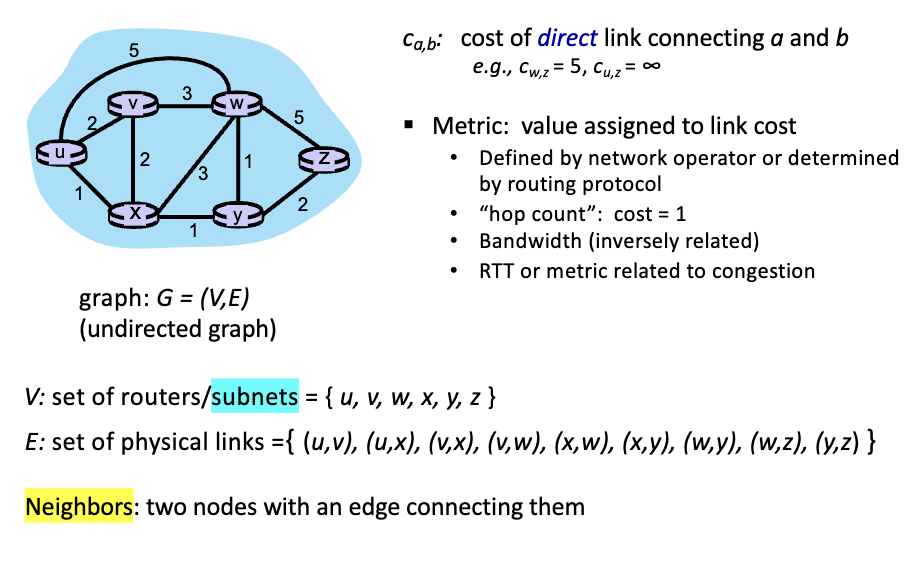

- least cost path
  - path bt src and dest that has the smallest cost
  - cost is determined by link cost
- shortest path
  - path bt src and dest that has the smallest number of hops
  - cost is all 1 for each link

## routing hierarchy


## link state routing
- global information
  - all link nodes & costs
  - entire network topology 
- link costs are flooded through network
- each router floods the link state update to all other routers (neighbors)
  - msg spreads throughout the entire autonomous system
  - hence, global info can be obtained
  - all nodes have an identical view of the network topology
- link state update = cost of link to neighbor
- flooding link state packets
  - 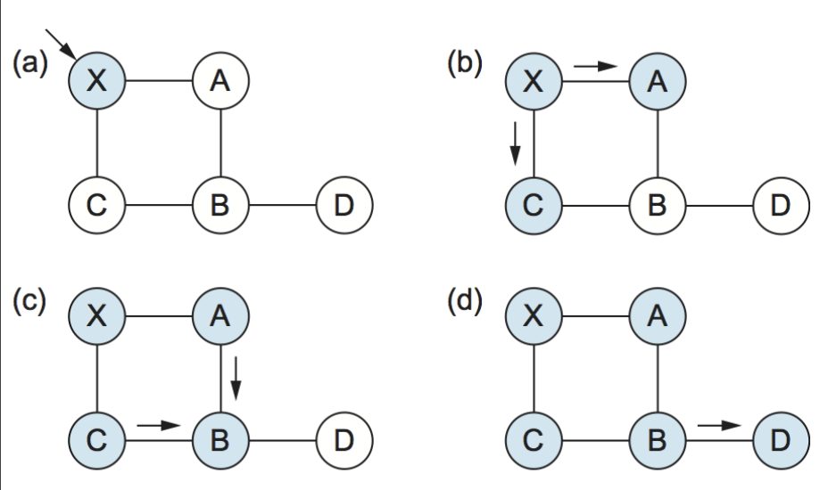

### Dijkstra's algorithm
- centralized
  - topology and link costs to each node in network are known
  - link state broadcast (all nodes have same info)
- iterative
  - after k iterations, know the least cost path to k destinations from single source
- shortest path tree
  - least cost paths from single source to all other nodes

#### Notation
- `c(u, v)`: link cost from node u to v
- `D(v)`: current value of cost of path from source to dest v
- `p(v)`: predecessor node along path from source to v
- `N'`: set of nodes whose least cost path is definitively known

## scalable routing
- autonomous systems (AS, aka. domains) aggregate routers into regions
  - ex: ISP, university, company
- intra-AS routing
  - intra-domain
  - routing **within** routers in the same AS
  - routing algorithm is run by routers in the same AS
- inter-AS routing
  - inter-domain
  - routing **among** routers in different AS
  - routing algorithm is run by routers in different AS
  - gateway router: router that connects to another AS
    - performs inter-AS and intra-AS routing
    - has two forwarding tables
      - intra-AS: routing within the AS
      - inter-AS: routing between AS

## Distance Vector
- decentralized
- relies on neighbors' computations to determine least cost path
- Bellman-Ford algorithm

### Algorithm

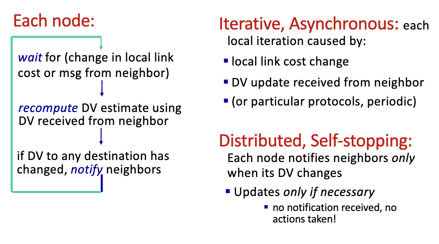

### Bellman-Ford algorithm
- Let `d(x, y)` be the cost of the least-cost path from `x` to `y`
- then, $d(x, y) = \min\{c(x, v) + d(v, y)\}$ for all neighbors $v$ of $x$
  - $c(x, v)$: cost of link from `x` to `v`
  - $d(v, y)$: cost of least cost path from `v` to `y`

## IP fragmentation

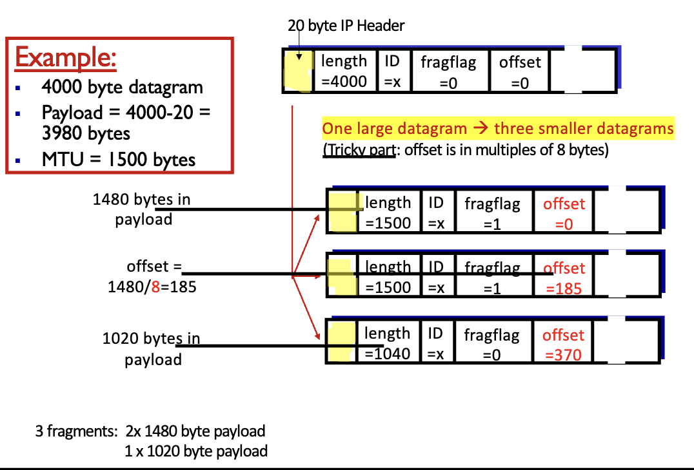

- The "offset" field in the IP header indicates the position of the fragment in the original datagram. This value is expressed in 8-byte (64-bit) blocks.


## NAT (Network Address Translation)
- one IP address is used for multiple devices
  - ISP supplies only one IP address
- NAT router has a table that maps local ip addresses to global ip addresses
  - with NAT, all devices in local network are assigned 32-bit private IP addresses
  - 10/8, 172.16/12, 192.168/16 prefixes
    - 이거 아니면 drop

### example
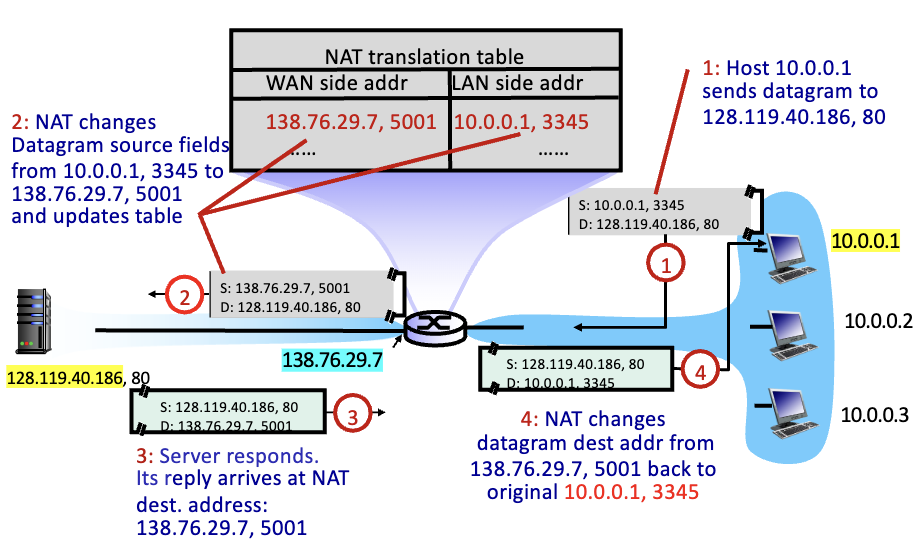

- left side: public network / right side: local network
- port number from transport layer & ip address from network layer
  - host to host delivery at network layer
- middle circle is the NAT router
  - src ip address is replaced with the ip address from the ISP

### NAT traversal
- 16 bits for port number
- NAT has been controversial bc routers should only process up to layer 3
- address shortage should be solved by IPv6 (128 bits address)


## Autonomous system
- intra-domain routing protocol
- decides how to route packets within the same AS
  - ex: RIP, OSPF, IS-IS, EIGRP

### Inter/Intra-AS tasks
- inter-domain routing
  - learn what destinations are reachable through AS
  - propafate this reachability info to all routers in AS
- intra-domain routing
  - determine least cost path to reach border router

## BGP (Border Gateway Protocol)
- de factor inter-domain routing protocol
  - aka. glue that holds the internet together
- allows subnets to advertise their existence to the rest of the internet
- logical components:
  - eBGP (external BGP)
    - between routers in different AS
    - obtain subnet reachability info from neighboring AS
  - iBGP (internal BGP)
    - between routers in the same AS
    - propagates reachability info to all routers in AS

### BGP message exchange
- BGP advertised routes
  - prefix + attributes
  - prefix: subnet
  - attributes: path, AS path, next hop, etc
- AS-path: list of ASes through which the prefix advertisement has passed
  - one AS to a prefix (path vector)
- NEXT-HOP: indicates specific internal-AS router to next-hop AS
- AS policy dictates propagation of routes (since multiple paths to a prefix are known)
  - ex: don't route through AS X

### BGP route selection (path vector protocol)
- BGP Session
  - peer bgp routers exchnage messages over semi-permanent TCP connections
  - prefix + attributes
