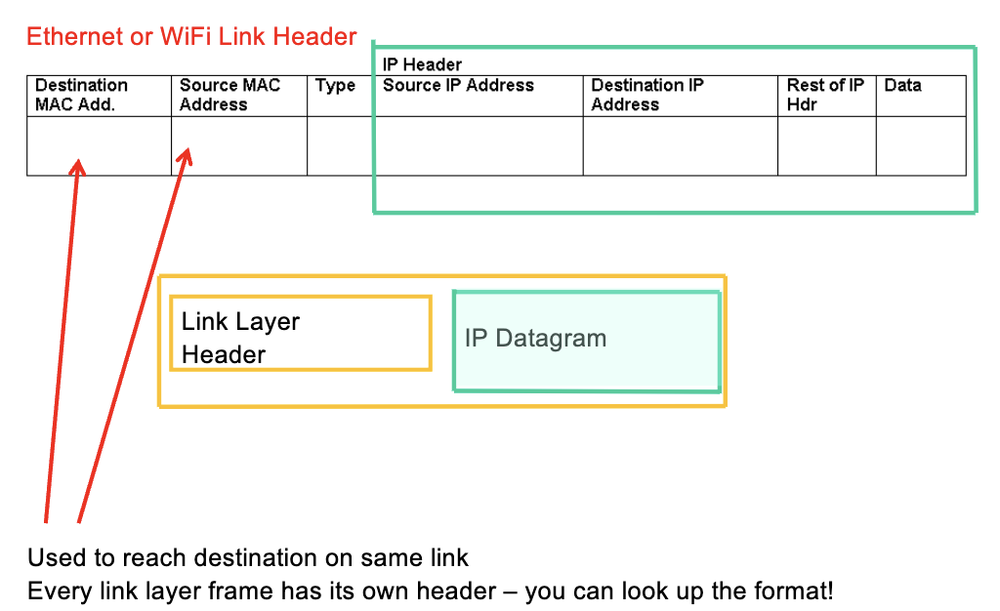
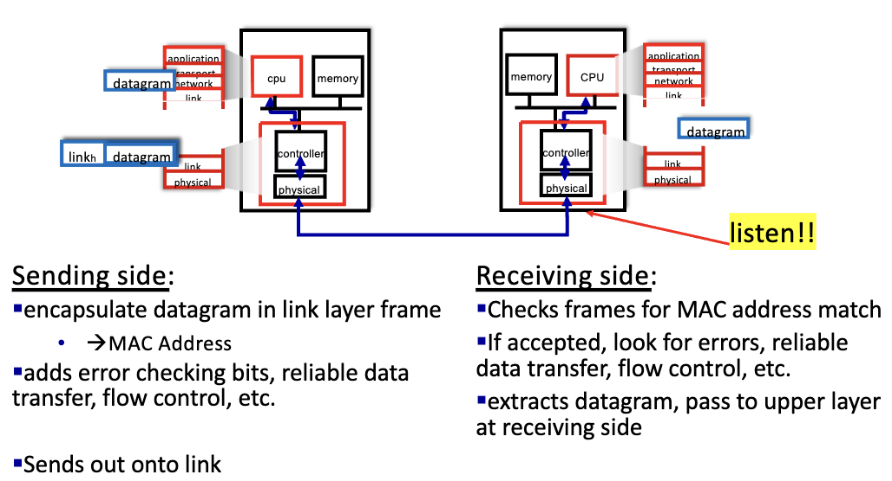
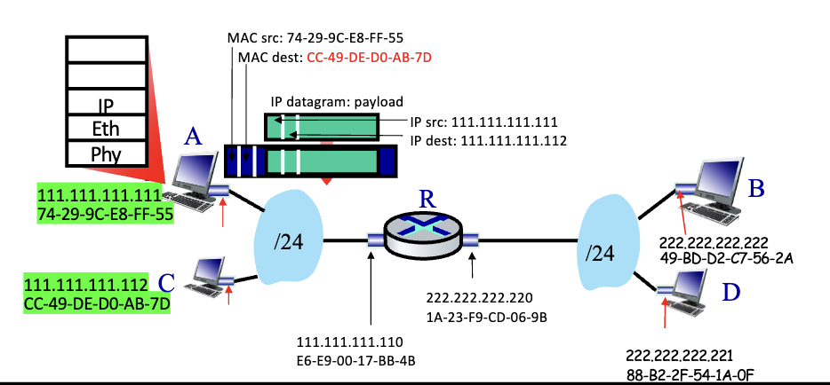
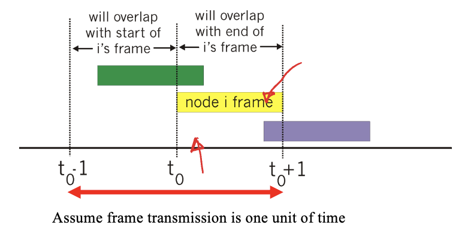
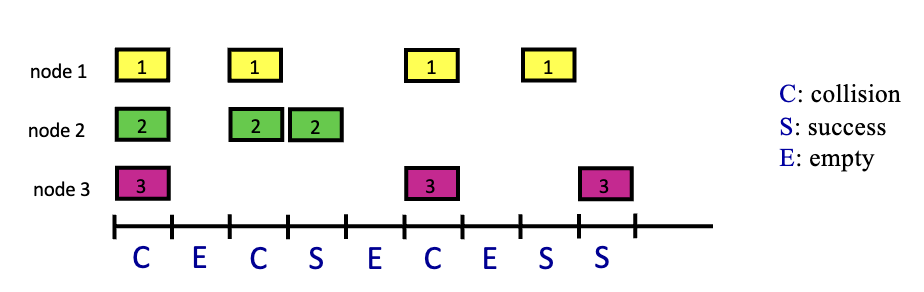
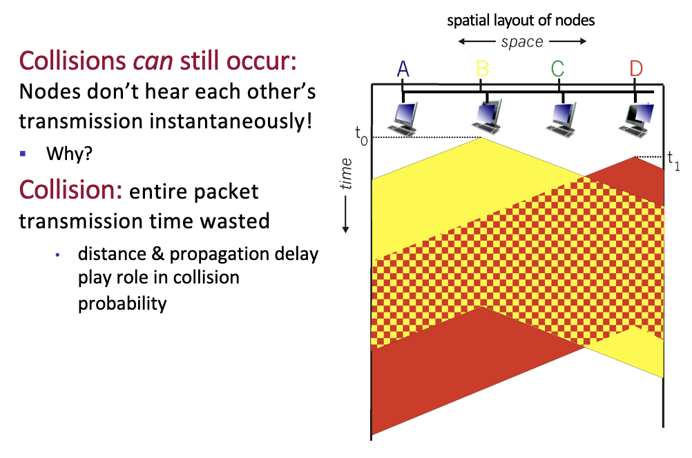
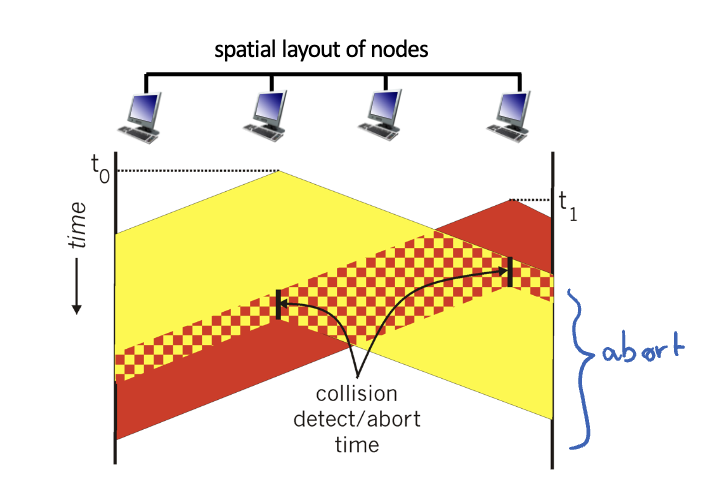
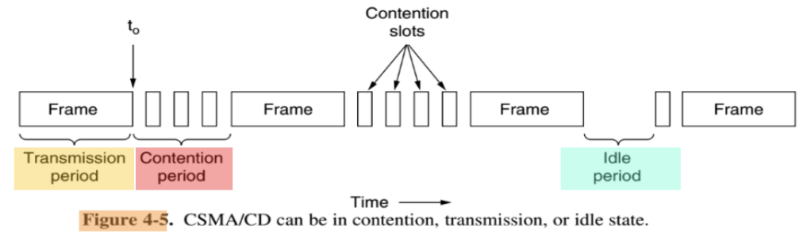
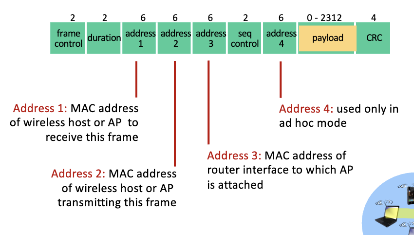
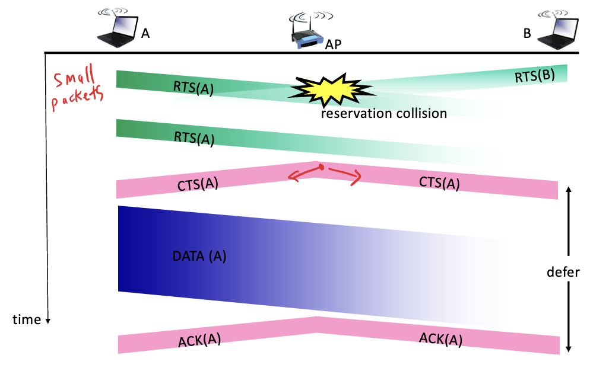

# Chapter 5 - Link Layer

## Link Layer
### Protocol
- each type of link has its own protocol
- ethernet, wifi, etc.

> [!NOTE]
> Data-link layer has the responsibility of transferring data between two nodes on a link.

### Services
- reliable delivery bt adj nodes
- flow control
  - pacing between sender and receiver
- error detection & correction
- half-duplex and full-duplex

## Link layer frame
- encapsulate datagram into frame
  - adds header and trailer
- MAC address in frame headers identify source and destination
- channel access if shared medium
  - multiple access protocols

### structure

## Network Interface Card (NIC)
- adapter/controller in every host and router
- attaches into host's system buses
- every interface has a unique 48 bit MAC address & 32 bit IP address
  - MAC address is burned in NIC (built-in)
  - IP address is assigned by network admin (server)
  - port number is assigned by the OS
  - ip는 동일해도 mac은 천차만별
  - link layer frame을 만들면 router 없이 mac address로 통신 가능

## interfaces communicating
- interface card --> link --> listens for mac address --> packet gets passed up the layers upto the application layer --> final data arrives
- 

## ARP (Address Resolution Protocol)
- IP --> MAC address
- ARP table
  - each IP node keeps an ARP table
  - TTL (Time To Live) for each entry (usually 20 min)
- ARP can only be used in the same network!
  1. A broadcasts ARP request (including IP address of B, and A doesn't have B's MAC address)
     1. looks for a target IP address
  2. B replies directly to A with its MAC address
     1. B knows its own MAC address
  3. A caches the MAC address of B
     1. A can now send a frame to B

## forwarding packets on same subnet A --> C

- encapsulation by host A:
  - network layer: ip datagram --> ip address
    - if on same subnet, broadcast to find the mac address --> form link layer frame
  - link layer: frame --> mac address
    - src mac, dest mac
  - no router is needed

## forwarding to the universe (datagram from A to B)
- focusing on addressing 
- assume
  - A knows B's IP address
  - A knows the IP address of the first hop router, R1
  - R1 knows B's IP address
- link layer header replaced each hop!

### Link 1
- host A creates IP datagram
  - ip src: A, ip dest: B
- nic in host A creates link layer frame
  - src mac: A's mac, dest mac: R1's mac
  - encapsulates the IP datagram as payload
  - NIC to NIC

### enters router
- router accepts LL frame
- decapsulates LL frame and IP datagram passed up to IP

### exit router
- IP forwarding: determine outgoing link
- create new link layer header
  - src mac: R1's mac, dest mac: B's mac
  - IP payload unchanged

### Link 2 (destination)
- LL frame forwarded to B
- mac addresses matches B's NIC
- decapsulation
  - LL header removed
  - IP datagram devliered up to Network & Application Layer

## MAC (Multiple Access Control)

### protocols
- channel partitioning
  - divide channel into smaller pieces
  - allocate a piece to each node
  - ex) TDM, FDM
- random access
  - channel not divided
  - station follow rules to "seize" channel
  - allow collisions (recover from them)
  - no entitiy is in charge
  - ex) CSMA/CD, CSMA/CA
- taking turns
  - nodes take turns
  - ex) polling, token passing

### random access protocols
- Aloha Protocol, slotted Aloha, CSMA, CSMA/CD, CSMA/CA

#### pure aloha
- when frame arrives, simple transmit immediately
- no synchronization
- collisions happen over an interval (vulnerability period)
- P(success) = 0.18
- 

#### slotted aloha
- still transmit immediately, but within a time slot
- assumptions
  - all frames are the same size
  - time is divided into slots
  - nodes start to transmit ONLY at the beginning of a slot
  - if 2 or more nodes transmit in the same slot, all frames are lost
- P(success) = 0.37
  - vulnerability period is cut in half through the use of slots
- 

#### CSMA (Carrier Sense Multiple Access)
- listen before transmit (carrier sense)
  - if channel is idle, transmit
  - if channel is busy, defer
- link is shared by many nodes
  - if 2 or more nodes transmit at the same time, collision occurs
- collision can still occur
  - propagation delay
  - two nodes may not hear each other's transmission
- 
  
  - the overlapping(checkerboard) area is the collision
  - why did D not know about B's transmission? (propagation delay)

#### CSMA/CD (Collision Detection)
- listen while transmitting
- abort as soon as collision is detected
  - channel will be idle sooner
- 
- three states
  - 1. idle - channel free, no stations transmitting
  - 2. transmitting - successfully transmitting
  - 3. collision/contention - collision detected, stations back-odd, spread out retransmission
  - 
- If NIC detects collision, NIC aborts and sends a jam signal
  - NIC runs a *binary exponential backoff algorithm* to determine when to retransmit
  - after mth collision, NIC chooses K from {0, 1, 2, ..., 2^m-1}
  - wait K * 512 bit time before retransmitting
  - go back to listening state
- ex:
  - 1st collision: K = {0, 1}
  - 2nd collision: K = {0, 1, 2, 3}
  - 3rd collision: K = {0, 1, 2, 3, 4, 5, 6, 7}
  - wait random number of slots before retransmitting

## Ethernet
- dominant wired LAN technology
- MAC protocol: CSMA/CD
- Collisions handled by binary exponential backoff

### Ethernet Frame Structure

### Ethernet Switch
- self-learning (MAC address table)
  - switch learns which hosts can be reached through which ports
  - source-based learning
- numbered ports
  - each port has a unique number
  - switch forwards frames based on destination MAC address
- inside the switch, it is collision free
  - packets can be sent and received simultaneously
- switch is transparent
  - hosts are unaware of the existence of the switch
  - no configuration needed
- switch observes incoming frame's SOURCE MAC address
- switch builds the table
- selectively forward frame based on table entries

### Source Self-learning
- frame is going from A to D
- when frame arrives at switch, switch learns A's incomding port of the sender (source)
- records the sender/port pair in switch table (+ TTL)

### Learning/Forwarding
1. Learning
   - observe incoming frame's source MAC address & port #
   - enter into switch table
2. Forwarding
   - if dest mac address is in the table
     - if destination port == incoming port, drop the frame
     - else, forward the frame to the destination port
   - else, flood the frame to all ports except the incoming port

### interconnecting switches
- switches can be connected to each other
- all hosts share the same prefix

## Switch vs Router
- Both are store-and-forward devices
  - routers: network layer devices
    - examines network layer header
  - switches: link layer devices
    - examines link layer header
- both have forwarding tables
  - routers: IP address, table computed by routing algorithms, route aggregation
  - switches: build their own forwarding table by recording source MAC addresses from all incoming frames

## wifi
- wireless LAN
- infrastructure mode
  - connected to the base station (access point)
  - all communication goes through the access point
  - handoff: mobile changes base station providing connection into wired network
  - 기기끼리 직접 통신하지 않음 --> access point을 통해 통신
- Arriving host must associate with an AP
  - scans channels, listening for beacon frames containing AP's name (SSID) and MAC address
  - selects AP to associate with
  - sends association request frame to AP
  - typically runs DHCP to get IP address in AP's subnet
- ad hoc mode
  - no base stations
  - nodes can only transmit to other nodes within link coverage
  - nodes organize themselves into a network (route among themselves)
- 802.11 frame
  - 
  - address 4 is used in ad hoc mode
  - payload is anything above the link layer (TCP segment, IP datagram, etc.)

### CMSA/CA (802.11 MAC Protocol)
- collision avoidance
- used in wifi
- CSMA/CD does not work because it cannot transmit and listen at the same time
- 802.11 sender
  - if channel sensed idle for DIFS (Distributed Interframe Space), start frame transmission
    - if no ack, retransmit
  - if channel sensed busy, defer transmission
    - random backoff timer
- 802.11 receiver
  - if frame received OK, return ACK after SIFS (Short Interframe Space)
  - if frame not received OK, return NACK
- avoiding collisions
  - sender reserves channel by sending small reservation packets
  - sender senses channel idle --> tranmit small RTS to Base Station (CSMA)
  - if base station determines channel is free (CSMA)
    - broadcasts CTS in reponse to RTS
  - CTS hear by all nodes
    - CTS includes a reservation time
    - sender transmits its data frame
    - other stations defer transmission during this time

#### RTS-CTS exchange
- RTS (Request to Send)
  - sender sends RTS to receiver
  - receiver sends CTS (Clear to Send) to sender
  - sender can now send data
- CTS (Clear to Send)
  - sender sends CTS to receiver
  - receiver can now send data
- 