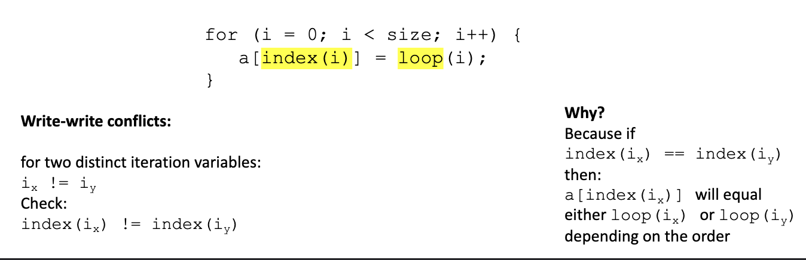
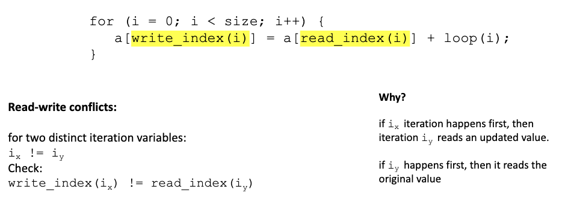

# DOALL loops, static scheduling, workstealing

## DOALL loops
- A DOALL loop is a loop where each iteration is independent of the others
- iterations can be done in any order and get the same results
  - hence, they can be done in parallel!!
  - assign each thread a range of iterations to work on

### nested loops

#### safety criteria
- every iteration of the outer-most loop must be independent
  - must produce same result regardless of order of the iterations
- write-write conflicts
  - two distinct iterations write different values to the same location
  - 
- read-write conflicts
  - two distinct iterations where one iteration reads from the location written to by another iteration
  - 

## Static scheduling
- works well when loop iterations take similar amounts of time