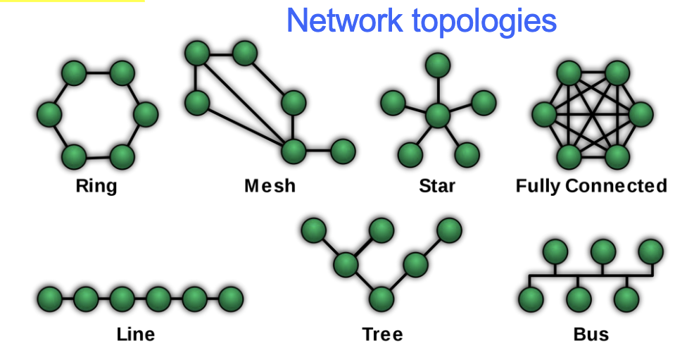
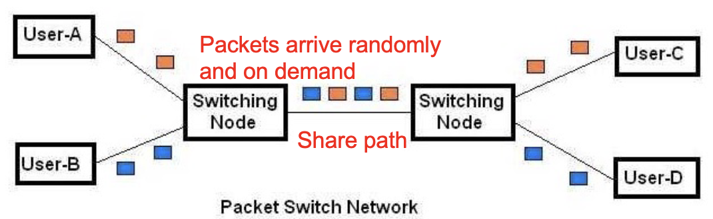
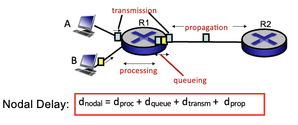
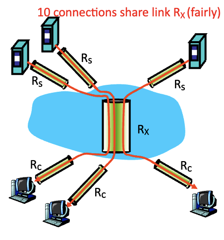
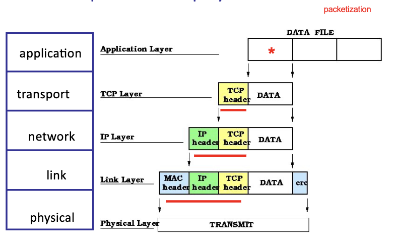
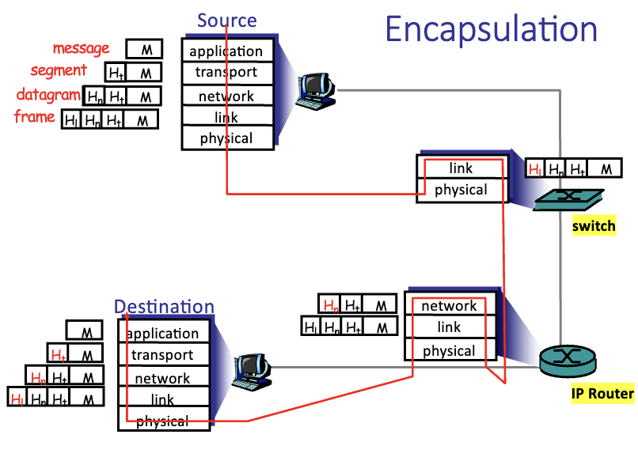

# Chapter 1

Table of Contents

- [Chapter 1](#chapter-1)
  - [Network](#network)
    - [components](#components)
  - [Internet](#internet)
    - [Protocol](#protocol)
    - [TCP/IP Internet Protocol Stack](#tcpip-internet-protocol-stack)
      - [1. Application Layer (L5)](#1-application-layer-l5)
      - [2. Transport Layer (L4)](#2-transport-layer-l4)
      - [3. Network Layer (L3)](#3-network-layer-l3)
      - [4. Data Link Layer (L2)](#4-data-link-layer-l2)
      - [5. Physical Layer (L1)](#5-physical-layer-l1)
  - [ARPANET](#arpanet)
  - [Web](#web)
    - [components](#components-1)
    - [How do we use the web](#how-do-we-use-the-web)
    - [desirable characteristics](#desirable-characteristics)
      - [그렇게 만드는 방법:](#그렇게-만드는-방법)
  - [Internet](#internet-1)
    - [Internet Service Provider (ISP)](#internet-service-provider-isp)
    - [Components](#components-2)
    - [Services](#services)
    - [Packet Switches](#packet-switches)
    - [IP Router](#ip-router)
    - [Network Edge](#network-edge)
    - [Access Networks](#access-networks)
    - [Network Core](#network-core)
  - [history](#history)
    - [residential access networks](#residential-access-networks)
  - [wireless access networks](#wireless-access-networks)
  - [links: physical media](#links-physical-media)
  - [Organization of nodes](#organization-of-nodes)
  - [Communication path](#communication-path)
  - [Channel Partitioning](#channel-partitioning)
    - [FDM (Frequency Division Multiplexing)](#fdm-frequency-division-multiplexing)
    - [TDM (Time Division Multiplexing)](#tdm-time-division-multiplexing)
  - [Transmission Delay](#transmission-delay)
  - [Packet Switching](#packet-switching)
    - [packets](#packets)
      - [features](#features)
      - [components](#components-3)
  - [Network-core functions](#network-core-functions)
    - [1. Forwarding](#1-forwarding)
    - [2. Routing](#2-routing)
  - [network multiplexing](#network-multiplexing)
    - [packet queueing](#packet-queueing)
    - [packet loss \& queue management](#packet-loss--queue-management)
    - [example](#example)
  - [Delay](#delay)
    - [End-to-end delay](#end-to-end-delay)
    - [store-and-forward](#store-and-forward)
      - [delay components](#delay-components)
  - [throughput](#throughput)
    - [Bottleneck link](#bottleneck-link)
    - [delay](#delay-1)
    - [packet switching의 delay](#packet-switching의-delay)
  - [Protocol stack](#protocol-stack)
    - [layer](#layer)
  - [Encapsulation](#encapsulation)

## Network

- a group or system of interconnected people or things (Google)
- two or more computers that are connected with one another for the purpose of communicating data electrioncally

### components

- **Nodes** : devices that are connected to the network
  - ex: routers, switches, cell towers, wifi access points
- **Links** : connections between nodes
  - wired: ethernet, fiber optic
  - wireless: wifi, bluetooth, satellite
- **End User Device**: host / end / system / terminating device
  - ex: computer, phone, tablet, server
- data travels through the source to destination in "hops"

## Internet

- a global network of networks that are connected using the Internet Protocol Suite (TCP/IP)

> Internet = specific network <br>
> internet = abbreviation for interconnected network <br>
> intranet = private network (individual network under its administrative control)

### Protocol

- format and order of messages send and received among network entities, and actions taken on message transmission and receipt

### TCP/IP Internet Protocol Stack

- protocal is orcanized into layers by functionality

#### 1. Application Layer (L5)

-

#### 2. Transport Layer (L4)

#### 3. Network Layer (L3)

#### 4. Data Link Layer (L2)

#### 5. Physical Layer (L1)

## ARPANET

- first packet switched network
- one of the first computer networks to implement the TCP/IP protocol suite

## Web

- collection of files accessible with hypertext links or URLs
- a system of interlinked hypertext documents accessed via the Internet

### components

1. web browser
2. web server
3. documents
4. protocol (HTTP)

### How do we use the web

1. web browser sends a request to the web server
2. web server sends a response to the web browser
   1. if required, it will look into the database to get the information

### desirable characteristics

- **scalability**: performance unaffected by growth & load
- **fault tolerant**: performance unaffected by failure

#### 그렇게 만드는 방법:

=> achieved through replication, distribution, and load balancing

N hosts --> middle box --> web server (여러개 존재; replication) --> database

- middle box:
  1. load balancer: distributes incoming network traffic across multiple servers
  2. firewall: at the entry point of networks to protect from unauthorized access
- even with faults, since we have several servers, the system will not fail

## Internet

- network of networks
- interconnected ISPs

### Internet Service Provider (ISP)

- aka. provider, autonomous system (independent network)
- independent networks provide user connectivity to the internet
- connect residential, business, and other ISPs to the internet
- connect content providers to users (ex: Google, Netflix)
- transfer data through the network core (ex: ATT, Level 3, Xfinity)

### Components

- **Computing Devices**:
  - terminals (hosts = end systems), iot devices
- **Network Applications**:
  - hosts running programs running at Network Edge
- **Packet Switches**:
  - forward packets (chunks of data) from one router to the next
  - packet: unit of transmittable data
- **Communication Links**:
  - fiber, copper, radio, satellite
  - transmission rate ($R$): bandwidth (bits per second)
- **Networks**:
  - collection of switches and links (nodes)
  - managed by an organization
- **Protocols**: rules that govern the format and meaning of packets
  - ex: IP, TCP, HTTP
  - used by hosts and switches
- **Internet** standards:
  - RFC: Request for Comments
  - IETF: Internet Engineering Task Force

### Services

- Infrastructure
  - provides services to applications
  - web, streaming videos, etc.
- programming interface for distributed applications
  - hooks + connect => internet transportation system
  - ex: socket interface
  - reliable delivery = TCP
  - unreliable delivery = UDP

### Packet Switches

- node = packet switch = IP router = ethernet switch
- IP router
  - uses ip addresses network layer
- ethernet switch
  - uses MAC addresses data link layer
  - LAN, enterprise/home/school networks

### IP Router

- symbol: circle with an x in the middle
- several input & output ports
- store & forward
  - input link --> output link and fully receiving the packet before forwarding it
  - receive entire packet
  - examine ip header (looking at destination ip address)
  - transfer the packet over the outgoing link

### Network Edge

- hosts: clients and servers
  - servers are often in data centers
- hosts run application programs
  - client: web browser, email, etc.
  - server: web server, email server, etc.

### Access Networks

- network that connects the end system to the first router (edge router)
- host -> ISP (through first router)
- first edge router: router that connects the host to the rest of the network
  - 얘가 output link를 가지고 있음 -> ISP로 연결f
- access link: physical link between the host and the first router

### Network Core

- backbone
- shared by all users
- mesh of interconnected networks of high speed routers
- data traversal:
  - terminal -> access network -> network core -> destination

## history

- dial-up internet
  - PSTN (public switched telephone network) to establish a connection (ISP) by dialing a phone number
- broadband
  - DSL, cable, fiber
- DSL: digital subscriber line
  - uses existing telephone line
  - high speed data transmission
  - no sharing
  - asymmetric: download speed > upload speed
- cable
  - **shared** link in neighborhood connects homes to CMTS (cable modem termination system)
    - homes share access network to cable headend
      - data rate depends on the number of users
      - data and television signals are transmitted over the same cable (split by the splitter)
  - frequency division multiplexing
    - each channel is transmitted at a different frequency
  - asymmetric but faster than DSL
- fiber
  - light pulses
  - GB/s (high speed)

### residential access networks


- 왼쪽 끝: wifi endpoint
- 화살표: access link
  - access link 끝에는 ISP가 있음
  - 네크워크 종류에 따라 다름 --> 네트워크에 맞는 modem이 필요

## wireless access networks

- shared wireless link connects hosts to router via base station (access point)
- wireless LANs
  - discrete mobility
  - access point: wifi device bridges
- wide-area cellular access networks
  - continuous mobility
  - access point: cell tower
  - 3G, 4G, 5G

## links: physical media

- bit: smallest unit of data that can be transmitted
- bytes: 8 bits
- physical links
  - guided media: signals propagate in solid media
    - ex: coaxiable table(copper), fiber, twisted pair (tp)
  - unguided media: signals propagate freely
    - ex: radio, microwave, infrared

## Organization of nodes



- star의 경우
  - 어느 node든 2 hops (low delay)
  - but if there is a failure in one link, it becomes unreachable (not robust)
- mesh의 경우
  - multiple paths available
  - BUT loop can occur
- tree의 경우
  - a node can become unreachable if the parent node fails

## Communication path

1. circuit switching (reserved)

- dedicated communication path -> service guaranteed
- resources are **reserved** for the duration of the communication (end-to-end)
- reclaiming idle resouces is not possible until the communication is over
- inefficient for bursty data / data communication
- ex: telephone network

2. packet switching (ond-demand)
   - data is divided into packets
   - packets are sent over the network and reassembled at the destination
   - **on-demand** resource allocation

## Channel Partitioning

- circuit switching에서 쓰이는 방식
- 하나의 채널을 공유하기 위해 사용

### FDM (Frequency Division Multiplexing)

- frequency divided into narrow frequency bands (channels)
- each user is allocated a channel
- users transmit continuously at max rate possible in their allocated channel
  - $\sum(user\ rate) = link\ rate$
  - individual user rate < total link capacity

### TDM (Time Division Multiplexing)

- frame: time divided into slots
- each user is allocated a slot
- users can transmit data in their allocated time slot at full link rate
  - not continuous transmission
- ex:
  - entire bandwidth = 1.536 Mbps
  - 24 users
  - bandwidth guarantee = 1.536 / 24 = 64 kbps per user
    - each user sends 8 bits per channel
- BUT silent periods are wasted
  - still only allowed to send 8 bits per channel
  - link utilization is low

## Transmission Delay

transmisision delay = $L/R$

- $L$: packet length (bits)
- $R$: link bandwidth (bps)
- host에서 NIC(Network Interface Card)로 전송하는 시간
- packet 크기 & rate에 따라 transmission delay 결정
- 내 컴퓨터에서 보내기 + destination이 받는 시간 = 2 \* transmission delay = $2L/R$

## Packet Switching



- application layer broken into smaller packets
- on-demand resource allocation; no reservation
- no service guarantee
  - throughput, delay, jitter, etc. can vary
- full link bandwidth when transmitting!!! (no wasted resources)
  - supports more users compared to circuit switching
  - if user B has nothing to send, user A can use full bandwidth

### packets

```
packet = header + data
```

- **header**: control information
  - IP forwarding: destination IP address
  - destination address
  - source address
  - sequence number
  - error detection bits
  - etc.
- independent units of transmission
- transmitted across links on path from $s$ to $d$
- hop-by-hop
- can take different paths & arrive out of order
- reordering is done at the destination
  - **congestion**: packets might not arrive at all

#### features

- each packet is treated independently
  - full link bandwidth when transmitting
- store-and-forward
  - entire packet must arrive before it can be forwarded

#### components

- IP Header: destination IP address
- Data: payload

## Network-core functions

### 1. Forwarding

- aka. IP forwarding
- **local action**
  - forwarding happens in the router
  - transfer packet from input link to output link
- looks at the IP header (20B usually)
  - destination IP address를 보고 어느 output link로 보낼지 결정

### 2. Routing

- **global action**
  - determine the end-to-end path that packets will take
  - dynamic routing protocol
    - 실시간으로 network topology를 업데이트
  - routing algorithm 사용

## network multiplexing

- packets arrive probabilistically
- $arrivals > service\ rate$
  - the packets are queued
  - finite sized queue

### packet queueing

- $\lambda_{in} > \lambda_{out}$
- packets are queued when they arrive faster than they can be transmitted
- $\lambda$: arrival rate
- $D_Q$: average queueing delay

### packet loss & queue management

- sources of packet loss:
  - congestion
  - transmission errors
  - queue overflow --> packets are dropped
- dropped packets can be
  - retransmitted by the source
  - retransmitted by the router (link)
  - ignored

### example

- 1 Mbps link
- each user
  - 100 kbps when transmitting
  - active 10% of the time
- circuit switching
  - 10 users
  - 1 Mbps / 100 kbps = 10 users
- packet switching
  - less than 10 users => no queueing delay
  - with 35 users, P(# active users > 10) < 0.0004
  - binomial distribution으로 산술 연산

> 1.3.2 해보기 문제들 (3개 잇다고 함,,), homework?

## Delay

### End-to-end delay

- time it takes bits to travel from a source to dest through a network
- 각 router를 지날때마다 nodal delay 발생
- end-to-end delay는 모든 nodal delay의 합
- 각 노드의 service time, link의 길이, link의 속도 등이 다름

### store-and-forward

- $D_{end-to-end} = N * \frac{L}{R}$
- $N$ = number of hops



- processing, queueing, transmission, propagation
- inside router: service time
  - $D_{proc} + D_{queue}$
- outside router:
  - $D_{prop}$: propagation along link
  - $D_{trans}$: transmission onto link

#### delay components
1. **processing delay** $D_{proc}$
   - check bit errors
   - determine output link / IP forwarding
   - $\mu sec$ (hardware)
2. **queueing delay** $D_{queue}$
   - time the packet waits in the output queue before transmission out of the node
   - varies depending on network traffic & congestion in router
   - $msec$
3. **transmission delay** $D_{trans}$
   - $L$: packet length (bits)
   - $R$: link bandwidth (bps)
   - pumps bits into link at rate $R$
   - $D_{trans} = L/R$
4. **propagation delay** $D_{prop}$
   - $d$: length of physical link (m)
   - $s$: propagation speed in medium
     - usually $2 * 10^8 m/sec$ for fiber
     - light speed = $3 * 10^8 m/sec$
   - bits travel across link
   - $d/s$

## throughput
- rate at which bits (transmitted by the sender) are delivered to the receiver
  - bits/time unit
- instantaneous throughput
  - rate at given point in time as seen by the receiver
- average throughput
  - $\frac{F}{T}$ : file size (bits delivered) / time interval

### Bottleneck link
- link on end-to-end path that constrains throughput
- $R_s$: sender's transmission rate (server)
- $R_c$: receiver's reception rate (client)
- maximum throughput = min($R_s, R_c, R{network}$)

### delay
- bottleneck sets the lower bound on "distribution" time
  - time to distribute entire file of F bits
- Distribution time = $\frac{F}{R_{min}}$ = (amount of data) / (transfer rate)

### packet switching의 delay
- high capacity link can become a bottleneck due to sharing
  - per connection throughput = min($R_s, R_c, R_{link}/n$)
  - where $n$ is the number of connections



> circuit switching은 다름. 누가 connection에서 dropout 한다고 bandwidth가 줄어들지 않음

## Protocol stack

### layer
  - each layer has a specific function
  - each layer communicates with the same layer on the other side!!
  - maintaining이 쉬워짐
  - 전송할떄 protocol stack을 타고 내려가고, 받을때는 역순으로 올라감
  - each layer depends on the services of the layer below it

```plaintext
+---------------------+
| Application Layer   | L5
+---------------------+
| Transport Layer     | L4
+---------------------+
| Network Layer       | L3
+---------------------+
| Data Link Layer     | L2
+---------------------+
| Physical Layer      | L1
+---------------------+
``` 

1. **Physical Layer**
   - bits on the wire
   - how to transmit bits
   - ex: ethernet, wifi, fiber
2. **Data Link Layer**
   - data transfer between end systems connected by a single physical link
   - ex: ethernet, wifi
3. **Network Layer**
   - todo: write explanation

## Encapsulation


- message = ICMP message
- TTL자체는 header의 hop limit이 큼 (도착하라고) --> 얜 response임
- switch
  - only looks at the link layer header
- IP router
  - looks at the IP header (network layer)
  - destination ip address를 찾기 위해
- Destination
  - decapsulation
  - protocol stack을 타고 올라감

> wireshark grabs packets and displays the different layers
