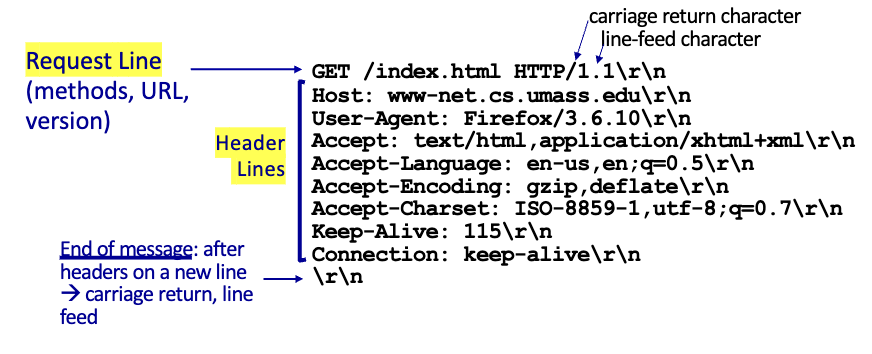
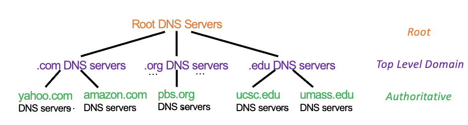

# Chapter 2: Application Layer

## network app

- processes running on different end systems that communicate with each other over the network
  - 실제 네트워크가 어떻게 작동하는지 몰라도 됨
  - API를 통해 네트워크에 접근 가능
  - packet만 잘 전달하고 받으면 됨 --> fast development 가능

## client-server paradigm

- no direct communication between end systems
- 다 서버를 통해 통신함
- HTTP, DNS protocol 둘다 client-server paradigm을 가정함

### server

- always-on host
- permanent IP address
- data centers for scaling/robustness
- trust
  - ex: cnn에 접속하면 cnn의 컨텐츠를 받을 수 있음

### client

- contact, communicate with server
- intermittently connected
- may have dynamic IP address
- 서로 직접적인 통신 불가능

## Application Layer Protocols

- defines:
  - types of messages exchanged (request, response)
  - message syntax: what fields in messages & how fields are delineated
  - message semantics: meaning of information in fields
  - rules for when and how processes send & respond to messages
  - open protocols: defined in RFCs
    - ex: HTTP, SMTP, FTP, DNS
  - proprietary protocols: e.g., Skype
    - owned by an organization
    - can be modified only by the organization

## Web

- distributed repository of information/documents that can be located by URL / hyperlink
- usage:
  - display web pages requested & received from web servers
  - HTML defines display format

## HTTP

- HyperText Transfer Protocol
- defined messages transferred, format, and expected actions upon receiving messages
- stateless protocol
  - server maintains no information about past client requests --> no history (cookie가 대신 저장함)
  - each request/response is independent
  - scalable

### message flow

- client server model (request-response)
- client: sends browser request to server + received & displays response
- server: receives request, sends response

### basic web page

- base HTML file + embedded objects
  - base HTML file: text, links to objects
  - embedded objects: images, audio, java applet, html files, ...
    - aka. referenced objects
- address of object: URL
  - 

### client request message

> request, response 종류 두가지

- `GET` method
  - request an object from a server
  - 
  - header lines: `name:value`
    - extra useful info about request
    - ex: `Accept-Language: en`
  - blank line: end of header

#### general format

#### example

- `POST`, `HEAD`, `PUT`, `GET`

### server response message

- status line:
  - indicates if request succeeded or failed
  - ex: `HTTP/1.1 200 OK`
- header lines
  - key-value pairs
  - ex: `Content-Length: 3495`, `Content-Type: text/html`
- data
  - object requested
  - ex: HTML file, image, audio, video, ...

## Cache
- copy of recently accessed objects
  - reduces response time
  - reduces traffic
  - ex: browser cache
- if the cache has the up-to-date object, the server will not send the object again
  - 근데 없거나 최신이 아니라고 판단되면 cache forward request to server
- server랑 client의 중간다리 느낌
- if object modified, 
  - cache --> conditional GET to origin server
  - server --> if object modified, returns file
  - cache --> updates its copy
  - `last-modified` field로 up-to-date 여부 판단
  - known as `conditional GET`
    - `if-modified-since` field를 헤더에 넣어서 보냄
    - `304 Not Modified` response를 받으면 cache에 있는걸 사용
    - `200 OK` response를 받으면 cache를 업데이트

## Process Communication
### IPC (Inter-Process Communication)
- two processes on the same host communicate with each other
- defined by the OS
- ex: pipes, message queues, shared memory, sockets

### Server process on remote host
- server process: process that waits to be contacted
- client process: process that contacts server

#### address
- unique id, shared infrastructure to identify user within a network
- 32 bit IP address + 16 bit port number
  - ex: 128.119.245.12:80
- ports: 16 bit number
  - 0 ~ 65535
  - well-known ports: 0 ~ 1023
    - ex: 80 (HTTP), 21 (FTP), 25 (SMTP), 53 (DNS), 443 (HTTPS)
  - registered ports: 1024 ~ 49151
  - dynamic/private ports: 49152 ~ 65535

## App Implementation
- application layer uses services of transport layer and network to send/deliver data
  - API = hook (os의 abstraction 이용)
  - send/receive data
- transport protocols implemented within the OS
- data integrity, throughput, delay, security, ...
  - bandwidth sensitive vs. elastic apps,

### Socket Interface
- allows processes to communicate with each other
- API (TCP/IP sockets)
  
## RTT (Round Trip Time)
- time elapsed for a small packet to travel from client to server AND back

## TCP Connection
- Set bits in TCP header
  - SYN: synchronize sequence numbers
  - ACK: acknowledgment (can include data)
    - 3rd step ack는 데이터를 포함할 수 있음
  - and more...
- Response time
  - 1 RTT to establish TCP connection
  - 2 RTT to send HTTP request and receive HTTP response (ignore data transmission time)
  - 

### Persistent HTTP
- existing connection used for multiple requests/responses
- server reclaims resources
- http header - keep-alive
- parallel - multiple TCP connections
  - wire shark에서 ack, syn의 갯수가 적음
- Response time
  - Base Pgae: 2RTT (for file transmission time)
  - additional embedded objects: 1RTT to grabthem all; TCP remains open

### Non-Persistent HTTP
- OS overhead for each connection
- http header - close

## Cookies
- User-server state management
- benefits:
  - authentication
  - shopping carts (remember items)
  - recommendations
  - user session state (web mail)

- client: sends a request to server
- server: sends cookie to client (`Set-Cookie: <cookie>`)
- client: stores cookie
  - 다음번에 request를 보낼때 cookie를 같이 보냄 (`Cookie: <cookie>`)
  - cookie는 브라우저가 관리

## Domain Name System (DNS)
- IP address: 32 bit number
- domain name: human-readable address

### Distributed hierarchical database
- replicated servers distributed worldwide
- DNS servers organized in a hierarchy
  - root DNS servers
  - top-level domain (TLD) servers
  - authoritative DNS servers
  - local DNS servers

### Application Layer Protocol
- core internet protocol
- client-server architecture
  - clients query servers to resolve domain names and obtain RRs (Resource Records) (Name to IP address mapping)
- Define messages
  - syntax, format, semantics, etc

### DNS Nameserver
- on port 53
- stores DNS RR for a domain

### DNS Services
- mapping
  - host --> IP address translation
  - host aliasing
    - canonical, alias names
  - mail server aliasing
    - ex: `cs.virginia.edu` --> `stardust.cs.virginia.edu`
- Load distribution
  - replicated web servers
  - multiple IP addresses for one name
    - DNS returns list of IP addresses
- resolver
  - local name server spcified by your local ISP

### DNS Distributed Hierarchical Database
- minimum three levels, each layer has a different role

- client queries the root server --> get IP addres for `.com` server 
- client queries the `.com` server --> get IP address for `amazon.com` TLD DNS server
- client queries the `amazon.com` authoritative DNS server --> get IP address for `www.amazon.com`

### centralized vs. distributed DNS
- centralized: single point of failure & load too high for single server
