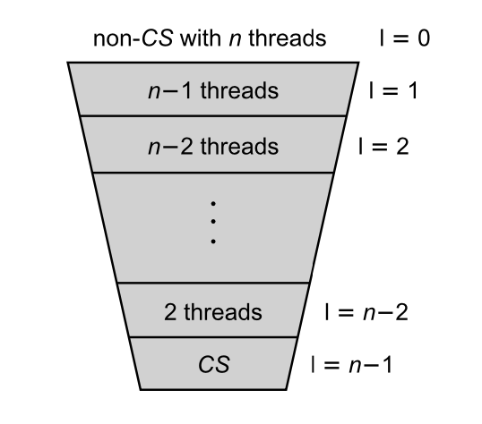

\tableofcontents

\newpage

# Implementing Mutexes
## Filter Lock
Perterson lock uses two-elemetn boolean flag array to indicate whether a thread is tying to enter the critical setion. To generalize this to $n$ threads (i.e. implement the filter lock), each thread must pass though `n-1` levels of 'exclusion' to enter the critical section. 

### Constructor & Initialization
To implement the filter lock, two arrays -- one for the level and one for the victim -- will be needed. Each thread will start at level 0 and increment the level as it passes through the exclusion levels. The thread will only enter the critical section when all other threads are at a higher level.

**Pseudocode**
```cpp
class mutex {
 public:
  mutex() {} // constructor is not needed
  
  // Initialize the level and victim arrays 
  // Initialized to 0 and resized to the number of threads
  void init (int num_threads) {
    _num_threads = num_threads; 
    level.resize(num_threads, 0);
    victim.resize(num_threads, 0);
  }

 private:
    vector<atomic<int>> level;
    vector<atomic<int>> victim;
    int _num_threads;
};
```

### Lock

{ width=80% }

As shown in the figure above, the lock function will increment the level of the thread to `n-1` and set the victim to itself. The thread will then wait until all other threads are at a higher level and the victim is itself. 

**Pseudocode**

```cpp
void lock(int thread_id) {
    for (int i  = 1; i < num_threads; ++i) {
        // attemtp to enter level i
        level[thread_id] = i;
        victim[i] = thread_id;

        // spin until all threads with a lower level or with the same level but with a smaller thread id have finished
        while ((for every other thread that is NOT thread_id) (level[j] >= i && victim[i] == thread_id)) {};
    }
}
```

### Unlock
The `unlock()` function will simply reset the level of the thread to 0.

**Pseudocode**
```cpp
void unlock(int thread_id) {
    level[thread_id] = 0;
}
```

## Lamport's Bakery Algorithm
Lamport's Bakery Algorithm is another way to implement a mutex. However, unlike the Filter Lock, it guarantees *first-come-first-served* property by using a distributed version of a ticket dispenser.

Each thread will takes a ticker (or number in the doorway), then waits until no thread with an earlier ticket(number) is trying to enter the critical section.

### Constructor & Initialization
Similar to the filter lock, two arrays are going to be needed: number and entering. The number array will be tracking the ticket number of each thread. Meanwhile, the entering is needed to indicate whether a thread is trying to get a ticket. (Ensures that a thread does not get a ticket while another thread is trying to get one.)

**Pseudocode**
```cpp
class mutex {
 public:
  mutex() {} // constructor is not needed
  
  void init (int num_threads) {
    _num_threads = num_threads;
    entering.resize(num_threads, false);
    number.resize(num_threads, 0);
  }

 private:
    vector<atomic<bool>> entering;
    vector<atomic<int>> number;
    int _num_threads;
};
```

### Lock
The `lock()` function will first set the entering flag to true, then set the number of the current thread to max of all other threads' numbers + 1. The entering flag will be set to false once the thread has received its ticket number. The thread will then wait until all other threads have received their ticket number and all threads with smaller numbers have finished their work. 

Side note: A ticket variable to keep track of the current maximum ticket number could be implemented to avoid the max function if RMW were allowed.


**Pseudocode**

```cpp
void lock(int thread_id) {
    entering[thread_id] = true;
    number[thread_id] = 1 + max(number[0], number[1], ..., number[_num_threads - 1]);
    entering[thread_id] = false;

    for(int j = 1; j <= _num_threads; ++j){
        // wait until thread j receives its number
        while(entering[j]) {};

        // wait until all threads with smllaer numbers finish their work; meanwhile spin
        while((number[j] != 0) && ((number[j], j) < (number[thread_id], thread_id))) {};
    }
}
```

### Unlock
The `unlock()` function will simply reset the number of the thread to 0.

**Pseudocode**
```cpp
void unlock(int thread_id) {
    number[thread_id] = 0;
}
```

# A Fair Reader-Writer Lock
In the default reader-writer lock, readers are more often allowed in the critical section than writers. To provide more fiairness to the writer, a flag can be added to indicate whether a writer is waiting.

If a writer is waiting, the readers will be blocked until the writer has finished, and therefore, prevent the writer from being starved.

## Constructor & Initialization
The other variables remain the same as the ones in the default reader-writer lock. An additional variable called `_writer_waiting` will be added to indicate whether a writer is waiting.

**Pseudocode**
```cpp
class rw_mutex {
 public:
  rw_mutex() {
    // Initialize the number of readers, writer, and writer_waiting
    _num_readers = 0;
    _writer = false;
    _writer_waiting = false;
  }

 private:
  int _num_readers;
  bool _writer;
  mutex m;
  atomic<bool> _writer_waiting;
};
```


## Read Lock
The reader lock is also similar to that of the default reader-writer lock. However, the reader will now also check if there is a writer waiting before entering the critical section. If there is no writer waiting, the reader will follow the original logic where it checks if there is a writer in the critical section and enters if there are none. However, if there is a writer waiting, the reader will wait until the writer has finished.

The unlock function will remain the same as the default reader-writer lock.

**Pseudocode**
```cpp
void lock_reader() {
  bool acquired = false;
  while (!acquired) {
    m.lock();
    if (no writers are waiting and there are no writers in the critical section) { 
      _num_readers++;
      acquired = true;
    }
    m.unlock();
  }
}

void unlock_reader() {
  m.lock();
  _num_readers--;
  m.unlock();
}
```

## Write Lock
The writer lock will also be similar to the default reader-writer lock. However, the writer will now set the `_writer_waiting` flag to true before approaching the critical section.

After it exists the critical section, the writer sets the `_writer_waiting` flag to false to indicate that it has finished.

**Pseudocode**
```cpp
void lock() {
  _writer_waiting = true; // indicate that a writer is waiting
  bool acquired = false;
  while (!acquired) {
    m.lock();
    if (no readers and writers in critical section) {
      _writer = true;
      acquired = true;
    } else {
      _writer_waiting = true; // indicate that a writer is still waiting
    }
    m.unlock();
  }
}

void unlock() {
  m.lock();
  _writer = false;
  _writer_waiting = false; // indicate that the writer has finished
  m.unlock();
}
```

# Concurrent Linked List
## Coarse-grained Locking
`mutex m` will be added to the private variables. It is a single lock that every thread must acquire before accessing any method in the linked list.

The mutex will be locked and unlocked in the following locations for each method:
- `pop()`: 
  - Lock: at the beginning of the function because it is reading the head pointer.
  - Unlock: before the return statement because it is deleting the current node and updating the head pointer before returning.
    - Unlocking will be also needed before it returns from the first and second if-statement.
- `peek()`:
  - Lock: at the beginning of the function because it is reading the head pointer.
  - Unlock: before the return statement because it loops through reading the linked list.
    - Unlocking will be also needed before it returns -1 from the first if-statement.
- `push()`:
  - Lock: at the beginning of the function because it is updating the head pointer.
  - Unlock: at the end of the functioin because it is adding a new node to the linked list.
    - Unlocking will be also needed before it returns from the first if-statement.

## RW Locking
In this implementation, the `shared_mutex m` will be added to the private variables. The `shared_mutex` will allow the RW lock to allow multiple readers to access the linked list at the same time.

Since `pop()` and `push()` methods are modifying the linekd list (i.e are writers), they will need to acquire an exclusive lock. Meanwhile, the `peek()` method is only reading the linked list (i.e. a reader), it will only need a shared lock.

The `shared_mutex` will be locked and unlocked in the following locations for each method:
- `pop()`:
  - Lock: at the beginning of the function because it is reading the head pointer.
  - Unlock: before the return statement because it is deleting the current node and updating the head pointer before returning.
    - Unlocking will be also needed before it returns -1 from the first if-statement.
- `peek()`:
  - Lock: `m.lock_shared()` at the beginning of the function because it is reading the head pointer.
  - Unlock: `m.unlock_shared()` before the return statement because it loops through reading the linked list.
    - Unlocking will be also needed before it returns -1 from the first if-statement.
- `push()`:
  - Lock: at the beginning of the function because it is updating the head pointer.
  - Unlock: at the end of the functioin because it is adding a new node to the linked list.
    - Unlocking will be also needed before it returns from the first if-statement.

## SwapTop
The `swap_top()` method will be implemented with a reader lock. This is possible because the pop and push operations already have writer locks implemented, and therefore the `swap_top()` method can be efficiently implemented with a reader lock.

The rest of the implementation will remain the same as the RW Locking implementation.

### Pseudocode
```cpp
void swap_top(int to_swap){
  reader_lock.lock();
  if (stack is empty)
    reader_lock.unlock();
    return;
  
  pop();
  push(to_swap);

  reader_lock.unlock();
  
  return;
}
```